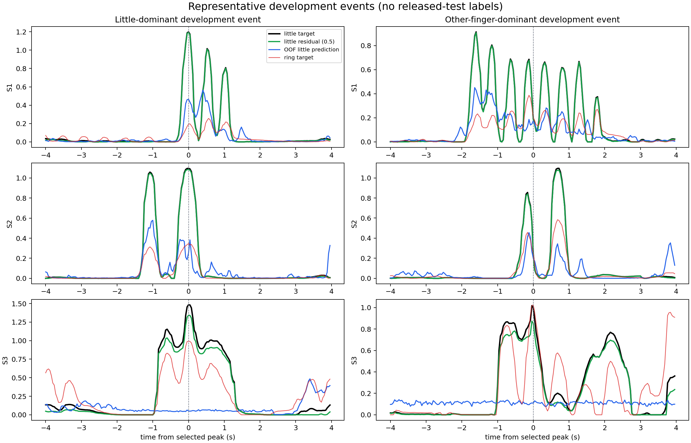

# ECoG finger-trajectory decoding

In 2018, we published a CNN-LSTM model for continuous finger-trajectory
decoding from ECoG:

> Z. Xie, O. Schwartz, and A. Prasad, “Decoding of finger trajectory from
> ECoG using deep learning,” *Journal of Neural Engineering*, 15(3), 036009,
> 2018. [doi:10.1088/1741-2552/aa9dbe](https://doi.org/10.1088/1741-2552/aa9dbe)

Several people have asked me for the source code since then. Unfortunately, the
original code was lost when my laptop hard drive failed during a move. I began
this repository in 2026 because those requests deserved a better answer than
“the code is gone.”

This is not a recovered copy of the old Theano project. I rebuilt the method
from the paper, the public BCI Competition IV data, and my recollection of the
original experiments. I also used the opportunity to revisit decisions that
were constrained by the software and compute available at the time. The result
is both a late reimplementation and a continuation of the original work.

I developed this reconstruction with substantial assistance from
[OpenAI Codex](https://openai.com/codex/) using GPT-5.6 Sol for code
reconstruction, experiment orchestration, quantitative and visual diagnostics,
and documentation. I remain responsible for the scientific decisions and
interpretation.

The [project report](docs/project-report.md) contains the complete experimental
record. This README is meant to explain what the current pipeline does, why its
less obvious choices were made, and how to reproduce it.

## Overview

The task is BCI Competition IV, Data Set 4: continuous reconstruction of five
glove trajectories from ECoG in three subjects. The model is trained separately
for each subject and finger.

Eleven of the fifteen current subject/finger models follow the main signal path
of the 2018 model:

1. FastICA initializes a trainable spatial convolution.
2. A three-level, dilated `bior6.8` wavelet-packet tree produces eight spectral
   outputs without temporal decimation.
3. Squared activation is accumulated in non-overlapping 40 ms bins.
4. LARS selects a sparse set of spatial-spectral features.
5. A nonlinear LSTM models the temporal history and predicts the trajectory.

The LARS solution is more than a pruning step. It gives the recurrent decoder a
working regression function before nonlinear optimization begins. Parameters
that should initially contribute little are randomized at approximately
`1e-3`, rather than fixed at zero, so the LSTM starts in a near-linear regime
without losing nonlinear capacity. Training first fits the recurrent head with
the spatial and spectral stem frozen, then fine-tunes the complete differentiable
model at a smaller learning rate.

Four subject/finger pairs selected a broader fixed dictionary during the same
out-of-fold comparison: S1 middle and S3 thumb, middle, and ring. These models
concatenate the ICA-wavelet energies with seven conventional frequency bands and
movement-versus-rest CSP features. LARS chooses useful atoms from both families
before initializing the same nonlinear LSTM. The exact bands and their purpose
are described below.

The original four-second minibatches were largely a Theano static-graph
constraint, not a physiological assumption. The current implementation can use
longer histories, caches reconstructed windows, and keeps the small dataset in
GPU memory.

## What was changed, and why

### Glove baseline correction

The raw glove channels have a slowly varying baseline. A single baseline for an
entire recording leaves long segments with different resting levels; aggressive
event-level correction, on the other hand, can distort the movement itself.
The current target pipeline estimates a local lower envelope and subtracts it
before normalization.

Crucially, that envelope is refitted inside every training fold. “Split-safe
target” in this repository means that neither the baseline nor the normalization
for a held-out interval was estimated from that interval. This matters because
the target preprocessing is part of the fitted model, even though it occurs on
the glove rather than the ECoG.

### Cross-finger movement

Ring and little finger trajectories often contain genuine co-movement. An early
version of this reconstruction assigned each event to whichever finger had the
largest corrected trajectory. That winner-take-all rule produced visually clean
targets, but it also moved small deflections from one finger to another and
occasionally created an apparent movement where none existed.

The released trajectories are therefore preserved for scoring, and the cleaned
targets use conservative baseline subtraction rather than hard finger
assignment. Separate per-finger models allow spatial and spectral filters to
specialize without pretending that the biomechanics are independent.

### Event-grouped validation

Every 40 ms prediction uses several seconds of preceding ECoG. Randomly
splitting adjacent bins would put strongly overlapping input histories on both
sides of the split and give an optimistic validation score. The cross-validation
code instead keeps complete movement/rest events together and removes 95 bins
(3.8 s) around each held-out boundary.

The competition training file contains 400,000 labeled samples per subject. The
current selection protocol uses all of it as development data and builds three
folds separately for every subject and finger, because their movement-event
distributions differ. Each fold holds out complete events from across the
recording rather than one contiguous time block. Target baselines, CSP filters,
and LARS selection are refitted inside each fold.

Earlier reconstruction experiments used the first two-thirds for fitting and a
final-third chronological validation segment. Those experiments remain in the
project report as historical diagnostics, but they are not the source of the
current headline configuration.

### Notch filtering and trainable filters

The ECoG is notch-filtered at 60, 120, and 180 Hz before the learned filter bank.
This explicitly removes narrow power-line components instead of asking the
network to suppress them from limited data.

For the eleven ICA-wavelet routes, the spatial and wavelet filters are
initialized from FastICA and the biorthogonal tree, then trained during the
second stage. The four joint-dictionary routes keep both their ICA-wavelet and
CSP/designed-band atoms fixed and train only the selected nonlinear temporal
head. The initial wavelet frequency responses are measured directly; the
intended eight-band coverage is shown below.


### Why seven additional frequency bands?

The wavelet tree gives a principled multiresolution initialization. The seven
designed bands give the sparse selector a second, familiar ECoG vocabulary:

| Band | What it is intended to expose |
|---|---|
| 4–8 Hz | Slow/theta-range movement modulation |
| 8–12 Hz | Mu/alpha rhythm |
| 12–30 Hz | Beta rhythm and movement-related desynchronization |
| 30–55 Hz | Low gamma below the strongest 60 Hz line component |
| 65–95 Hz | Lower high gamma above the 60 Hz component |
| 105–145 Hz | A middle high-gamma scale |
| 155–195 Hz | An upper high-gamma scale |

The bands are produced with fourth-order zero-phase Butterworth filters after
the 60, 120, and 180 Hz notch stage. Separating 30–55 from 65–95 Hz avoids
burying the strongest power-line region inside one broad gamma feature, while
three high-gamma ranges let the data choose the useful scale instead of averaging
all broadband activity together.

For each band and training fold, I fit two CSP problems: movement of the decoded
finger versus common rest, and movement of any finger versus common rest. From
each problem I retain the two filters at both ends of the generalized
eigenspectrum. This produces eight spatial projections per band, or 56 CSP
energy channels per 40 ms bin. Their `log1p` L2 energies and one-second histories
are combined with the ICA-wavelet histories. Fold-local LARS then decides which
atoms survive. CSP, normalization, and LARS are all refitted without the held-out
event, and the selected carrier/CSP filters remain fixed during the final LSTM
training.

## Current results: no test peek

The primary comparison remains Pearson correlation with the released,
unmodified test glove trajectory. `Macro-5` is the mean across all five fingers.
The paper values below are calculated from its rounded per-finger CNN-LSTM
numbers, so they should not be interpreted as more precise versions of the
paper's rounded aggregate.

| Subject | 2018 paper | OOF-routed six-seed refit | Test-informed best of runs* |
|---|---:|---:|---:|
| S1 | 0.556 | 0.540 | **0.652** |
| S2 | 0.408 | **0.423** | **0.512** |
| S3 | 0.582 | 0.552 | **0.699** |

| Subject | Finger | 2018 paper | Selected final refit | Difference |
|---|---|---:|---:|---:|
| S1 | Thumb | 0.75 | 0.678 | -0.072 |
| S1 | Index | 0.79 | 0.793 | +0.003 |
| S1 | Middle | 0.17 | 0.268 | +0.098 |
| S1 | Ring | 0.60 | 0.589 | -0.011 |
| S1 | Little | 0.47 | 0.374 | -0.096 |
| S2 | Thumb | 0.62 | 0.587 | -0.033 |
| S2 | Index | 0.38 | 0.399 | +0.019 |
| S2 | Middle | 0.27 | 0.337 | +0.067 |
| S2 | Ring | 0.47 | 0.544 | +0.074 |
| S2 | Little | 0.30 | 0.250 | -0.050 |
| S3 | Thumb | 0.74 | 0.772 | +0.032 |
| S3 | Index | 0.55 | 0.340 | -0.210 |
| S3 | Middle | 0.46 | 0.566 | +0.106 |
| S3 | Ring | 0.41 | 0.657 | +0.247 |
| S3 | Little | 0.75 | 0.423 | -0.327 |

This label describes how I selected the current result. It does not mean I had
never seen the released labels. Before I fixed this protocol, I used them to
diagnose earlier models and compare saved runs. Looking back, I also think the
exploratory workflow behind my 2018 result was probably influenced by repeated
test feedback. Because the old code and logs were lost, I cannot quantify that
influence. I therefore treat the paper numbers as a historical reference, not a
prospectively sealed benchmark.

### How the final refit is produced

Before the final refit, the preprocessing, architecture, history length, and
epoch rule are fixed using separate event-grouped cross-validation for every
subject and finger. The folds cover the complete competition training file.
The network weights are then initialized anew and trained on that complete
development recording.

| Phase | Data used | Purpose |
|---|---|---|
| Model selection | All 400,000 samples, held out by fold | Three event-grouped folds choose the configuration separately for every subject and finger. |
| Final refit | All 400,000 development samples | Reinitialize six members and train the selected configuration. |
| Final test | Separate 200,000-sample released test file | Compute the reported test PCC; test labels are not used for fitting or selection. |

Here, “complete development recording” means the full 400,000-sample labeled
competition training file; it never includes the released test recording.

This final-refit result is the one to use when evaluating the reproducible
pipeline. It exceeds the rounded paper mean for S2, but not yet for S1 or S3.
For S1 middle and S3 thumb, middle, and ring, cross-validation selected a joint
ICA-wavelet and designed-band CSP representation; the other fingers retain the
paper-derived ICA-wavelet route.
The largest gaps are not explained by a global finger permutation or a simple
temporal lag. They are concentrated in particular fingers and recording
periods, consistent with target-regime and ECoG nonstationarity.

`*` This column is not a held-out performance estimate.

### What “test-informed best of runs” means

During reconstruction, many models produced predictions for the released test
recording. After inspecting the test labels, we selected the saved prediction
with the highest test PCC separately for each subject/finger pair. S1 thumb also
uses a blend of two saved predictions, with the mixing weight chosen to maximize
test PCC.

This is an oracle analysis: it uses the answers from the test set to choose
which run to report. It cannot tell us how the selection rule would perform on
a new recording where the glove trajectory is unknown, and it must not be
compared with the paper as a fair held-out result.

We retain the analysis because it answers a narrower diagnostic question: *did
any model we trained recover the signal for this finger?* All fifteen pairs have
at least one test prediction above the corresponding rounded paper value. The
gap between this oracle result and the OOF-routed refit shows how much
performance may be available in the trained candidate set but cannot be claimed
without a selection rule that generalizes across recording periods.

The per-finger values and the provenance of every route are recorded in
[`docs/results/retrospective-extension.json`](docs/results/retrospective-extension.json).


## PCC and trajectory quality

PCC is invariant to affine scaling. A prediction can therefore correlate well
with the glove while having almost no visible amplitude, or it can follow the
main events while producing unacceptable motion during rest. PCC is retained
for comparison with the paper, but model diagnosis also includes derivative
PCC, rest RMS, movement-state F1, peak amplitude, and event-aligned plots.

The visualization uses a label-free display transform: a development-derived
baseline is removed, a smooth nonnegative projection is applied, and gain is
matched to the development target distribution. This makes amplitude failures
visible without altering the raw-coordinate PCC or fitting a scale to the test
labels.


The current comparison shows why the four fixed-dictionary replacements were
accepted. S1 middle recovers more movement timing and suppresses several large
false bursts, although strong trains remain under-amplitude and movement-state
precision is still poor. S3 thumb, middle, and ring show clearer timing and
better scale; middle still compresses some long events and ring retains some
rest leakage. S2 often recovers onset while missing individual peaks, and its
weak middle and little-finger routes remain an open problem. These observations,
not PCC alone, motivate the cross-finger and velocity experiments in the report.

### Little-finger target audit

The S3 discrepancy is exceptional: the paper reported 0.64 for LARS, 0.68 for
linear regression, and 0.75 for LSTM, whereas the present OOF-routed final refit
reaches only 0.423. The paper plots example trajectories only for S1, so its S3
trajectory cannot be visually compared. This repository does contain a
retrospectively selected S3 model at 0.759 whose event plots track little-finger
movement well. The signal is therefore recoverable; the present gap cannot be
explained as an intrinsically undecodable S3 little finger.

I tested the target-cleaning hypothesis using the development recording alone.
In S1 and S2, only 0.9% and 1.5% of little-finger target energy occurs while
another finger has the larger trajectory. S3 is different: another finger
dominates 52.7% of little-active bins, the little and ring targets correlate
0.649, and the OOF little decoder correlates more strongly with ring (0.327)
than with little (0.269).

That is training-only evidence for genuine S3 little/ring ambiguity, but it is
not evidence for blindly deleting coupled motion. Two conservative probes were
cross-fitted within the purged event folds: nonnegative subtraction of estimated
passive coupling, and soft attenuation only when another finger was stronger.
Neither improved a newly fitted held-out linear decoder for any subject. The
unmodified/half-strength raw-glove PCC pairs were 0.390/0.390 for S1,
0.267/0.266 for S2, and 0.274/0.271 for S3. The headline targets therefore stay
unchanged. Little-finger-only cleaning remains a justified experimental
direction, especially for S3, but the next version needs learned event-level
attribution rather than a winner-take-all or linear subtraction rule.

The paper used a different target family: a global fitted baseline, removal of
small fluctuations, and winner-take-all cleaning. On the same development
folds, changing only the S3 little target to the paper baseline improved the
fast held-out linear probe from 0.274 to 0.290. Adding a little-only winner mask
reached 0.280, so the baseline helped but winner-take-all did not explain the
old 0.75. The next S3-little experiment must therefore compare these target
families with the stronger multibase/state-aware decoder, not infer the answer
from a weak linear probe.





## Main experimental conclusions

- Direct raw-target training improved the first final S1-thumb refit from
  0.647 to 0.714. An 80-unit, three-seed LSTM ensemble reached 0.698 and had
  better velocity and amplitude behavior, but did not improve on the best
  single-model PCC.
- Seed ensembles can reduce variance, provided collapsed seeds are excluded
  using training-only evidence. They did not eliminate the chronological
  distribution shift.
- Simply duplicating and perturbing biorthogonal atoms lost PCC on 11 of 15
  subject/finger combinations. In contrast, a heterogeneous dictionary with
  genuinely different inductive biases—ICA-wavelet plus designed-band CSP—won
  the development-fold comparison for four pairs and raised the final S1 and S3
  means. Overcompleteness alone was not useful; complementary atoms sometimes
  were.
- Latent movement-state gating improved some retrospective morphologies but did
  not consistently improve the final refit.
- Hard winner-take-all target correction is rejected because it can transfer
  movement between fingers.
- Training-only evidence isolates substantial little/ring ambiguity in S3, but
  fixed little-only subtraction and dominance attenuation both reduce held-out
  decoding. The paper baseline gives a small S3 gain without winner-take-all;
  this motivates a nested, learned event-attribution model and a strong-decoder
  target comparison without changing the present headline results.

These are conclusions from this reconstruction, not claims about what was or
was not tried in the original unpublished code. Full tables, unsuccessful
experiments, and visual diagnoses are retained in the
[project report](docs/project-report.md).

## Data

Download [BCI Competition IV, Data Set 4](https://www.bbci.de/competition/iv/)
and arrange the competition files and released labels as follows:

```text
data/raw/bci_competition_iv_ds4/
├── mat/
│   ├── sub1_comp.mat
│   ├── sub2_comp.mat
│   └── sub3_comp.mat
└── true_labels/
    ├── sub1_testlabels.mat
    ├── sub2_testlabels.mat
    └── sub3_testlabels.mat
```

The competition data are not redistributed here. The loader validates the
expected shapes before an experiment begins.

## Installation

Python 3.10 or newer is required.

```bash
python -m venv .venv
source .venv/bin/activate
python -m pip install --upgrade pip
python -m pip install -e ".[dev]"
```

Native Mamba support is optional and is not needed for the selected LSTM path
or the test suite.

## Reproduce the core pipeline

```bash
export PYTHONPATH=scripts:src

python scripts/audit_dataset.py
python scripts/preprocess_dataset.py --subjects 1 2 3
python scripts/prepare_split_safe_targets.py --subjects 1 2 3
python scripts/audit_wavelet_frequency_response.py

# Build per-subject/per-finger folds over the complete development recording.
python scripts/build_event_stratified_folds.py --subjects 1 2 3 \
  --fingers thumb index middle ring little --purge-bins 95 \
  --selection-scope full-development \
  --target-map configs/targetsafe_conservative_targets.yaml \
  --output-root outputs/event_stratified_folds_fulldev_targetsafe_conservative_v1

# Evaluate the 50-step ICA-wavelet candidates inside those folds. Repeat with
# --sequence-steps 100 and the seq100 output root for the longer-history family.
python scripts/run_event_lars_e2e_nested_cv.py --subjects 1 2 3 \
  --fingers thumb index middle ring little --folds 0 1 2 --seeds 0 1 \
  --target-map configs/targetsafe_conservative_targets.yaml \
  --fold-root outputs/event_stratified_folds_fulldev_targetsafe_conservative_v1 \
  --output-root outputs/event_lars_e2e_fulldev_seq50_v1 \
  --warmup-epochs 8 --max-epochs 48 --learning-rate 1e-4 \
  --spatial-learning-rate 3e-6 --wavelet-learning-rate 3e-6 \
  --output-activation softplus --sequence-steps 50

# Refit the OOF-selected ICA-wavelet configurations with six random seeds.
python scripts/run_frozen_event_refits.py \
  --ensemble-map configs/full_development_event_refit.yaml \
  --output-root outputs/full_development_event_refit_v1 \
  --selection-cache-root outputs/full_development_event_refit_lars_v1
python scripts/summarize_frozen_full_refit.py \
  --input-root outputs/full_development_event_refit_v1 \
  --ensemble-map configs/full_development_event_refit.yaml \
  --output-root outputs/full_development_event_refit_v1/ensemble

# Screen the heterogeneous fixed dictionary, then prepare and refit only the
# four OOF winners recorded in configs/heterogeneous_six_seed_refit.yaml.
python scripts/benchmark_event_heterogeneous_dictionary.py --subject 1
python scripts/benchmark_event_heterogeneous_dictionary.py --subject 2
python scripts/benchmark_event_heterogeneous_dictionary.py --subject 3
python scripts/cache_csp_band_signals.py --subject 1
python scripts/prepare_heterogeneous_full_refit.py --subject 1 --fingers middle
python scripts/cache_csp_band_signals.py --subject 3
python scripts/prepare_heterogeneous_full_refit.py --subject 3 \
  --fingers thumb middle ring
python scripts/run_heterogeneous_six_seed_refits.py
python scripts/summarize_heterogeneous_six_seed_refits.py

python -m pytest -q
```

The CSP-band cache defaults to `/dev/shm`; cache creation and heterogeneous
feature preparation must therefore run in the same execution environment.
Some selected fingers use a 100-step input history. Exact selection, refit, and
negative/ablation recipes are listed in the
[reproduction recipes](docs/project-report.md#reproduction-recipes).

## Repository layout

```text
configs/                 versioned preprocessing and model settings
docs/                    report, figures, and compact result summaries
scripts/                 audits, training, selection, and visualization
src/ecog_decoding/       reusable loading, preprocessing, features, and models
tests/                   synthetic unit and regression tests
data/                    local competition files (ignored)
outputs/                 predictions, checkpoints, and logs (ignored)
```

## Citation

If this reimplementation is useful, please cite the 2018 paper above. The
included [`CITATION.cff`](CITATION.cff) distinguishes this software repository
from the original publication and from the lost historical source code.
