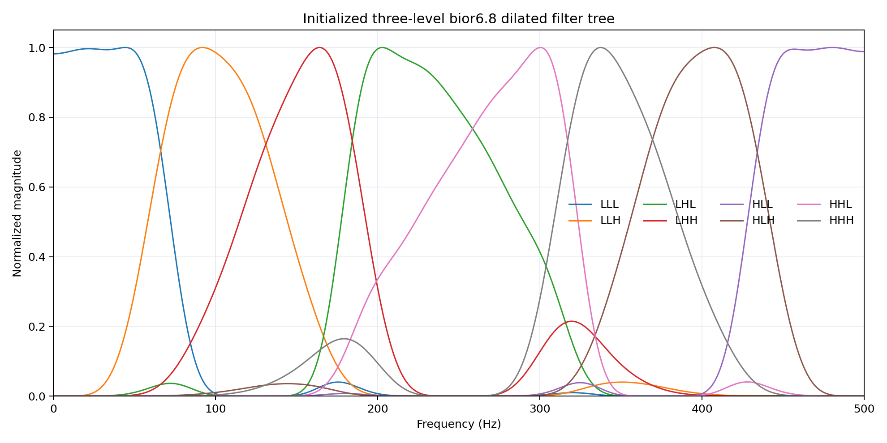

# ECoG finger-trajectory decoding

In 2018, we published a CNN-LSTM model for continuous finger-trajectory
decoding from ECoG:

> Z. Xie, O. Schwartz, and A. Prasad, “Decoding of finger trajectory from
> ECoG using deep learning,” *Journal of Neural Engineering*, 15(3), 036009,
> 2018. [doi:10.1088/1741-2552/aa9dbe](https://doi.org/10.1088/1741-2552/aa9dbe)

Several people have asked me for the source code since then. Unfortunately, the
original code was lost when my laptop hard drive failed during a move. I began
this repository in 2026 because those requests deserved a better answer than
“the code is gone.”

This is not a recovered copy of the old Theano project. I rebuilt the method
from the paper, the public BCI Competition IV data, and my recollection of the
original experiments. I also used the opportunity to revisit decisions that
were constrained by the software and compute available at the time. The result
is both a late reimplementation and a continuation of the original work.

The [project report](docs/project-report.md) contains the complete experimental
record. This README is meant to explain what the current pipeline does, why its
less obvious choices were made, and how to reproduce it.

## Overview

The task is BCI Competition IV, Data Set 4: continuous reconstruction of five
glove trajectories from ECoG in three subjects. The model is trained separately
for each subject and finger.

The signal path follows the main structure of the 2018 model:

1. FastICA initializes a trainable spatial convolution.
2. A three-level, dilated `bior6.8` wavelet-packet tree produces eight spectral
   outputs without temporal decimation.
3. Squared activation is accumulated in non-overlapping 40 ms bins.
4. LARS selects a sparse set of spatial-spectral features.
5. A nonlinear LSTM models the temporal history and predicts the trajectory.

The LARS solution is more than a pruning step. It gives the recurrent decoder a
working regression function before nonlinear optimization begins. Parameters
that should initially contribute little are randomized at approximately
`1e-3`, rather than fixed at zero, so the LSTM starts in a near-linear regime
without losing nonlinear capacity. Training first fits the recurrent head with
the spatial and spectral stem frozen, then fine-tunes the complete differentiable
model at a smaller learning rate.

The original four-second minibatches were largely a Theano static-graph
constraint, not a physiological assumption. The current implementation can use
longer histories, caches reconstructed windows, and keeps the small dataset in
GPU memory.

## What was changed, and why

### Glove baseline correction

The raw glove channels have a slowly varying baseline. A single baseline for an
entire recording leaves long segments with different resting levels; aggressive
event-level correction, on the other hand, can distort the movement itself.
The current target pipeline estimates a local lower envelope and subtracts it
before normalization.

Crucially, that envelope is refitted inside every training fold. “Split-safe
target” in this repository means that neither the baseline nor the normalization
for a held-out interval was estimated from that interval. This matters because
the target preprocessing is part of the fitted model, even though it occurs on
the glove rather than the ECoG.

### Cross-finger movement

Ring and little finger trajectories often contain genuine co-movement. An early
version of this reconstruction assigned each event to whichever finger had the
largest corrected trajectory. That winner-take-all rule produced visually clean
targets, but it also moved small deflections from one finger to another and
occasionally created an apparent movement where none existed.

The released trajectories are therefore preserved for scoring, and the cleaned
targets use conservative baseline subtraction rather than hard finger
assignment. Separate per-finger models allow spatial and spectral filters to
specialize without pretending that the biomechanics are independent.

### Event-grouped validation

Every 40 ms prediction uses several seconds of preceding ECoG. Randomly
splitting adjacent bins would put strongly overlapping input histories on both
sides of the split and give an optimistic validation score. The cross-validation
code instead keeps complete movement/rest events together and removes 95 bins
(3.8 s) around each held-out boundary.

The competition training file contains 400,000 labeled samples per subject. We
use its first two-thirds as the **model-fitting partition** and reserve its last
third as a **chronological validation partition**. The three event folds are
built only inside the model-fitting partition. They are built separately for
each subject and finger because their event distributions differ.

After the model family, target pipeline, seeds, and epoch count have been chosen
from these folds, the configuration is evaluated once on the untouched
chronological validation partition. This extra check tests whether a choice made
on earlier events transfers to a later recording period.

### Notch filtering and trainable filters

The ECoG is notch-filtered at 60, 120, and 180 Hz before the learned filter bank.
This explicitly removes narrow power-line components instead of asking the
network to suppress them from limited data.

The spatial and wavelet filters are initialized from FastICA and the
biorthogonal tree, but they remain trainable during the second stage. Their
initial frequency responses are measured directly; the intended eight-band
coverage is shown below.



## Current results

The primary comparison remains Pearson correlation with the released,
unmodified test glove trajectory. `Macro-5` is the mean across all five fingers.
The paper values below are calculated from its rounded per-finger CNN-LSTM
numbers, so they should not be interpreted as more precise versions of the
paper's rounded aggregate.

| Subject | 2018 paper | Final train+validation refit | Test-informed best of runs* |
|---|---:|---:|---:|
| S1 | 0.556 | 0.512 | **0.652** |
| S2 | 0.408 | **0.423** | **0.512** |
| S3 | 0.582 | 0.488 | **0.699** |

### How the final refit is produced

Before the final refit, the preprocessing, architecture, history length, and
epoch rule are fixed using separate event-grouped cross-validation for every
subject and finger. The folds cover the complete competition training file.
The network weights are then initialized anew and trained on that complete
development recording.

| Phase | Data used | Purpose |
|---|---|---|
| Model selection | All 400,000 samples, held out by fold | Three event-grouped folds choose the configuration separately for every subject and finger. |
| Final refit | All 400,000 development samples | Reinitialize six members and train the selected configuration. |
| Final test | Separate 200,000-sample released test file | Compute the reported test PCC; test labels are not used for fitting or selection. |

Here, “complete development recording” means the full 400,000-sample labeled
competition training file; it never includes the released test recording.

This final-refit result is the one to use when evaluating the reproducible
pipeline. It exceeds the rounded paper mean for S2, but not yet for S1 or S3.
The largest gaps are not explained by a global finger permutation or a simple
temporal lag. They are concentrated in particular fingers and recording
periods, consistent with target-regime and ECoG nonstationarity.

`*` This column is not a held-out performance estimate.

### What “test-informed best of runs” means

During reconstruction, many models produced predictions for the released test
recording. After inspecting the test labels, we selected the saved prediction
with the highest test PCC separately for each subject/finger pair. S1 thumb also
uses a blend of two saved predictions, with the mixing weight chosen to maximize
test PCC.

This is an oracle analysis: it uses the answers from the test set to choose
which run to report. It cannot tell us how the selection rule would perform on
a new recording where the glove trajectory is unknown, and it must not be
compared with the paper as a fair held-out result.

We retain the analysis because it answers a narrower diagnostic question: *did
any model we trained recover the signal for this finger?* All fifteen pairs have
at least one test prediction above the corresponding rounded paper value. The
gap between this oracle result and the final train+validation refit shows how
much performance is currently lost because training-only validation does not
reliably identify the best model across recording periods.

The per-finger values and the provenance of every route are recorded in
[`docs/results/retrospective-extension.json`](docs/results/retrospective-extension.json).


## PCC and trajectory quality

PCC is invariant to affine scaling. A prediction can therefore correlate well
with the glove while having almost no visible amplitude, or it can follow the
main events while producing unacceptable motion during rest. PCC is retained
for comparison with the paper, but model diagnosis also includes derivative
PCC, rest RMS, movement-state F1, peak amplitude, and event-aligned plots.

The visualization uses a label-free display transform: a development-derived
baseline is removed, a smooth nonnegative projection is applied, and gain is
matched to the development target distribution. This makes amplitude failures
visible without altering the raw-coordinate PCC or fitting a scale to the test
labels.


The plots reveal errors that the aggregate score obscures. S1 middle remains
strongly confounded with index movement. S2 often recovers onset while missing
individual peaks. S3 has the strongest overall event timing, but some dense
movement sequences are merged or truncated. These observations motivate the
cross-finger latent-assignment and velocity-prediction experiments described in
the report.

## Main experimental conclusions

- Direct raw-target training improved the first final S1-thumb refit from
  0.647 to 0.714. An 80-unit, three-seed LSTM ensemble reached 0.698 and had
  better velocity and amplitude behavior, but did not improve on the best
  single-model PCC.
- Seed ensembles can reduce variance, provided collapsed seeds are excluded
  using training-only evidence. They did not eliminate the chronological
  distribution shift.
- A redundant overcomplete biorthogonal dictionary lost PCC on 11 of 15
  subject/finger combinations. Extra atoms did not compensate for the added
  estimation burden on this dataset, so the original eight-band tree remains
  the default.
- Latent movement-state gating improved some retrospective morphologies but did
  not consistently improve the final refit.
- Hard winner-take-all target correction is rejected because it can transfer
  movement between fingers.

These are conclusions from this reconstruction, not claims about what was or
was not tried in the original unpublished code. Full tables, unsuccessful
experiments, and visual diagnoses are retained in the
[project report](docs/project-report.md).

## Data

Download [BCI Competition IV, Data Set 4](https://www.bbci.de/competition/iv/)
and arrange the competition files and released labels as follows:

```text
data/raw/bci_competition_iv_ds4/
├── mat/
│   ├── sub1_comp.mat
│   ├── sub2_comp.mat
│   └── sub3_comp.mat
└── true_labels/
    ├── sub1_testlabels.mat
    ├── sub2_testlabels.mat
    └── sub3_testlabels.mat
```

The competition data are not redistributed here. The loader validates the
expected shapes before an experiment begins.

## Installation

Python 3.10 or newer is required.

```bash
python -m venv .venv
source .venv/bin/activate
python -m pip install --upgrade pip
python -m pip install -e ".[dev]"
```

Native Mamba support is optional and is not needed for the selected LSTM path
or the test suite.

## Reproduce the core pipeline

```bash
export PYTHONPATH=scripts:src

python scripts/audit_dataset.py
python scripts/preprocess_dataset.py --subjects 1 2 3
python scripts/prepare_split_safe_targets.py --subjects 1 2 3
python scripts/audit_wavelet_frequency_response.py

# Build complete-event folds and purge one input history at every boundary.
python scripts/build_event_stratified_folds.py --subjects 1 2 3 \
  --fingers thumb index middle ring little --purge-bins 95 \
  --target-map configs/targetsafe_conservative_targets.yaml \
  --output-root outputs/event_stratified_folds_targetsafe_conservative_v1

# Train the per-subject/per-finger LARS-initialized models.
python scripts/run_event_lars_e2e_nested_cv.py --subjects 1 2 3 \
  --fingers thumb index middle ring little --folds 0 1 2 --seeds 0 1 \
  --target-map configs/targetsafe_conservative_targets.yaml \
  --fold-root outputs/event_stratified_folds_targetsafe_conservative_v1 \
  --output-root outputs/event_lars_e2e_softplus_targetsafe_lr1e4_v1 \
  --warmup-epochs 8 --max-epochs 48 --learning-rate 1e-4 \
  --spatial-learning-rate 3e-6 --wavelet-learning-rate 3e-6 \
  --output-activation softplus

# Refit the fixed selections on train+validation and render the diagnostics.
python scripts/run_frozen_event_refits.py
python scripts/summarize_frozen_full_refit.py
python scripts/render_extension_report.py \
  --routing configs/retrospective_diagnostic_routing.yaml

python -m pytest -q
```

Some selected fingers use a 100-step input history. Exact configurations and
the negative/ablation recipes are listed in the
[reproduction recipes](docs/project-report.md#reproduction-recipes).

## Repository layout

```text
configs/                 versioned preprocessing and model settings
docs/                    report, figures, and compact result summaries
scripts/                 audits, training, selection, and visualization
src/ecog_decoding/       reusable loading, preprocessing, features, and models
tests/                   synthetic unit and regression tests
data/                    local competition files (ignored)
outputs/                 predictions, checkpoints, and logs (ignored)
```

## Citation

If this reimplementation is useful, please cite the 2018 paper above. The
included [`CITATION.cff`](CITATION.cff) distinguishes this software repository
from the original publication and from the lost historical source code.
