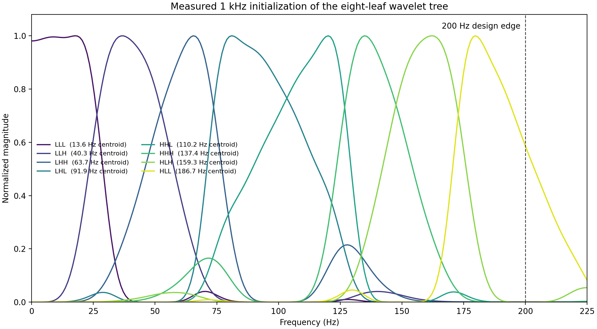
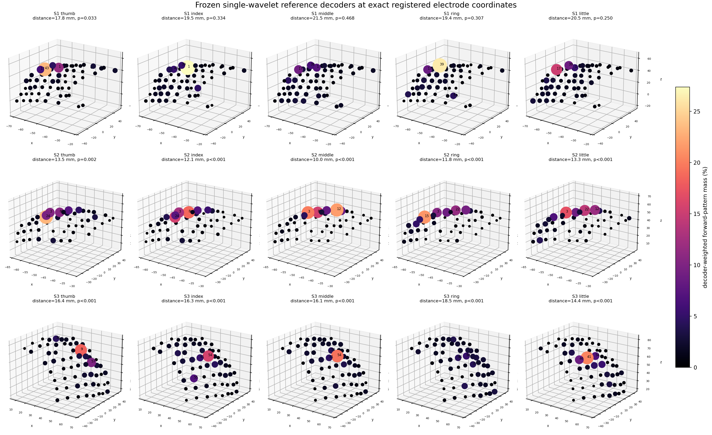
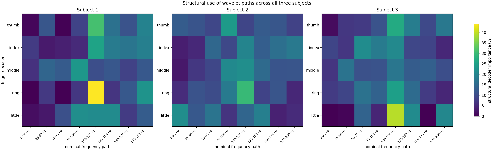
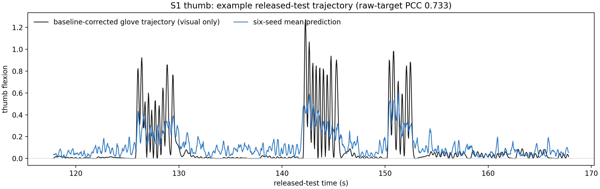

# ECoG finger-trajectory decoding

In 2018, we published a CNN-LSTM model for continuous finger-trajectory
decoding from electrocorticography (ECoG):

> Z. Xie, O. Schwartz, and A. Prasad, “Decoding of finger trajectory from
> ECoG using deep learning,” *Journal of Neural Engineering*, 15(3), 036009,
> 2018. [doi:10.1088/1741-2552/aa9dbe](https://doi.org/10.1088/1741-2552/aa9dbe)

Several people have asked me for the source code. Unfortunately, the original
code was lost when my laptop hard drive failed during a move. I began this
repository in 2026 because those requests deserved a better answer than “the
code is gone.”

This repository is a 2026 reimplementation built from the paper, the public
BCI Competition IV data, and my recollection of the original experiments; the
lost Theano/Keras source was unavailable. OpenAI Codex using GPT-5.6 Sol
substantially assisted with code, experiment orchestration, diagnostics, and
documentation. I remain responsible for the scientific decisions and
interpretation.

The release records one development-selected model structure for each of the
15 subject/finger pairs. A route is either one model or an equal-weight average
of random-seed refits with the same structure. Every route shows strictly
positive nested cross-fold validation PCC gain over its own untuned
initialization. Model selection uses development data; released-test labels are
reserved for final descriptive scoring.
The machine-readable source of truth is the
[`model registry`](configs/canonical_models.yaml), with the complete
[`audit`](docs/results/canonical-model-audit.json) and a compact
[`results table`](docs/canonical-model-release.md).

## The original single-tree baseline

The common baseline trains one model for each subject and finger. Every baseline
model has the same signal path:

1. Remove the documented bad channel(s), notch 60, 120, and 180 Hz line noise,
   and standardize ECoG with statistics fitted on the training split.
2. Initialize a 1x1 spatial convolution with FastICA components and a small
   finger-specific CSP bank. CSP (common spatial patterns) contrasts movement
   of the decoded finger with common rest. Most models use one CSP row; the S1
   thumb, middle, and little models use 2, 4, and 8 rows respectively.
3. Pass every spatial component through one three-level, undecimated
   `bior6.8` wavelet-packet tree. “Undecimated” means that the convolutions do
   not discard time samples.
4. Convert each of the eight terminal wavelet signals to log energy in
   non-overlapping 40 ms bins, giving a 25 Hz feature sequence aligned with the
   glove trajectory.
5. Use LARS, a sparse linear regression, to select spatial-frequency histories
   and provide the initial temporal decoder.
6. Use development folds to select the LSTM learning rate and update count,
   including zero updates when the LARS initialization is better. When selected,
   fine-tune the full differentiable path at a smaller stem learning rate. A
   Softplus output represents nonnegative flexion.

The matched baseline uses LARS in two closely related ways:

| Baseline decoder | Prediction before tuning | What tuning changes | Pairs |
|---|---|---|---:|
| LARS-initialized LSTM | The LSTM weights are set so that the LSTM itself approximately reproduces the LARS prediction. | The LSTM, and when selected the spatial-wavelet frontend, can move away from that starting prediction. | 14 |
| Fixed LARS plus residual LSTM | `prediction = fixed LARS prediction + LSTM correction`. The correction output starts at exactly zero, so the initial prediction is exactly LARS. | The LSTM learns only the additive correction; the LARS term remains fixed. | S3 little |

The LARS-initialized models use one of two LSTM cell definitions. The
paper-equation cell follows the printed 2018 recurrence and omits the usual
`tanh` on the candidate and exposed cell state. The standard cell uses
PyTorch's conventional LSTM equations. In this matched baseline, S1 thumb,
index, and little use the paper-equation cell; the other 11 LARS-initialized
models use the standard cell. Both definitions operate on one feature stream
and produce one trajectory output.

Every one of the 15 released routes has positive tuned-minus-initialized PCC on
nested development folds. For the S3-little residual form, tuning raises OOF
PCC from `0.631943` to `0.649982` (`+0.018039`). The complete release contains
other development-selected structures, which are listed separately in the
[`detailed release table`](docs/canonical-model-release.md).

### Why interpolate the wavelet filters?

The competition ECoG is stored at 1 kHz, so an ordinary three-level wavelet
packet divides the 0–500 Hz Nyquist range. The useful acquisition range is
concentrated below approximately 200 Hz. Allocating five of eight initial
wavelet leaves above that range wastes the initialization.

The released model keeps the 1 kHz samples and changes the filters rather than
resampling the input. The first `bior6.8` low/high pair is stretched by 5/2 with
polyphase Kaiser interpolation. The next two levels use the original taps at
dilations 5 and 10. This preserves the 1 kHz time grid while giving eight
measured response centroids at approximately 13.6, 40.3, 63.7, 91.9, 110.2,
137.4, 159.3, and 186.7 Hz. The path labels are Gray-coded after high-pass
splits, so `H` and `L` strings should not be read as a simple left-to-right
frequency order.



The [machine-readable frequency audit](docs/results/frequency-compressed-wavelet-initialization.json)
comes from the implemented PyTorch cascade, including its nonlinearities—not
from idealized textbook band edges.

### Spatial initialization

FastICA supplies label-free spatial components. CSP rows are fitted separately
inside every subject/finger training split. They use the two initialized
wavelet paths covering roughly 100–150 Hz, aggregated before the CSP covariance
calculation. Most models retain the most movement-dominant CSP vector. The S1
thumb retains two movement-dominant vectors; S1 middle retains two vectors from
each covariance tail; and S1 little retains four from each tail. These choices
were made from purged development folds.

Every selected CSP vector is applied to the same notched broadband ECoG as the
ICA rows. The complete bank forms the rows of one spatial convolution feeding
one temporal tree.

LARS selects histories from the eight wavelet energies of every retained
spatial row. The baseline decoder therefore contains one spatial convolution,
one wavelet tree, and one LSTM.

## What the trained single-wavelet models learned

For a matched cross-subject interpretation, this audit uses six frozen
single-wavelet seeds for every subject/finger pair: 90 checkpoints in total,
with no retraining or model selection. This common reference family matches 8
of the 15 selected release structures. The other 7 panels are historical
same-family references and characterize that reference family rather than the
different selected structures.

Spatial importance is based on covariance-transformed forward patterns,
weighted by the recurrent decoder's structural use of each component, rather
than treating a discriminative spatial-filter coefficient as source amplitude.
Every retained model input was matched to an exact registered `(x, y, z)`
coordinate. A permutation null then reassigned the same weights across that
subject's retained contacts.

The subjects differ clearly. S1 has overlapping, comparatively distributed
maps: only thumb is nominally compact (`p=0.0327`), and none of its five tests
survive a 15-pair Bonferroni threshold. All five S2 maps (`p<=0.0016`) and all
five S3 maps (`p<=0.0001`) are more compact than their coordinate-permutation
nulls. These statistics describe regional concentration rather than
single-electrode control: the footprints overlap, and S3 ring distributes
weight over about 42 effective channels inside its preferred region.



The decoders also emphasize different mixtures of the same eight wavelet paths.
Spectral centroids span `100.7-128.8 Hz` for S1, `83.0-119.6 Hz` for S2, and
`93.8-123.7 Hz` for S3. Across all 90 checkpoints, the largest path-centroid
displacement from initialization is only `0.120 Hz`, and the largest relative
kernel change is `0.324%`. The learned distinction is therefore mainly readout
reweighting of nearly fixed passbands, not movement of the filters to new
frequencies. Squaring each path before pooling removes carrier-phase sign, so
the analysis measures band-energy use.



These post-hoc model attributions describe the inputs used by the frozen
decoders; causal neurophysiology would require an intervention. The complete
protocol and reproducible scripts are in the
[`experiment record`](experiments/docs/single-wavelet-mechanistic-interpretation.md),
with all 15 compact numerical summaries in
[`JSON`](experiments/results/single-wavelet-mechanisms-all-subjects.json).

## Target and validation

The glove trajectories have slowly changing rest levels. A local lower-envelope
baseline is therefore fitted and subtracted separately inside each split. The
window is subject-specific because the glove drift differs across recordings.
Hard winner-take-all assignment is not used: ring/little and other finger pairs
can genuinely co-move, and forced reassignment can fabricate movement on the
wrong finger. For S1 little only, development-fold diagnostics selected a soft
event-level attenuation when another finger clearly dominates; ambiguous and
co-moving events are retained.

Random bin splits would leak nearly identical ECoG histories across train and
validation. Model selection instead uses three folds made from complete
movement/rest events. A 95-bin (3.8 s) margin is removed around every held-out
interval. Target baselines, normalization, FastICA, CSP, and LARS are refitted
inside every fold.

The complete 400,000-sample competition training file is the development set.
After cross-fold selection, each selected route is refitted on all development
samples. A route may be one model or an equal-weight ensemble of independently
refitted seeds with the same structure. The separate 200,000-sample released
test file is used only for the final descriptive score.

## Released-test results

The reported metric is Pearson correlation coefficient (PCC) against the
unmodified released test glove trajectory. These test scores are descriptive:
model structure, hyperparameters, update schedule, and ensemble membership were
fixed from development folds before final scoring. Paper values are rounded as
published, so very small differences should not be overinterpreted. The
`Difference` column compares released-test scores. Tuning gain is reported
separately from nested development OOF predictions relative to each route's
own untuned initialization.

| Subject | Finger | 2018 paper | 2026 release | Difference |
|---|---|---:|---:|---:|
| S1 | Thumb | 0.750 | 0.733 | -0.017 |
| S1 | Index | 0.790 | 0.759 | -0.031 |
| S1 | Middle | 0.170 | **0.285** | **+0.115** |
| S1 | Ring | 0.600 | **0.657** | **+0.057** |
| S1 | Little | 0.470 | 0.454 | -0.016 |
| **S1** | **Macro-5** | **0.556** | **0.578** | **+0.022** |
| S2 | Thumb | 0.620 | 0.579 | -0.041 |
| S2 | Index | 0.380 | 0.377 | -0.003 |
| S2 | Middle | 0.270 | 0.210 | -0.060 |
| S2 | Ring | 0.470 | **0.555** | **+0.085** |
| S2 | Little | 0.300 | **0.393** | **+0.093** |
| **S2** | **Macro-5** | **0.408** | **0.423** | **+0.015** |
| S3 | Thumb | 0.740 | 0.734 | -0.006 |
| S3 | Index | 0.550 | **0.619** | **+0.069** |
| S3 | Middle | 0.460 | **0.644** | **+0.184** |
| S3 | Ring | 0.410 | **0.557** | **+0.147** |
| S3 | Little | 0.750 | 0.617 | -0.133 |
| **S3** | **Macro-5** | **0.582** | **0.634** | **+0.052** |

Seven of 15 individual finger scores and all three subject Macro-5 scores exceed
the rounded paper values. The exact results, architecture for every route,
development gain, member count, and artifact checks are in the
[`detailed release table`](docs/canonical-model-release.md) and
[`machine-readable audit`](docs/results/canonical-model-audit.json).

The example below shows the released S1-thumb six-seed mean prediction. The
50-second interval was selected using total glove movement across all five S1
fingers, without looking at prediction fit. The black trace is baseline-corrected
only to make movement morphology visible; the `0.733` PCC in the title is the
whole-file score against the unmodified released-test target.



The [experimental archive](experiments/README.md) preserves the alternative
models and diagnostics that preceded the selected release.

## Reproduce the release

Download [BCI Competition IV, Data Set 4](https://www.bbci.de/competition/iv/)
and arrange it as follows:

```text
data/raw/bci_competition_iv_ds4/
├── mat/
│   ├── sub1_comp.mat
│   ├── sub2_comp.mat
│   └── sub3_comp.mat
└── true_labels/
    ├── sub1_testlabels.mat
    ├── sub2_testlabels.mat
    └── sub3_testlabels.mat
```

The competition data are not redistributed. Python 3.10 or newer is required.

```bash
python -m venv .venv
source .venv/bin/activate
python -m pip install --upgrade pip
python -m pip install -e ".[dev]"
export PYTHONPATH=scripts:src

python scripts/audit_dataset.py
python scripts/preprocess_dataset.py --subjects 1 2 3
python scripts/build_event_stratified_folds.py \
  --subjects 1 2 3 --fingers thumb index middle ring little \
  --purge-bins 95 --selection-scope full-development \
  --target-map configs/targetsafe_conservative_targets.yaml \
  --output-root outputs/event_stratified_folds_fulldev_targetsafe_conservative_v1

python scripts/audit_wavelet_frequency_response.py \
  --sampling-rate 1000 --tap-resample-up 5 --tap-resample-down 2 \
  --fft-size 32768 \
  --output outputs/single_wavelet_1000hz_tap5over2_v1/frequency_response.json

python scripts/run_single_wavelet_cv.py \
  --subjects 1 2 3 --fingers thumb index middle ring little \
  --gpus 0 1 2 3 4 5 6 7 \
  --fold-root outputs/event_stratified_folds_fulldev_targetsafe_conservative_v1 \
  --output-root outputs/single_wavelet_1000hz_tap5over2_nested_v2 \
  --model-rate 1000 --tap-resample-up 5 --tap-resample-down 2 \
  --head-learning-rate 1e-4 --spatial-learning-rate 3e-6 \
  --wavelet-learning-rate 3e-6 --lars-candidate-scale 1 \
  --sequence-steps 100 --sequence-stride 25 --batch-size 24 \
  --csp-mode movement_1 --output-activation softplus --softplus-beta 10 \
  --sampler-mode dense_sequences --selection-metric raw_pcc \
  --selection-rule best --compile

python scripts/run_single_wavelet_refits.py \
  --selection-root outputs/single_wavelet_1000hz_tap5over2_nested_v2 \
  --output-root outputs/single_wavelet_1000hz_tap5over2_full_refit_v1 \
  --model-rate 1000 --tap-resample-up 5 --tap-resample-down 2 \
  --head-learning-rate 1e-4 --spatial-learning-rate 3e-6 \
  --wavelet-learning-rate 3e-6 --lars-candidate-scale 1 \
  --sequence-steps 100 --sequence-stride 25 --batch-size 24 \
  --csp-mode movement_1 --output-activation softplus --softplus-beta 10 \
  --sampler-mode dense_sequences --selection-metric raw_pcc \
  --selection-rule best --gpus 0 1 2 3 4 5 6 7 --compile

python scripts/run_single_wavelet_ensemble.py \
  --selection-root outputs/single_wavelet_1000hz_tap5over2_nested_v2 \
  --initialization-root outputs/single_wavelet_1000hz_tap5over2_full_refit_v1 \
  --output-root outputs/single_wavelet_1000hz_tap5over2_six_seed_refit_v1 \
  --seeds 0 1 2 3 4 5 --gpus 0 1 2 3 4 5 6 7 \
  --model-rate 1000 --tap-resample-up 5 --tap-resample-down 2 \
  --head-learning-rate 1e-4 --spatial-learning-rate 3e-6 \
  --wavelet-learning-rate 3e-6 --lars-candidate-scale 1 \
  --sequence-steps 100 --sequence-stride 25 --batch-size 24 \
  --csp-mode movement_1 --output-activation softplus --softplus-beta 10 \
  --sampler-mode dense_sequences --selection-metric raw_pcc \
  --selection-rule best --compile

PYTHONPATH=experiments/scripts:scripts:src \
  python experiments/scripts/run_residual_recurrent_sweep.py \
  --pairs 3:little --gpus 0 1 2 3 4 5 6 7

python scripts/run_single_wavelet_ensemble.py \
  --subjects 3 --fingers little --seeds 0 1 2 3 4 5 \
  --selection-root outputs/residual_recurrent_single_wavelet_oof_v1/residual_lstm/lr1e-4 \
  --initialization-root outputs/single_wavelet_1000hz_tap5over2_full_refit_v1 \
  --output-root outputs/residual_recurrent_single_wavelet_s3_little_six_seed_v1 \
  --force-schedule frozen_150 --recurrent-cell residual_lstm \
  --head-learning-rate 1e-4 --spatial-learning-rate 0 \
  --wavelet-learning-rate 0 --csp-mode movement_1 \
  --sequence-steps 100 --output-activation softplus --softplus-beta 10 \
  --gpus 0 1 2 3 4 5 --compile

python scripts/summarize_single_wavelet_ensemble.py \
  --root outputs/single_wavelet_1000hz_tap5over2_six_seed_refit_v1 \
  --route-map configs/final_single_wavelet_routes.yaml \
  --output-root outputs/final_single_wavelet_routes

PYTHONPATH=experiments/scripts:scripts:src \
  python experiments/scripts/audit_canonical_models.py \
  --manifest configs/canonical_models.yaml \
  --require-release-pass \
  --output docs/results/canonical-model-audit.json

python -m pytest -q
```

The training commands above reproduce the original single-tree baseline. The
development-selected per-pair routes are specified in the
[`model registry`](configs/canonical_models.yaml). The earlier
[`configs/final_single_wavelet_routes.yaml`](configs/final_single_wavelet_routes.yaml)
records the historical homogeneous single-tree release.

The code caches reconstructed wavelet leaves in `/dev/shm` and uses
`torch.compile(mode="reduce-overhead")` for repeated training calls. On the H100
server, the final S1 full-development refits took 17–101 seconds after the
shared cache was prepared; the eight-CSP-row little-finger model is the slowest.
For new GPU runs, `--lasso-backend torch_fista` evaluates the sparse Lasso path
in parallel; the default CPU LARS path remains available for exact reproduction.

## Repository layout

```text
configs/                 target and split settings
docs/                    detailed report, figures, and machine-readable results
scripts/                 release preprocessing, validation, training, and rendering
src/ecog_decoding/       reusable model and preprocessing components
tests/                   release-path tests
experiments/             alternatives, negative controls, and historical diagnostics
data/                    local competition files (ignored)
outputs/                 checkpoints and generated outputs (ignored)
```

See the [project report](docs/project-report.md) for the full protocol, matched
400/1000 Hz comparison, visual interpretation, and a concise record of rejected
alternatives. If this reimplementation is useful, please cite the 2018 paper;
[`CITATION.cff`](CITATION.cff) distinguishes the software release from the
original publication and lost historical source.
