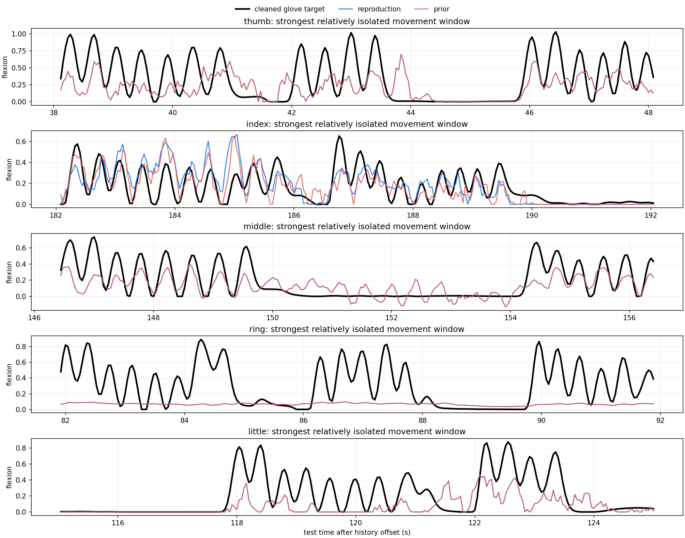

# ECoG finger-trajectory decoding

Late reimplementation and extension of:

> Z. Xie, O. Schwartz, and A. Prasad, “Decoding of finger trajectory from
> ECoG using deep learning,” *Journal of Neural Engineering*, 15(3), 036009,
> 2018. [doi:10.1088/1741-2552/aa9dbe](https://doi.org/10.1088/1741-2552/aa9dbe)

## Important provenance note

This repository is **not the original 2018 source release**. The original code
was lost when the first author's laptop hard drive failed during a move. This
implementation was rebuilt in 2026 from the published paper, the public BCI
Competition IV data, and the author's methodological recollection. It should be
read as a late, independent reimplementation and research continuation—not as
an archival recovery or a claim of bit-for-bit reproduction.

The reconstruction deliberately tests newer alternatives where the old design
can be improved. It retains the paper's biorthogonal wavelet initialization,
energy-binning idea, FastICA spatial initialization, and recurrent comparison,
while adding stricter leakage controls, per-finger model selection, modern
sequence backbones, and visual trajectory diagnostics.

The full methods, experiment history, numerical tables, limitations, and visual
diagnosis are in the [project report](docs/project-report.md).

## Current status

The primary score is Pearson correlation against the released, unmodified test
glove trajectories. `Hist-4` is the original competition convention: thumb,
index, middle, and little finger, excluding ring. `Macro-5` includes all five.

| Subject | Thumb | Index | Middle | Ring | Little | Macro-5 | Hist-4 |
|---|---:|---:|---:|---:|---:|---:|---:|
| S1 reconstructed | 0.696 | 0.809 | 0.296 | 0.612 | 0.395 | 0.561 | 0.549 |
| S2 reconstructed | 0.599 | 0.472 | 0.208 | 0.495 | 0.373 | 0.429 | 0.413 |
| S3 reconstructed | 0.711 | 0.508 | 0.637 | 0.676 | 0.693 | 0.645 | 0.637 |

These are not uniformly better than the paper. Eight of the fifteen per-finger
PCC values exceed the rounded CNN-LSTM values reported in 2018. S2 and S3 exceed
their reconstructed rounded aggregate references, but S1's `Hist-4` score is
0.011 below the paper figure's 0.56. More importantly, S1 ring has PCC 0.612 but
only 0.127 movement-peak amplitude ratio and 0.054 movement-state recall. Its
trajectory is nearly flat, so it is a failure by visual and morphology criteria
despite the apparently respectable correlation.



Machine-readable summaries are versioned in [`docs/results`](docs/results).
Raw recordings, released test labels, checkpoints, predictions, and working
outputs are intentionally excluded from the repository.

## Data

Use [BCI Competition IV, Data Set 4](https://www.bbci.de/competition/iv/), whose
data remain governed by the competition's terms. Download the competition files
and true labels from the official site, then arrange them as:

```text
data/raw/bci_competition_iv_ds4/
├── mat/
│   ├── sub1_comp.mat
│   ├── sub2_comp.mat
│   └── sub3_comp.mat
└── true_labels/
    ├── sub1_testlabels.mat
    ├── sub2_testlabels.mat
    └── sub3_testlabels.mat
```

No competition data are distributed in this repository. The loader validates
the expected shapes before any experiment runs.

## Method in brief

ECoG is processed at 1 kHz with documented bad-channel removal, narrow notches
at 60/120/180 Hz, and training-partition-only standardization. Glove targets are
downsampled to 25 Hz and audited under both the paper-like constrained baseline
and more local lower-envelope baselines. Winner-take-all finger reassignment is
not used in the final paths because it created movement on the wrong finger.

The paper-style front end is a three-level undecimated wavelet packet tree
initialized from the 17-tap `bior6.8` analysis filters. Its dilations are 1, 2,
and 4, yielding 2, 4, and 8 bands. Band energy is computed in non-overlapping
40 ms bins. FastICA is fit on the training partition and initializes the spatial
1x1 convolution. Fixed-feature LSTM, GRU, diagonal SSM, linear-attention, Mamba,
TCN, CSP, ridge, and LARS-style baselines are all available. Final selection is
per subject and per finger using only a chronological validation partition.

The 2018 implementation's four-second training blocks were a Theano static-graph
constraint, not a physiological assumption; modern training can operate on the
complete contiguous sequence. CUDA paths use `torch.compile(mode="reduce-overhead")`
when supported.

## Installation

Python 3.10 or newer is required.

```bash
python -m venv .venv
source .venv/bin/activate
python -m pip install --upgrade pip
python -m pip install -e ".[dev]"
```

Native Mamba is optional and is not required by the test suite or the selected
reproduction paths.

## Reproduce the core pipeline

```bash
export PYTHONPATH=src

python scripts/audit_dataset.py
python scripts/preprocess_dataset.py --subjects 1 2 3
python scripts/prepare_paper_baseline_targets.py --subjects 1 2 3
python scripts/compare_target_baselines.py --subjects 1 2 3
python scripts/audit_wavelet_frequency_response.py
python -m pytest -q
```

The exact experiment commands used for the reported subject-specific paths are
listed in the [project report](docs/project-report.md#reproduction-recipes).

## Evaluation policy

- Fit preprocessing, ICA, feature selection, model parameters, and any ensemble
  weights without released test labels.
- Select candidates on one chronological validation partition.
- Evaluate the final frozen candidate against the original released glove
  trajectory, not a cleaned surrogate.
- Report every finger, `Macro-5`, and competition-style `Hist-4`.
- Inspect movement windows, rest false positives, derivative PCC, state F1,
  movement peak ratio, and peak-triggered shape; PCC alone can be misleading.

## Repository layout

```text
configs/                 versioned preprocessing and model settings
docs/                    detailed report, figures, compact result summaries
scripts/                 audits, benchmarks, training, selection, visualization
src/ecog_decoding/       reusable loading, preprocessing, features, and models
tests/                   synthetic unit and regression tests
data/                    local competition files (ignored)
outputs/                 generated arrays, checkpoints, logs, figures (ignored)
```

## Citation

If this reimplementation is useful, cite the 2018 paper above. A
[`CITATION.cff`](CITATION.cff) file is included for citation managers and makes
the distinction between the software reimplementation and the original paper.

## Contributing

See [CONTRIBUTING.md](CONTRIBUTING.md). In particular, do not commit competition
data, true labels, model checkpoints, machine-specific configuration, or outputs
that reveal local paths.
