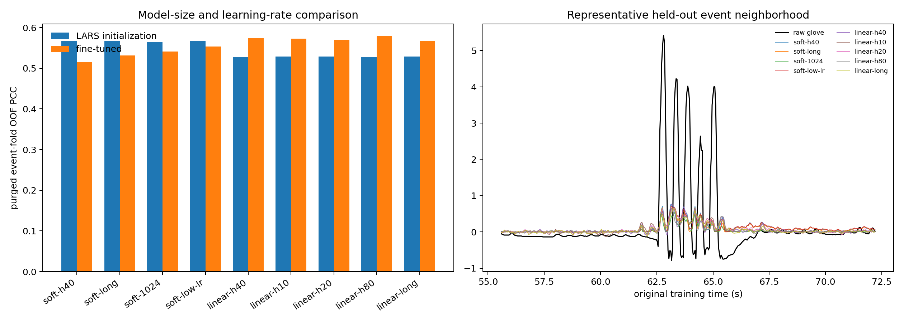

# ECoG finger-trajectory decoding

Late reimplementation and research continuation of:

> Z. Xie, O. Schwartz, and A. Prasad, “Decoding of finger trajectory from
> ECoG using deep learning,” *Journal of Neural Engineering*, 15(3), 036009,
> 2018. [doi:10.1088/1741-2552/aa9dbe](https://doi.org/10.1088/1741-2552/aa9dbe)

## Provenance

This repository is **not the original 2018 source release**. The original code
was lost when the first author's laptop hard drive failed during a move. This
implementation was rebuilt in 2026 from the paper, the public BCI Competition
IV data, and the author's methodological recollection. It is a late independent
reimplementation and extension, not an archival recovery or a claim of
bit-for-bit reproduction.

The reconstruction retains the paper's FastICA spatial initialization,
three-level dilated biorthogonal-wavelet tree, 40 ms energy bins, sparse linear
feature selection, and recurrent decoder. It adds explicit 60/120/180 Hz notch
filtering, split-safe glove baselines, per-subject/per-finger models, event-level
cross-validation, modern GPU training, seed ensembles, and trajectory-shape
diagnostics.

The [project report](docs/project-report.md) gives the full methods, experiment
history, numerical results, limitations, and visual diagnosis.

## Current results

The primary score is Pearson correlation against the released unmodified test
glove trajectory. `Macro-5` is the mean across all five fingers. The paper
numbers below are rounded per-finger CNN-LSTM values; its aggregate is also a
five-finger mean, so a rounded `0.56` must not be compared with any one finger.

Three result tiers are kept separate:

1. **Training-only event CV.** Target baselines are refit inside each split,
   complete movement/rest events define three folds, 95 bins are purged around
   every held-out interval, and model/seed decisions use only out-of-fold data.
   The frozen configuration has OOF `Macro-5` 0.488, 0.444, and 0.373 for
   S1--S3.
2. **Frozen full-development refit.** The OOF-selected configurations are fit
   on all development rows for a fixed median epoch count and the released test
   is evaluated once. This is the strongest protocol implemented here, although
   the released labels had already been viewed during earlier reconstruction.
3. **Retrospective diagnostic ceiling.** Previously saved predictions are
   routed per finger after released-test inspection. This answers whether the
   signal is present and supports visual diagnosis, but it is not an unbiased
   benchmark or a deployable selector.

### Frozen full-development refit

| Subject | Thumb | Index | Middle | Ring | Little | Macro-5 | Mean of rounded paper fingers* |
|---|---:|---:|---:|---:|---:|---:|---:|
| S1 | 0.647 | 0.774 | 0.111 | 0.565 | 0.435 | **0.506** | 0.556 |
| S2 | 0.602 | 0.394 | 0.298 | 0.534 | 0.245 | **0.415** | 0.408 |
| S3 | 0.715 | 0.346 | 0.439 | 0.513 | 0.417 | **0.486** | 0.582 |

`*` This is computed from the paper's rounded per-finger values; it is not a
more precise reconstruction of the paper's rounded aggregate figure.

The large OOF-to-chronological drop is concentrated in S1 and S3 and is not
explained by a global finger permutation or a one-bin lag. It is evidence of
temporal nonstationarity and target-regime mismatch. S1 middle is especially
confounded with index movement; S3 has genuine multi-finger co-movement, which
makes hard winner-take-all reassignment unsafe.

### Retrospective diagnostic ceiling

| Subject | Result | Thumb | Index | Middle | Ring | Little | Macro-5 |
|---|---|---:|---:|---:|---:|---:|---:|
| S1 | 2018 paper | 0.750 | 0.790 | 0.170 | 0.600 | 0.470 | 0.556 |
| S1 | 2026 diagnostic routing | 0.752 | 0.821 | 0.498 | 0.636 | 0.554 | **0.652** |
| S2 | 2018 paper | 0.620 | 0.380 | 0.270 | 0.470 | 0.300 | 0.408 |
| S2 | 2026 diagnostic routing | 0.622 | 0.556 | 0.395 | 0.579 | 0.407 | **0.512** |
| S3 | 2018 paper | 0.740 | 0.550 | 0.460 | 0.410 | 0.750 | 0.582 |
| S3 | 2026 diagnostic routing | 0.757 | 0.630 | 0.648 | 0.702 | 0.759 | **0.699** |

All fifteen retrospective per-finger scores exceed the rounded paper values.
For S1 thumb, this requires a 9.6% blend of the raw-target 80-unit ensemble into
the previous 0.740 route; its weight was selected on released-test PCC and it
reaches 0.752. Because released-test labels determine this diagnostic routing,
these numbers must not be reported as confirmatory performance. The
machine-readable routing explicitly records this fact in
[`docs/results/retrospective-extension.json`](docs/results/retrospective-extension.json).


PCC alone can reward a correctly timed but nearly invisible trace. The report
figures therefore use a separate display-domain mapping: a label-free
20th-percentile baseline, smooth nonnegative projection, and a
99.5th-percentile gain matched to the development target distribution. It
changes amplitude and morphology metrics, not Pearson correlation, and never
fits gain to released-test labels.


### Main experimental findings

- A LARS-initialized nonlinear LSTM is useful, but the output should train in a
  linear regime; Softplus during optimization reduced S1-thumb OOF PCC.
- Initializing coefficients that should be zero with random magnitude near
  `1e-3` preserves nonlinear capacity without destroying the sparse linear
  starting function.
- Equal-weight seed ensembles help when collapsed seeds are excluded using
  training-only evidence. They reduce variance but do not remove the
  chronological regime shift.
- Direct raw-target training raises the first frozen S1-thumb refit from 0.647
  to 0.714. A training-only seed-1/2 ensemble selected at OOF PCC 0.614 fell to
  0.694 terminally. An 80-unit three-seed ensemble held OOF PCC at 0.629 and
  improved its best terminal member from 0.692 to 0.698, with stronger visual
  amplitude and velocity behavior. The remaining S1-thumb gain is retrospective
  blending, not a confirmatory training result.
- A redundant overcomplete bior dictionary lost on 11 of 15 fingers and did not
  justify its extra atoms. The original eight-band three-level tree remains the
  default.
- Latent movement-state gating and state-aware residuals improve retrospective
  morphology, especially for cross-finger interference. Direct winner-take-all
  target correction fabricates movement on the wrong finger and is rejected.
- The initialized filter responses cover the intended eight spectral bands;
  the measured cascade response is shown below and audited numerically.




## Data

Use [BCI Competition IV, Data Set 4](https://www.bbci.de/competition/iv/), whose
data remain governed by the competition's terms. Download the competition files
and true labels from the official site, then arrange them as:

```text
data/raw/bci_competition_iv_ds4/
├── mat/
│   ├── sub1_comp.mat
│   ├── sub2_comp.mat
│   └── sub3_comp.mat
└── true_labels/
    ├── sub1_testlabels.mat
    ├── sub2_testlabels.mat
    └── sub3_testlabels.mat
```

No competition data are distributed in this repository. The loader validates
the expected shapes before any experiment runs.

## Method in brief

ECoG is processed at 1 kHz with documented bad-channel removal, zero-phase
notches at 60/120/180 Hz, and training-partition-only standardization. Glove
targets are downsampled to 25 Hz. Local lower-envelope baselines are refit within
each split; no future segment informs a training target.

The spectral front end is a three-level undecimated wavelet-packet tree
initialized from the 17-tap `bior6.8` analysis filters. Dilations 1, 2, and 4
yield eight terminal bands. The zero coefficient is omitted as in the paper
reconstruction, and band energy is accumulated in non-overlapping 40 ms bins.
FastICA fitted on training data initializes the spatial 1x1 convolution.

The decoder is fit separately for every subject and finger. Fixed-feature LARS,
ridge, LSTM, GRU, diagonal SSM, linear-attention, Mamba, TCN, CSP, and trainable
wavelet variants remain available. The frozen reproduction path uses a
LARS-initialized LSTM and a two-stage schedule: train the recurrent head with the
stem frozen, then fine-tune the differentiable spatial and wavelet stem at a
smaller learning rate.

The 2018 four-second training blocks were a Theano static-graph limitation, not
a physiological assumption. Modern paths cache window reconstruction, use
strided views where safe, keep small datasets resident on the GPU, and request
`torch.compile(mode="reduce-overhead")` when supported.

## Installation

Python 3.10 or newer is required.

```bash
python -m venv .venv
source .venv/bin/activate
python -m pip install --upgrade pip
python -m pip install -e ".[dev]"
```

Native Mamba is optional and is not required by the selected reproduction path
or the test suite.

## Reproduce the core pipeline

```bash
export PYTHONPATH=scripts:src

python scripts/audit_dataset.py
python scripts/preprocess_dataset.py --subjects 1 2 3
python scripts/prepare_split_safe_targets.py --subjects 1 2 3
python scripts/audit_wavelet_frequency_response.py

# Build split-safe complete-event folds with a 3.8 s purge for the 4 s input.
python scripts/build_event_stratified_folds.py --subjects 1 2 3 \
  --fingers thumb index middle ring little --purge-bins 95 \
  --target-map configs/targetsafe_conservative_targets.yaml \
  --output-root outputs/event_stratified_folds_targetsafe_conservative_v1

# Run the per-finger nested LARS-initialized trainable-wavelet models.
python scripts/run_event_lars_e2e_nested_cv.py --subjects 1 2 3 \
  --fingers thumb index middle ring little --folds 0 1 2 --seeds 0 1 \
  --target-map configs/targetsafe_conservative_targets.yaml \
  --fold-root outputs/event_stratified_folds_targetsafe_conservative_v1 \
  --output-root outputs/event_lars_e2e_softplus_targetsafe_lr1e4_v1 \
  --warmup-epochs 8 --max-epochs 48 --learning-rate 1e-4 \
  --spatial-learning-rate 3e-6 --wavelet-learning-rate 3e-6 \
  --output-activation softplus

# Repeat selected fingers with --sequence-steps 100 and the output root named
# in configs/final_event_ensemble.yaml before freezing the per-finger map.

# Refit the frozen configuration on all development rows and evaluate once.
python scripts/run_frozen_event_refits.py
python scripts/summarize_frozen_full_refit.py

# Recreate the explicitly retrospective diagnostic figures.
python scripts/render_extension_report.py \
  --routing configs/retrospective_diagnostic_routing.yaml

python -m pytest -q
```

Exact targeted commands and the negative/ablation experiments are documented
in the [project report](docs/project-report.md#reproduction-recipes).

## Evaluation policy

- Fit preprocessing, ICA, target baselines, feature selection, model parameters,
  ensemble membership, and epoch count without released-test labels.
- Keep complete movement/rest events together and purge every held-out boundary
  by at least the receptive-field history.
- Report the original released glove PCC for paper comparison.
- Keep raw-coordinate scoring separate from cleaned-flexion visualization.
- Report all five fingers and `Macro-5`; `Hist-4` is supplementary only and is
  never compared with the paper's five-finger aggregate.
- Inspect event timing, rest false positives, derivative PCC, movement-state F1,
  and peak amplitude. PCC is a proxy, not the scientific endpoint.
- Label every test-inspected routing or ablation as retrospective.

## Repository layout

```text
configs/                 versioned preprocessing and model settings
docs/                    detailed report, figures, compact result summaries
scripts/                 audits, benchmarks, training, selection, visualization
src/ecog_decoding/       reusable loading, preprocessing, features, and models
tests/                   synthetic unit and regression tests
data/                    local competition files (ignored)
outputs/                 generated arrays, checkpoints, logs, figures (ignored)
```

## Citation

If this reimplementation is useful, cite the 2018 paper above. A
[`CITATION.cff`](CITATION.cff) file is included for citation managers and makes
the distinction between this software reimplementation and the original paper.

## Contributing

See [CONTRIBUTING.md](CONTRIBUTING.md). Do not commit competition data, true
labels, checkpoints, prediction arrays, credentials, `.remote`, or
machine-specific paths.
