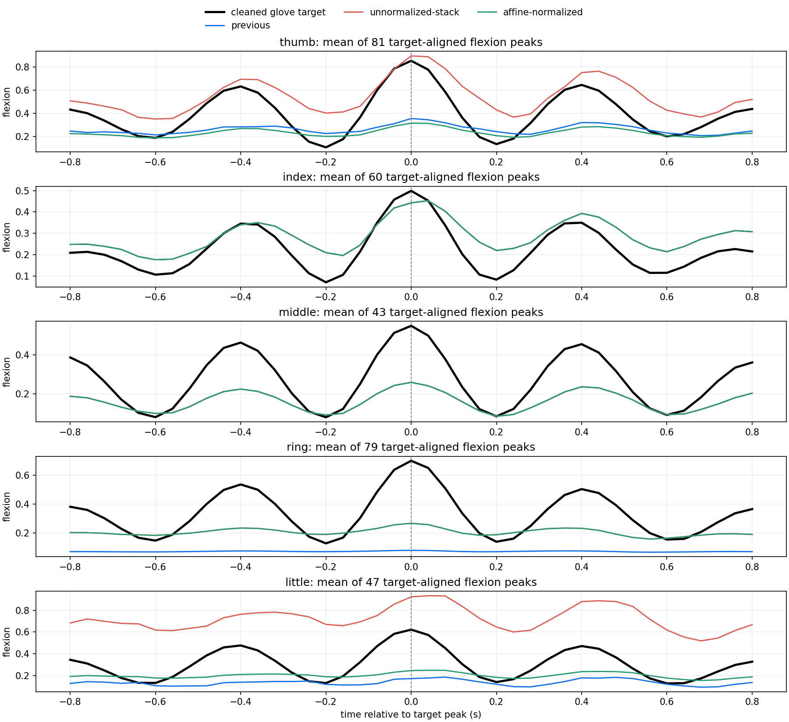
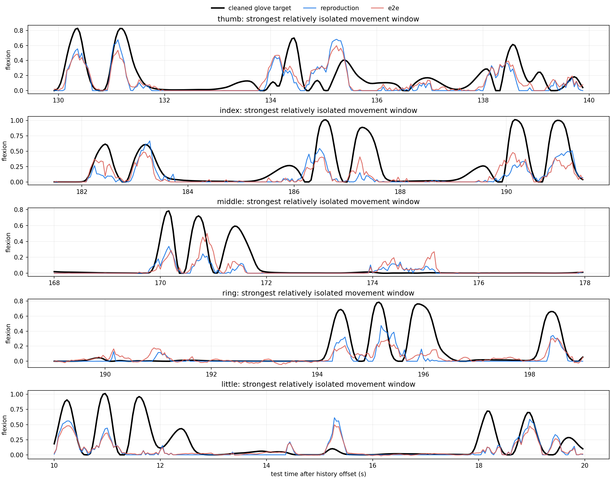
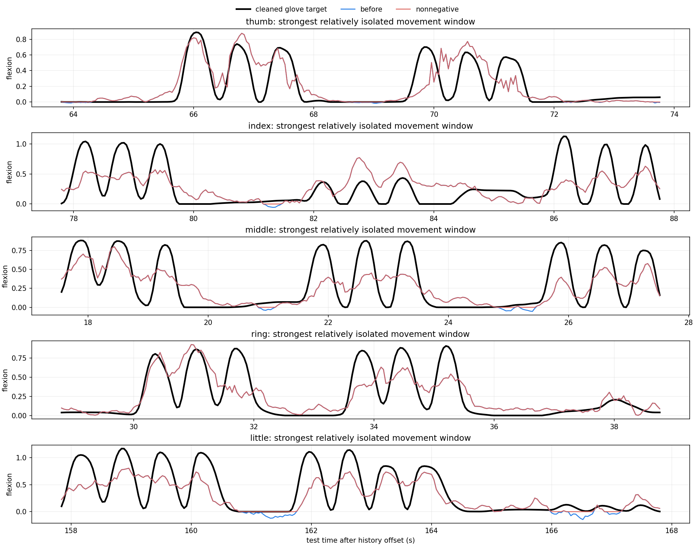

# Project report: late reimplementation of ECoG finger-trajectory decoding

**Report date:** 4 September 2026

**Original study:** Xie, Schwartz, and Prasad (2018),
[*Decoding of finger trajectory from ECoG using deep learning*](https://doi.org/10.1088/1741-2552/aa9dbe)

## Executive summary

This project is a late reimplementation and extension of the first author's
2018 ECoG finger-trajectory decoding work. The original source code was lost
when the author's laptop hard drive failed during a move. The present repository
was therefore rebuilt in 2026 from the paper, the public BCI Competition IV
Data Set 4 recordings, and methodological recollection. It is not the original
code, and the results should not be described as a bit-for-bit reproduction.

The reconstruction recovered the main modeling ideas: a trainable spatial
filter initialized by FastICA; a three-level, dilated, biorthogonal wavelet tree;
40 ms band-energy bins; and temporal decoding. It also made three important
modeling and evaluation changes. First, every data-derived choice is fit on a
chronological training or validation partition. Second, each subject and finger
may use a different validated decoder, avoiding competition between five output
heads. Third, model quality is judged from held-out trajectory shape as well as
Pearson correlation.
The rebuilt preprocessing also explicitly applies zero-phase notch filters at
60 Hz and its 120/180 Hz harmonics to suppress power-line contamination.

The current raw-test `Macro-5` PCC is 0.578 for S1, 0.429 for S2, and 0.646 for
S3. The paper's aggregate is a five-finger average, so these values—not
`Hist-4`—are the correct comparison. S1's preceding reconstruction already
matched the paper's rounded 0.56 at 0.561; the exploratory stacked system
reaches 0.578 after nonnegative output projection.
Across all fifteen subject-finger pairs, eight reconstructed PCCs exceed the
rounded paper CNN-LSTM values.

The S1 headline is a heterogeneous system, not one end-to-end decoder. Thumb
and little use validation-only ridge stacking followed by amplitude calibration;
index and middle retain their selected base models; ring retains a separately
calibrated base prediction. The non-stacked per-finger baseline is reported
alongside the headline result because the second-stage stack needs independent
replication.
A constrained calibration repairs the previously near-flat ring trace:
movement-state recall rises from 0.054 to 0.863 and peak ratio from 0.127 to
0.576. The first thumb/little stack improved correlation and timing but visibly
overshot amplitude. Positive affine normalization fitted on validation preserves
PCC while reducing thumb/little rest RMS to 0.063/0.099 and movement peak ratios
to 0.534/0.587. The remaining middle-finger false activity and under-amplitude
are preserved in the figures rather than hidden behind one aggregate number.

## Scope and research goals

The work began as an attempt to recover the 2018 pipeline after repeated code
requests. Once it became clear that the original implementation could not be
recovered, the goal changed from historical replication to a transparent,
better-documented reimplementation that asks:

1. Can the paper's fixed wavelet-energy representation still support useful
   finger decoding with modern, leakage-controlled training?
2. Does a modern state-space or linear-attention model improve on an LSTM?
3. Should all five fingers share a decoder, or should model choice be made per
   subject and per finger?
4. Can target correction remove glove drift and finger coupling without
   fabricating movement on the wrong finger?
5. Do numerical improvements correspond to visibly better movement timing,
   amplitude, and rest behavior?

The primary goal is a physiologically credible trajectory. PCC is a useful
proxy, but it is not allowed to override obvious visual failure.

## Data and split

The project uses BCI Competition IV Data Set 4. The public files are not
redistributed here. Each subject has 400,000 training ECoG samples and 200,000
released test samples at 1 kHz. Glove trajectories have five columns and are
released on the same 1 kHz grid before downsampling.

| Subject | Raw ECoG channels | Removed physical channels | Retained channels |
|---|---:|---|---:|
| S1 | 62 | 55 | 61 |
| S2 | 48 | 21, 38 | 46 |
| S3 | 64 | 50 | 63 |

The manuscript names S3 channel 49, but it also states that S3 retained 63 of 64
channels. The raw-data audit and the author's recollection resolve this as a
zero-based index: physical channel 49 is normal, while physical channel 50
(array index 49) has a test-only burst with more than 250-fold variance
inflation. The corrected loader therefore removes physical channel 50 only.

The training recording is divided chronologically. The first two-thirds of the
training file are available for fitting and the last third is validation. On
the complete train-plus-released-test timeline, this is approximately 44% model
fit, 22% validation, and 33% final test. The test labels are used only after a
candidate and its hyperparameters have been frozen. The public summaries include
test metrics for reporting, but no selector is permitted to read them.

## ECoG preprocessing

### Bad channels and line noise

The primary path removes the channels listed above and applies narrow IIR notch
filters at 60, 120, and 180 Hz. This decision was made after spectral audits of
the released recordings and is consistent with the expectation that the ECoG
needs power-line rejection. Retained channels are standardized using means and
scales fitted only on the model-fitting portion of the training recording.

### Spatial initialization

FastICA is fit separately for every subject and only on its training partition.
Its unmixing matrix initializes a bias-free 1x1 spatial convolution. A CUDA
implementation is available for speed, while scikit-learn remains the fixed
feature reference. Early LassoLars experiments selected ICA-band features per
finger. Joint pruning was not imposed on the final five-output model because a
component weak for one finger can still be important for another. Later paths
instead allow separate finger models or structured feature selection.

## Glove target preprocessing

### Baseline removal

The paper-like target uses a constrained lower-envelope baseline. In compact
form, it minimizes an L1 distance from baseline to observed trajectory plus a
squared first-difference smoothness penalty, with the baseline constrained to
remain below the trajectory. The paper reconstruction uses a tension parameter
of `1e5`.

A single global smoothness value did not follow all local resting-level changes.
The audit therefore also creates rolling lower-envelope variants at explicitly
named time scales (for example `local_w2_q10`: a two-second window and tenth
percentile). The local window and quantile are selected from chronological
validation decoding, not from test labels.

Every primary score in this report is calculated against the original released
test glove trajectory. A cleaned target is used only to visualize movement
morphology and calculate diagnostic quantities such as state F1.

### Why winner-take-all correction was rejected

Ring and little fingers are mechanically coupled, so a small ring displacement
can accompany intended little-finger motion. The initial reconstruction tried
to assign each event to one winning finger and remove estimated coupling. This
created a decisive failure: activity that belonged to the index finger could
appear as corrected little-finger movement during a period when the raw little
finger did not move.

Consequently, the primary pipeline retains all five baseline-subtracted glove
channels and does not apply winner-take-all reassignment. Event-corrected targets
remain only as an experimental comparison. This preserves real co-movement and
avoids inventing categorical intent not present in the released measurements.

## Wavelet-energy front end

The reconstructed front end follows the paper's core structure:

- biorthogonal `bior6.8` analysis filters;
- three levels of an undecimated wavelet-packet tree;
- 2, 4, and 8 filters at dilations 1, 2, and 4;
- 17 active coefficients, omitting the inert zero coefficient remembered from
  the original implementation;
- zero-padding for the exact fixed-feature reproduction;
- scaled-tanh activation after each layer; and
- L2 energy followed by `log1p` in non-overlapping 40 ms bins.

The output rate is therefore 25 Hz, matching the downsampled glove trajectory.
Each decoded step sees the preceding 25 energy bins, corresponding to one second
of history. A dedicated frequency-response audit measures every initialized
branch before training; this is necessary because correct coefficient values can
still be wired into an incorrect tree or dilation pattern.

The 100-step/four-second block in the legacy implementation was a Theano
static-graph limitation. It is not retained as a biological context limit. The
modern code can train over complete contiguous sequences or use chunks only to
manage memory.

## Temporal and spatial model audit

The following families were implemented or benchmarked:

- fixed wavelet/ICA energy with ridge or LARS-style sparse regression;
- LSTM and GRU;
- a parallel diagonal state-space baseline;
- causal linear attention;
- native Mamba where its optional dependency is available;
- causal dilated TCN;
- movement-versus-rest CSP in multiple frequency bands; and
- beta-gated high-gamma amplitude heads.

Modern sequence models were not assumed to be superior. On this small dataset,
the diagonal SSM, linear-attention, and Mamba experiments did not consistently
beat the simpler recurrent or TCN models. The strongest S1/S2 route used
finger-specific fixed-feature LSTMs with exact end-to-end wavelet refinement for
selected fingers. S3 benefited from movement-versus-rest CSP and a shape-aware
TCN, then a validation-selected blend with beta-gated/high-gamma components.

Filter terminology separates the spectral and spatial stages. In a
trainable-wavelet route, gradient descent updates both the bior6.8 wavelet taps
and the FastICA-initialized spatial projection. In a fixed-wavelet route, both
are frozen. A fixed-bandpass+CSP route instead uses conventional frozen
frequency bands with CSP spatial filters estimated on training data and then
frozen. A learned temporal head alone does not make either front end trainable.

| Final route | Subject/fingers | Spectral front end | Spatial front end |
|---|---|---|---|
| Trainable wavelet | S1 index; S2 index, middle | Gradient-trained bior6.8 taps | Gradient-trained, FastICA-initialized projection |
| Fixed wavelet | S1 ring; S2 thumb, ring, little | Frozen bior6.8 taps | Frozen FastICA projection |
| Fixed bandpass+CSP | S1 middle; all S3 fingers | Frozen conventional bandpass filters | Training-estimated, frozen CSP |
| Fixed-only ensemble | S1 thumb | Fixed wavelet and fixed bandpass candidates | Fixed FastICA/CSP/SPoC candidates |
| Mixed ensemble | S1 little | Fixed candidates plus a trainable-wavelet candidate | Mixed fixed and gradient-trained candidates |

S1 little is the sole mixed case: its validation stack includes the
trainable-wavelet little-finger candidate with standardized coefficient 0.0465.
S1 thumb also considered a trainable-wavelet candidate, but its selected
coefficient was exactly zero. S1 index and S2 index/middle are the only final
outputs driven directly by a gradient-trained ICA/wavelet front end. The
machine-readable audit is `docs/results/learned-filter-map.json`.

The table describes the frozen final routing rather than claiming that only
those fingers benefited during development. A later S2-thumb end-to-end run
reached validation PCC 0.630 versus 0.600 for the fixed-feature LSTM, but its
held-out test PCC was 0.579 versus 0.599. Selecting the fixed result after seeing
that test comparison would be test-aware, so the discrepancy is retained as a
sensitivity result. The exact end-to-end runs used a front-end learning rate of
1e-5 and a temporal-head learning rate of 1e-3. Since several fingers peaked in
the first five validation checks, this single conservative rate does not rule
out early overfitting; a smaller-rate and frozen-front-end warm-up audit remains
appropriate future work.

CSP is useful for S3 but did not replace the S1/S2 fixed-window models. The
strongest tested CSP-family checkpoints reached Macro-5 0.471 for S1 and 0.286
for S2, versus 0.578 and 0.429 for the selected systems. S1's validation stack
gave the raw CSP candidate zero weight for both stacked fingers, although a
calibrated CSP trace contributed as a complementary component.

The beta-gated/high-gamma head was initially evaluated only for S3. A completed
transfer ablation confirms that this was not an overlooked S1/S2 improvement.
For S1, gamma-only and beta-gated variants reached Macro-5 0.470 and 0.410; for
S2 they reached 0.346 and 0.316. No individual finger exceeded its selected
S1/S2 result. In particular, S2 middle reached at most 0.183 versus 0.208, and
S1 little reached at most 0.328 versus 0.420. These candidates are retained as
negative controls rather than added to the final ensembles.

Separate per-subject models are mandatory because channel geometry differs.
Separate per-finger models were also allowed: sharing one spatial and spectral
representation across all five outputs can cause competition, especially when
their signal-to-noise ratios and useful bands differ.

For the latest S1 PCC-leading candidate, thumb and little-finger predictions
from the fixed-feature, end-to-end, CSP, SPoC, and ridge families are combined
with a nonnegative ridge stack. Its ridge penalty is selected by blocked
`TimeSeriesSplit` folds entirely inside the chronological validation partition;
the selected model is then fit on all validation predictions and frozen before
test scoring. Ring uses a separate smooth floor/dead-zone/gain calibration whose
PCC, derivative PCC, recall, peak ratio, and rest-RMS constraints are likewise
evaluated only on validation data.
Finally, positive affine scale and offset are fitted on the cleaned validation
target for stacked thumb and little predictions. Pearson correlation is
unchanged by that affine operation; it only calibrates amplitude and baseline.
The final exported flexion is then projected onto the nonnegative target domain
with `maximum(prediction, 0)`. This deterministic operation fits no parameter,
and the exact unconstrained predictions are retained as audit outputs. It cannot
rescue wrong timing or wrong-finger activity.

### Nonnegative output projection

Baseline-corrected flexion is nonnegative by construction, but unconstrained
regression created small extension-like troughs. The zero-floor projection was
promoted because it improved chronological validation as well as visual
morphology: validation Macro-5 changed from 0.5832 to 0.5893 for S1 and from
0.6260 to 0.6307 for S3; S2 was already nonnegative. On released test data,
Macro-5 changes from 0.5742 to 0.5782 for S1 and from 0.6390 to 0.6460 for S3.
Raw-target RMSE can increase slightly because the uncorrected glove recording
contains negative baseline drift; cleaned-target RMSE and derivative PCC improve.

CUDA was used for feature generation and neural training. Supported training
paths request `torch.compile(mode="reduce-overhead")`. Keeping the complete
small dataset in device memory reduces transfer overhead, but wall time is still
affected by wavelet feature construction, repeated validation, and per-finger
candidate sweeps.

## Model selection and metrics

All model and ensemble choices are made independently for each finger using the
chronological validation partition. A missing finger prediction is represented
as `NaN` and cannot win selection. Fixed hyperparameters inherited from the
paper, such as a 100-epoch refit audit, are fixed before test evaluation.

Primary reporting uses:

- per-finger Pearson correlation on the raw released test glove;
- macro average over all five fingers (`Macro-5`);
- historical competition average over thumb, index, middle, and little
  (`Hist-4`; ring excluded); and
- RMSE on the raw target.

Visual/morphology diagnostics use a baseline-corrected target only as an audit:

- movement-state precision, recall, and F1;
- RMS prediction during rest;
- derivative PCC;
- movement-window peak-amplitude ratio;
- peak-triggered waveform correlation and lag; and
- plotted movement and rest windows.

This distinction matters. Correlation is scale-invariant and can reward a small,
nearly invisible waveform if its timing happens to align with the target.

## Results

### Per-finger raw-test PCC

Paper values below are the rounded CNN-LSTM numbers reported in the 2018 paper.
They are a historical reference, not high-precision targets.

| Subject | Finger | Paper CNN-LSTM | Reimplementation | Difference |
|---|---|---:|---:|---:|
| S1 | Thumb | 0.750 | 0.730 | -0.020 |
| S1 | Index | 0.790 | 0.809 | +0.019 |
| S1 | Middle | 0.170 | 0.308 | +0.138 |
| S1 | Ring | 0.600 | 0.618 | +0.018 |
| S1 | Little | 0.470 | 0.426 | -0.044 |
| S2 | Thumb | 0.620 | 0.599 | -0.021 |
| S2 | Index | 0.380 | 0.472 | +0.092 |
| S2 | Middle | 0.270 | 0.208 | -0.062 |
| S2 | Ring | 0.470 | 0.495 | +0.025 |
| S2 | Little | 0.300 | 0.373 | +0.073 |
| S3 | Thumb | 0.740 | 0.720 | -0.020 |
| S3 | Index | 0.550 | 0.525 | -0.025 |
| S3 | Middle | 0.460 | 0.632 | +0.172 |
| S3 | Ring | 0.410 | 0.666 | +0.256 |
| S3 | Little | 0.750 | 0.687 | -0.063 |

The reimplementation is higher on 8/15 pairs. This count is descriptive; the
rounded paper values do not support a fine-grained statistical superiority
claim.

### Aggregate raw-test PCC

| Subject | Macro-5 | Hist-4 (supplementary) | Paper five-finger aggregate | Interpretation |
|---|---:|---:|---:|---|
| S1 exploratory stacked system | 0.578 | 0.568 | 0.560 | above by 0.018 |
| S1 non-stacked baseline, unconstrained | 0.561 | 0.549 | 0.560 | rounded match |
| S2 | 0.429 | 0.413 | about 0.410 | above |
| S3 | 0.646 | 0.641 | about 0.590 | above |

The paper aggregate averages all five fingers. `Hist-4`, which excludes ring,
is reported only as a separate competition-style diagnostic and is not compared
with the paper aggregate. The paper values are rounded, so the differences above
should not be presented as high-precision or statistical superiority claims.

### Morphology audit

| Subject | Macro rest RMS | Macro state F1 | Macro derivative PCC | Main concern |
|---|---:|---:|---:|---|
| S1 | 0.093 | 0.568 | 0.340 | Middle has heavy false activity; several fingers remain under-amplitude |
| S2 | 0.059 | 0.447 | 0.239 | Middle amplitude and state precision remain weak |
| S3 | 0.145 | 0.660 | 0.350 | Better peak scale, but some rest leakage remains |

The corrected S3 result retains physical channel 49 and removes only physical
channel 50. This policy was selected without test labels: on validation it
reached raw/cleaned Macro-5 of 0.626/0.652, compared with 0.613/0.636 when both
physical channels 49 and 50 were removed. Relative to that 62-channel
sensitivity run, the unconstrained released-test Macro-5 changes from 0.645 to
0.639. The nonnegative projection raises the selected 63-channel result to
0.646, while
middle/ring/little peak ratios improve from
0.616/0.800/0.548 to 0.736/0.968/0.646. Macro rest RMS rises from 0.128 to 0.147
and state F1 falls from 0.677 to 0.660. The 63-channel result is primary because
it wins on validation, matches the paper's stated channel count, and agrees with
the raw artifact location; the 62-channel score is retained only as a
sensitivity result.

The S1 ring repair is the clearest example of why the visual audit is part of
the acceptance criterion. The table compares the original selected prediction
with the validation-constrained calibration:

| S1 ring diagnostic | Before | After |
|---|---:|---:|
| Raw-test PCC | 0.612 | 0.618 |
| Cleaned-target PCC | 0.588 | 0.602 |
| Movement-state recall | 0.054 | 0.863 |
| Movement-state F1 | 0.101 | 0.660 |
| Movement peak ratio | 0.127 | 0.576 |
| Rest RMS | 0.052 | 0.097 |

The repair makes the repeated ring cycles visible, at the cost of additional
rest activity. Validation constraints bound that tradeoff. The initial stacked
thumb and little outputs had peak ratios 1.836 and 2.389 and rest RMS 0.409 and
0.368. Validation-fitted affine normalization changes those to 0.534/0.587 and
0.063/0.099 without changing PCC. Visual inspection confirms that the gross
overshoot and negative rest drift are removed, although amplitude is now
conservative and the middle trace remains noisy.








### Seed stability

Repeated fixed-feature LSTM runs showed small aggregate seed variation: S1
`Macro-5` SD 0.0047 and `Hist-4` SD 0.0053 across three seeds; S2 `Macro-5` SD
0.0067 and `Hist-4` SD 0.0055 across two seeds. These small aggregate SDs do not
imply that every finger is stable or morphologically correct. They also are not
sampling standard errors and should not be interpreted as confidence intervals.

The learnable asymmetric frontend behaves differently. In an experimental
S2-middle audit, three seeds at frontend LR `1e-4` had validation PCC
0.394--0.481 (sample SD 0.044), and three seeds at `3e-4` had PCC 0.405--0.509
(sample SD 0.057). An equal-weight average of all six reached validation PCC
0.522 and descriptive test PCC 0.391, versus 0.455/0.208 for the selected
fixed-feature middle model. Replacing only that finger raises S2 validation
Macro-5 from 0.469 to 0.482 and descriptive test Macro-5 from 0.429 to 0.466.
The morphology score also improves from 0.275 to 0.359, although visual review
still finds a false-positive rest excursion. The ensemble therefore remains an
experimental single-finger result pending purged blocked confirmation and is
not included in the primary table above.

### Context-length and partition-robustness audit

The current weak-finger results are locally saturated with respect to recurrent
context length. Keeping the frontend and feature selection fixed, S1 little
scored 0.353, 0.366, 0.413, and 0.405 with 10 s, 20 s, a smaller 10 s model, and
an almost-contiguous recurrent sequence, respectively; none exceeded the frozen
0.420 result. The corresponding S2 middle scores were 0.142, 0.124, 0.207, and
0.111 versus the frozen 0.208. A five-fold purged chronological ridge refit on
all 400 s also fell to 0.341 for S1 little and 0.114 for S2 middle. These are
rejected diagnostic candidates, not additions to the reported ensemble.

Fitting the label-free ICA spatial transform across the complete 400 s training
recording, rather than only the supervised fit partition, did not close the
fixed-feature gap either. The LARS checkpoint was effectively unchanged for S1
little (0.349 to 0.350) and declined for S2 middle (0.120 to 0.092). Thus the
remaining gap is not explained by the amount of data used to estimate ICA.

A post-hoc partition audit helps explain the instability. Selected-feature
target-correlation vectors remain directionally similar across partitions
(fit/test cosine 0.991 for S1 little and 0.878 for S2 middle), and feature mean
and scale shifts are modest. The target regimes are not comparable, however.
For S1 little, cleaned movement occupies 10.2% of fit, 18.1% of validation, and
10.5% of test. For S2 middle it occupies 8.7%, 9.0%, and only 3.2%, while target
standard deviation falls from 0.173 in fit to 0.079 in test. This makes repeated
tuning against the single movement-rich validation block especially prone to
select models that overproduce movement on the sparse test segment.

This audit uses released test labels only for diagnosis after every candidate is
frozen. It must not be used to choose a public model. The evidence supports a
plateau of the present feature-selection/model-selection family, not a claim
that the ECoG signal or the decoding task has reached an intrinsic ceiling. It
also mirrors the paper's observation that improved validation MSE did not always
translate into improved held-out correlation.

## What did not work

### Winner-take-all target assignment

This confused mechanical co-movement with intended movement and created
activity on fingers that were stationary in the raw glove record. It was removed
from the final paths.

### Hard movement binarization

An explicit movement-state target can help a recurrent network recognize
stationary-to-moving transitions, but hard gating created unnatural step-to-zero
artifacts. Soft state-aware objectives and gates were retained only when they
improved the validation morphology score.

### Post-hoc amplitude gain

Increasing gain reduced some peak-amplitude errors and could improve RMSE, but
it also amplified uncertain bumps during rest. A lower-RMSE S3 calibration was
rejected as primary because the plots showed worse rest leakage.

### One architecture for every subject and finger

The same SSM, LSTM, or CSP configuration did not win everywhere. S3 responds
well to CSP plus a TCN, whereas S1/S2 are better served by finger-specific fixed
features and selective end-to-end refinement. The final selector therefore does
not force architectural uniformity for its own sake.

### Unregularized 100-epoch full-data refit

The original paper used 100 epochs, so a final audit retrained the selected S1
fixed-feature LSTM for 100 epochs on the combined fit and validation partitions.
Validation performance had already peaked around epoch 1–5 and then declined.
The fixed 100-epoch refit produced raw-test PCC
`0.593/0.719/0.053/0.346/0.308` and `Hist-4` 0.418, far below the selected
early-stopped model's 0.549. The old epoch count is therefore not portable to
the present optimizer and full-data protocol; this candidate was rejected.

### Longer recurrent context and full-training ridge refits

Removing the old 4 s Theano sequence constraint did not improve the weak S1/S2
fingers. Ten-second, 20-second, and nearly contiguous sequences all remained at
or below the current frozen scores. Likewise, selecting ridge regularization
over purged chronological folds and refitting on the complete training recording
produced high internal cross-validation scores but poor released-test transfer.
This rules out the simple explanations that the 4 s context or the position of
one validation boundary is the main remaining bottleneck.

### PCC-only selection

S1 ring demonstrated the failure mode: scale-invariant correlation remained
high even when movement amplitude and state recall collapsed. Explicit
validation morphology constraints repaired ring. The first thumb/little stack
showed the complementary failure: better PCC and timing coexisted with excessive
gain and rest drift. Positive affine normalization corrected that scale mismatch
without altering PCC. Morphology remains an acceptance constraint, not a
secondary narrative.

## Reproduction recipes

Install the project and place the official competition files as described in
the top-level README. Then:

```bash
export PYTHONPATH=src

# Validate inputs and preprocess all subjects.
python scripts/audit_dataset.py
python scripts/preprocess_dataset.py --subjects 1 2 3
python scripts/prepare_paper_baseline_targets.py --subjects 1 2 3
python scripts/compare_target_baselines.py --subjects 1 2 3

# Confirm the initialized wavelet tree before training.
python scripts/audit_wavelet_frequency_response.py

# Audit whether weak-finger behavior is associated with partition shift.
python scripts/audit_partition_shift.py --subject 1 --finger little \
  --prepared-root outputs/preprocessed_v2 \
  --feature-root outputs/windowed_ica_wavelet_v1 \
  --selection-root outputs/fixed_lars_windowed_ica_screen512_v1 \
  --target local_w2_q10 --output outputs/partition_shift_v1/sub1_little

# Test a label-free ICA fit over the complete released training recording.
python scripts/fit_full_training_fastica.py --subject 1 --backend torch \
  --output-root outputs/full_training_fastica_torch_v1

# Test regularization selected over purged blocks spanning all training data.
python scripts/crossvalidate_selected_ridge.py --subject 1 \
  --feature-root outputs/windowed_ica_wavelet_v1 \
  --selection-root outputs/fixed_lars_windowed_ica_screen512_v1 \
  --target local_w2_q10 --fingers little

# Recreate the frozen S1 per-finger selection.
python scripts/select_per_finger_ensemble.py --subject 1 \
  --prepared-root outputs/preprocessed_v2 --history 25 \
  --method stable=outputs/paper_gap_ensemble_v1/sub1 \
  --method e2e_index=outputs/exact_e2e_s1_index_h40_v1/sub1 \
  --output outputs/paper_reproduction_s1_v1/sub1

# Repair the S1 ring trace using validation-only morphology constraints.
python scripts/calibrate_prediction_constrained.py --subject 1 \
  --prepared-root outputs/preprocessed_v2 \
  --prediction-root outputs/paper_reproduction_s1_v1/sub1 \
  --target local_w2_q10 --finger ring \
  --output outputs/s1_ring_constrained_calibration_v1/sub1

# After validation stacking, normalize thumb/little amplitude without changing PCC.
python scripts/normalize_prediction_affine.py --subject 1 \
  --prepared-root outputs/preprocessed_v2 \
  --prediction-root outputs/s1_validation_stack_v1/sub1 \
  --target local_w2_q10 --finger thumb --finger little \
  --output outputs/s1_validation_stack_affine_v1/sub1

# Make the public-facing S1 flexion nonnegative while preserving exact model
# outputs as *_unconstrained.npy files.
python scripts/project_prediction_nonnegative.py --subject 1 \
  --prepared-root outputs/preprocessed_v2 \
  --prediction-root outputs/s1_validation_stack_affine_v1/sub1 \
  --target local_w2_q10 --output outputs/final_nonnegative/sub1

# Recreate the frozen S2 per-finger selection.
python scripts/select_per_finger_ensemble.py --subject 2 \
  --prepared-root outputs/preprocessed_v2 --history 25 \
  --method h40=outputs/s2_lstm_sweep_h40_s3/sub2 \
  --method e2e_index=outputs/exact_e2e_idx_h40_t100_v1/sub2 \
  --method e2e_middle=outputs/exact_e2e_mid_h20_t50_v1/sub2 \
  --output outputs/paper_reproduction_s2_v1/sub2

# Generate held-out morphology panels.
python scripts/diagnose_prediction_morphology.py --subject 1 \
  --prepared-root outputs/preprocessed_v2 --target local_w2_q10 \
  --method reproduction=outputs/paper_reproduction_s1_v1/sub1 \
  --output outputs/paper_reproduction_visual_v1/sub1

python scripts/diagnose_prediction_morphology.py --subject 2 \
  --prepared-root outputs/preprocessed_v2 --target local_w1_q10 \
  --method reproduction=outputs/paper_reproduction_s2_v1/sub2 \
  --output outputs/paper_reproduction_visual_v1/sub2

python -m pytest -q
```

Some selection commands consume previously trained candidate directories. The
candidate-generating scripts and their arguments remain in `scripts/`; the
compact summaries under `docs/results/` identify the selected methods. A future
release should add a manifest that maps every public result to a complete command,
configuration hash, environment lock, and source commit.

## Reproducibility boundaries

This repository improves transparency but does not erase the limitations of a
late reconstruction:

- the original code and exact legacy environment are unavailable;
- paper values are rounded, and not every old training detail is recoverable;
- the released test labels were examined during this research process, even
  though each individual selector is coded to use validation only;
- the current public package excludes raw data and large trained artifacts;
- several experiment scripts reflect research exploration rather than one
  polished end-to-end command; and
- the S1 PCC-leading stack uses a meta-model fit on validation predictions, so
  its aggregate improvement needs independent repetition and is presented as
  an exploratory system rather than a single learned decoder; and
- S1 middle-finger false activity and conservative amplitudes remain unresolved
  even though the historical aggregate PCC has been reached.

For these reasons, the project should be cited as a reimplementation and
extension, not as the official source code accompanying the 2018 publication.

## Recommended next work

1. Improve S1 middle-finger precision and test whether blocked affine fits can
   raise conservative amplitudes without increasing rest activity.
2. Build a fully scripted experiment manifest from raw files to every reported
   summary, including hashes and package versions.
3. Repeat the selected S1 and S2 models over at least five seeds and report both
   aggregate and per-finger variability.
4. Repeat the ring calibration on blocked validation folds to quantify how
   stable the improved movement recall is.
5. Replace the single chronological validation selector with nested blocked
   cross-validation for the complete nonlinear training pipeline; the fixed
   ridge version has now been tested and did not transfer.

## Public-release policy

The repository contains code, configuration, tests, documentation, compact JSON
summaries, and derived diagnostic figures. It excludes:

- competition recordings and true-label files;
- `.remote`, credentials, environment variables, and machine-specific paths;
- checkpoints, prediction arrays, logs, caches, and temporary files; and
- the locally downloaded paper or supplement.

Contributors should preserve this boundary in every pull request.
