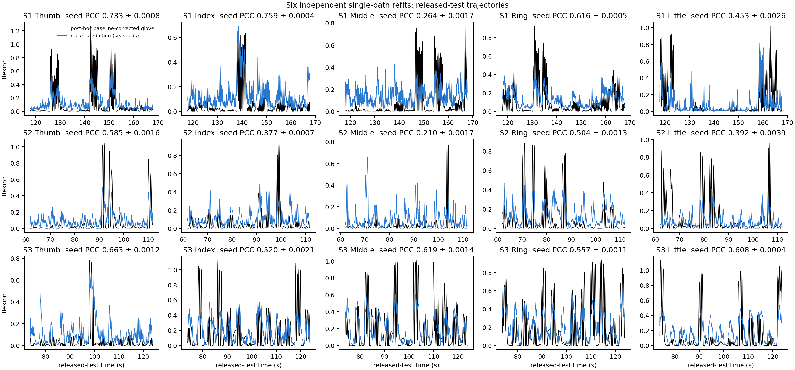

# Project report: ECoG finger-trajectory decoding reimplementation

**Report date:** 9 September 2026
**Original study:** Z. Xie, O. Schwartz, and A. Prasad, [*Decoding of finger
trajectory from ECoG using deep learning*](https://doi.org/10.1088/1741-2552/aa9dbe),
*Journal of Neural Engineering* 15(3), 036009 (2018)

## Summary

This repository is a late reimplementation of my 2018 ECoG finger-decoding
work. The original Theano/Keras source was lost when my laptop hard drive failed
during a move. I reconstructed the method from the paper, the public BCI
Competition IV Data Set 4 recordings, and my recollection of the original
experiments. It is not the lost code and should not be described as a bitwise
reproduction.

OpenAI Codex using GPT-5.6 Sol substantially assisted with implementation,
remote experiment orchestration, quantitative checks, visual diagnosis, and
documentation. I remain responsible for the scientific choices and
interpretation.

The released 2026 model uses one independently fitted model for each of 3
subjects and 5 fingers, with the same single signal path in all 15 cases. The
path is:

```text
notched 1 kHz ECoG
  -> FastICA rows + a finger-specific CSP initialization bank
  -> one trainable depth-3 bior6.8 wavelet-packet tree
  -> eight log-energy features per spatial row at 25 Hz
  -> 4 seconds of selected feature history
  -> one nonlinear LSTM initialized from LARS
  -> nonnegative Softplus flexion
```

There is no auxiliary low-frequency branch, conventional seven-band branch, or
model stacking in the released result. Development folds select the size of
the CSP initialization bank and one of two equivalent nonlinear LSTM equation
implementations, but every model retains the same one-spatial-bank,
one-wavelet-tree, one-LSTM topology.

Across six independent refits, the released-test Macro-5 Pearson correlations
are **0.565 ± 0.0008 for S1, 0.414 ± 0.0011 for S2, and 0.593 ± 0.0006
for S3** (mean ± population SD). The rounded values reported in the 2018
paper were 0.556, 0.408, and 0.582. All three subjects therefore exceed the
paper's rounded aggregate results, although several individual finger
trajectories remain weaker than their historical counterparts.

## Data

The project uses [BCI Competition IV, Data Set
4](https://www.bbci.de/competition/iv/). Each subject provides 400,000 ECoG
samples for development and a separate 200,000-sample released test recording.
ECoG is stored at 1 kHz. The glove trajectory is aligned to that time grid and
reduced to 25 Hz after preprocessing.

The competition files are not redistributed. The loader removes the following
physical channels:

| Subject | Raw channels | Removed channels | Retained channels |
|---|---:|---|---:|
| S1 | 62 | 55 | 61 |
| S2 | 48 | 21, 38 | 46 |
| S3 | 64 | 50 | 63 |

For S3, removing only physical channel 50 is consistent with retaining 63 of
64 channels and with the raw-data variance audit. Physical channel 49 is kept.

## Preprocessing

### ECoG

Narrow zero-phase notch filters remove 60, 120, and 180 Hz line noise. Channel
means and scales are fitted only from the applicable training split. The
software does not impose a strict 200 Hz low-pass filter. A power-spectrum
audit nevertheless found that energy above 200 Hz was small for S1 and S2; S3
contained more 200--300 Hz artifact energy. The wavelet redesign therefore
treats 200 Hz as an initialization design edge, not as a claim that every
sample above 200 Hz is absent.

### Glove trajectories

Glove rest levels drift over time. A local lower-envelope baseline is estimated
and subtracted separately inside each training/validation split. The window is
subject-specific because the drift scale differs among recordings. The target
is normalized using training statistics only.

The preprocessing does not use hard winner-take-all reassignment. Ring and
little fingers, for example, can physically co-move. Forcing every weak movement
to a single winner produced false activity on the wrong finger in an earlier
diagnostic. The default path therefore preserves the observed per-finger
trajectory after baseline correction. S1 little is the sole exception: a soft
event-level attenuation, selected from development folds, suppresses events
clearly dominated by another finger while retaining ambiguous and co-moving
events.

## Spatial initialization

Every subject/finger model starts with a bias-free 1x1 spatial convolution.
Most rows are initialized by FastICA fitted without labels. Additional rows are
initialized by finger-specific common spatial patterns (CSP): movement of the
decoded finger is contrasted with common rest.

The CSP covariance is not fitted from seven conventional bands. It is fitted
from samples in the two initialized wavelet paths centered near 110 and 137 Hz
(lexicographic paths `HHL` and `HHH`). Those samples are concatenated for one
movement-versus-rest eigensystem. Most models retain the most
movement-dominant eigenvector. Development folds selected two
movement-dominant vectors for S1 thumb, two vectors from each covariance tail
for S1 middle, and four vectors from each tail for S1 little. Every CSP vector,
like the ICA rows, is then applied to the same notched broadband ECoG before
the common wavelet tree. CSP is refitted for each finger and inside each
development fold.

This initialization lets the model start with several spatial views sensitive
to the 100--150 Hz movement-related range without creating a second feature
branch: all rows remain channels of one spatial convolution feeding the same
wavelet tree.

## Frequency-compressed wavelet tree

### Why change the initialization?

At 1 kHz, a textbook depth-3 wavelet packet allocates eight leaves across the
0--500 Hz Nyquist range. Much of the competition signal of interest is below
approximately 200 Hz, so several leaves begin in a region with little useful
power. Resampling ECoG to 400 Hz would align the tree naturally with 0--200 Hz,
but it would also change the input grid and add a separate resampling step.

The released model instead interpolates the wavelet filters while leaving ECoG
at 1 kHz. The first `bior6.8` analysis pair is stretched by a factor of 5/2
using polyphase resampling with a Kaiser 8.6 window. The original taps are then
used at dilations 5 and 10 in the next two levels. The tree is undecimated: no
time samples are discarded between levels.

The measured response centroids, ordered by physical frequency, are:

| Order | Tree path | Centroid (Hz) |
|---:|---|---:|
| 1 | LLL | 13.60 |
| 2 | LLH | 40.27 |
| 3 | LHH | 63.71 |
| 4 | LHL | 91.91 |
| 5 | HHL | 110.24 |
| 6 | HHH | 137.39 |
| 7 | HLH | 159.28 |
| 8 | HLL | 186.72 |

High-pass branches reverse local spectral order, so alphabetical path order is
not frequency order. The [frequency-response
figure](figures/frequency-compressed-wavelet-initialization.png) and
[machine-readable audit](results/frequency-compressed-wavelet-initialization.json)
were produced from the implemented PyTorch cascade in its linear regime.

After initialization, the spatial and wavelet convolution weights remain
trainable. Every leaf is converted to energy in a non-overlapping 40 ms window,
yielding a 25 Hz feature stream aligned to the glove output.

## Sparse selection and nonlinear temporal decoding

Four seconds of wavelet-energy history are available to the decoder. LARS
(least-angle regression with an L1 path) screens the large
spatial-frequency-lag representation and supplies a sparse linear predictor.
Feature scaling and LARS fitting are repeated inside each split.

The final temporal decoder is a nonlinear LSTM, not a residual LSTM added on
top of a frozen LARS prediction. One LSTM unit is initialized to approximate
the LARS mapping in the locally linear part of the sigmoid and tanh functions:
input and output gates begin open, the forget gate begins closed, and the
candidate input follows the LARS coefficients. Connections that should be zero
in the ideal construction receive small random weights with magnitude about
`1e-3`. The prediction itself passes through the LSTM and a Softplus output.

S1 thumb, index, and little use an explicit implementation of the equations
described in the paper; the remaining pairs use the standard PyTorch LSTM.
Both implementations are one-layer nonlinear gated recurrent models with one
input sequence and one output. This is an implementation choice within the
same topology, not an ensemble of recurrent branches.

Training has two stages:

1. Train the LSTM while the spatial and wavelet stem is frozen.
2. Unfreeze the complete differentiable path and fine-tune the stem with a
   smaller learning rate.

The schedule is selected from development folds. The final six seeds differ in
random initialization and minibatch order but share the selected architecture,
target policy, and schedule.

## Development-fold protocol

Random 40 ms bins are not independent: adjacent examples share nearly all of
their ECoG history. The 400,000-sample competition training recording is
therefore partitioned into three folds made from complete movement and rest
events. A 95-bin (3.8 s) margin is purged around each held-out interval.

For every outer fold, the target baseline, normalization, FastICA, CSP, LARS,
and training schedule are fitted without that fold. Schedule selection uses
grouped inner folds. The released 200,000-sample test labels are not used for
architecture, schedule, or seed selection in this final run.

After the development protocol was fixed, each pair was refitted on all 400,000
development samples with seeds 0--5. A member was eligible for averaging only
if its development predictions were finite and non-collapsed. All 90 members
passed this development-only screen.

The public labels had been inspected during the broader 2026 reconstruction,
and the original 2018 exploratory workflow may also have received repeated
test feedback. “No test peek” here has a precise, narrower meaning: no released
test score selected the configuration or seed membership reported below.

## Matched 400 Hz and 1 kHz development comparison

The frequency-compressed initialization was tested against the preceding
matched single-path 400 Hz model using the same event-grouped development
framework. These are means of per-finger outer-fold PCCs, not released-test
scores.

| Development result | S1 Macro-5 | S2 Macro-5 | S3 Macro-5 |
|---|---:|---:|---:|
| 400 Hz, fold-selected endpoint | 0.464 | 0.389 | 0.552 |
| 1 kHz interpolated tree, initialized LARS | 0.481 | 0.419 | 0.564 |
| 1 kHz interpolated tree, fold-selected endpoint | 0.466 | 0.441 | 0.562 |

The interpolated representation improves the matched 400 Hz baseline for all
three subjects before nonlinear fine-tuning and most clearly for S2 after
selection. Fine-tuning did not improve every fold, especially for S1 and S3;
the development-selected endpoint is still used without test-based replacement.

## Final S1 development-selected routes

The remaining S1 gap was addressed without adding temporal branches. A
split-local CSP-bank ablation first varied only the rows of the existing
spatial convolution. The candidates were then passed through the same nested
LSTM selection protocol. The table reports stitched predictions from the three
purged outer folds; released-test scores were not consulted for these choices.

| Finger | Previous selected OOF | Candidate LARS initialization | Candidate selected OOF | Final initialization / LSTM |
|---|---:|---:|---:|---|
| Thumb | 0.554 | 0.578 | 0.581 | 2 movement CSP rows / paper equations |
| Index | 0.700 | 0.721 | 0.722 | 1 movement CSP row / paper equations |
| Middle | 0.215 | 0.248 | 0.232 | 2+2 CSP covariance tails / standard LSTM |
| Little | 0.386 | 0.434 | 0.468 | 4+4 CSP covariance tails / paper equations; soft decontamination |

For middle finger, both nonlinear LSTM implementations were evaluated from the
same cached split-local initialization. Their selected OOF PCCs were 0.23216
for the standard cell and 0.23193 for the paper-equation cell; the standard
cell was frozen before final refitting. Its selected result is lower than the
fixed LARS initialization but higher than the preceding nonlinear model. This
release retains a trained nonlinear decoder consistently rather than changing
the middle model to linear regression after seeing its test score.

The exact checkpoint roots, seeds, target policy, CSP mode, recurrent-cell choice,
and OOF provenance are recorded in
[`configs/final_single_wavelet_routes.yaml`](../configs/final_single_wavelet_routes.yaml).
All four S1 overrides preserve the same one-spatial-convolution,
one-eight-leaf-tree, one-LSTM signal path.

## Final released-test result

Pearson correlation coefficient (PCC) is computed against the unmodified
released glove trace, matching the competition convention. `Macro-5` is the
unweighted mean across the five independently decoded fingers.

| Subject | 2018 paper | 2026 single-tree refits (mean ± SD) |
|---|---:|---:|
| S1 | 0.556 | 0.565 ± 0.0008 |
| S2 | 0.408 | 0.414 ± 0.0011 |
| S3 | 0.582 | 0.593 ± 0.0006 |

| Subject | Finger | 2018 paper | 2026 refits (mean ± SD) | Difference |
|---|---|---:|---:|---:|
| S1 | Thumb | 0.75 | 0.733 ± 0.0008 | -0.017 |
| S1 | Index | 0.79 | 0.759 ± 0.0004 | -0.031 |
| S1 | Middle | 0.17 | 0.264 ± 0.0017 | +0.094 |
| S1 | Ring | 0.60 | 0.616 ± 0.0005 | +0.016 |
| S1 | Little | 0.47 | 0.453 ± 0.0026 | -0.017 |
| S2 | Thumb | 0.62 | 0.585 ± 0.0016 | -0.035 |
| S2 | Index | 0.38 | 0.377 ± 0.0007 | -0.003 |
| S2 | Middle | 0.27 | 0.210 ± 0.0017 | -0.060 |
| S2 | Ring | 0.47 | 0.504 ± 0.0013 | +0.034 |
| S2 | Little | 0.30 | 0.392 ± 0.0039 | +0.092 |
| S3 | Thumb | 0.74 | 0.663 ± 0.0012 | -0.077 |
| S3 | Index | 0.55 | 0.520 ± 0.0021 | -0.030 |
| S3 | Middle | 0.46 | 0.619 ± 0.0014 | +0.159 |
| S3 | Ring | 0.41 | 0.557 ± 0.0011 | +0.147 |
| S3 | Little | 0.75 | 0.608 ± 0.0004 | -0.142 |

Exact values and all member audits are in
[`results/final-single-branch-six-seed.json`](results/final-single-branch-six-seed.json).
The largest across-seed SD is 0.0039 (S2 little). Mean pairwise prediction
correlations range from approximately 0.996 to 1.000. Averaging changes any
finger PCC by at most 0.0008, so there is no meaningful ensemble gain to claim.

## Visual diagnosis



The black trace in this figure is a post-hoc baseline-corrected glove trajectory
shown only to make event morphology visible. The blue trace is the arithmetic
mean of the six saved nonnegative Softplus predictions; no gain or offset is
fitted from test labels. Panel mean ± SD summarizes the six individual PCCs
against the raw competition target.

The model captures clear event timing for S1 thumb, index, and ring and for
most S3 fingers. S1 little now follows the main movement blocks but retains
several false-positive spikes. The failures are also visible: S1 and S2 middle
show weak movement selectivity and low-amplitude activity during rest; S2
little misses several large flexions; and S3 little detects multiple episodes
but does not reach the paper's high 0.75 PCC. These observations are why the
numerical aggregate is reported together with the trajectory figure.

The complete subject trajectories are also provided, rather than restricting
inspection to the high-activity windows in the summary figure:

- [S1 full trajectory](figures/final-single-branch-s1-full-trajectory.png)
- [S2 full trajectory](figures/final-single-branch-s2-full-trajectory.png)
- [S3 full trajectory](figures/final-single-branch-s3-full-trajectory.png)

PCC is invariant to affine scale. A low-amplitude prediction can therefore have
good PCC while being unsuitable as a literal movement reconstruction. The
Softplus constraint prevents negative flexion, but it does not by itself solve
amplitude calibration or false rest activity.

## Alternatives already tested

The experiment ledger was reviewed before choosing the 1 kHz interpolation.
The following directions had already failed as general replacements and were
not rerun:

| Alternative | Evidence-based disposition |
|---|---|
| Full depth-4 wavelet packet | Improved synthetic cases but reduced real S1/S2 results; rejected as the default. |
| Redundant overcomplete bior dictionary | Won 4 of 15 and lost 11 of 15; rejected as the default. |
| Asymmetric splits plus signed 0--5 Hz branch | Narrow S2 benefit, no S1 benefit; not a uniform single-path solution. |
| GRU hurdle model | Worse for the targeted S1/S2 fingers and increased rest activity. |
| SSM, linear attention, Mamba, and TCN search | No sequence family won consistently across subjects/fingers. |
| Extra beta/high-gamma features for S1/S2 | No targeted finger beat its selected S1/S2 route. |
| 10--20 s recurrent context | Did not fix the difficult fingers. |
| FastICA fitted on all 400 s before splitting | Did not explain the gap and hurt S2 middle. |
| Hard cross-finger winner assignment | Could manufacture weak motion on the wrong finger. |

Alternative per-finger models remain in the [experimental
archive](../experiments/README.md). Some have better scores on individual
released-test fingers, but they were developed under heterogeneous or
test-informed diagnostic protocols and are not mixed into the main table.

## Reproducibility and implementation checks

The released path includes checks for:

- split-local target, FastICA, CSP, and LARS fitting;
- event grouping and the 95-bin purge margin;
- exact agreement between cached and continuously reconstructed wavelet
  features before unfreezing;
- the eight-leaf frontend and absence of an auxiliary LMP output;
- LARS-to-LSTM initialization in the nonlinear cell;
- nonnegative Softplus predictions;
- development-only seed eligibility; and
- measured rather than assumed wavelet frequency responses.

All 90 saved checkpoints in the final route were loaded and inspected. Every
checkpoint reports eight wavelet leaves, no auxiliary temporal branch, no LMP
branch, and state keys for exactly one spatial bank, one wavelet tree, and one
LSTM.

Repeated reconstructed features are cached in `/dev/shm`, window extraction is
vectorized, and repeated training uses
`torch.compile(mode="reduce-overhead")`. With prepared caches, the final S1
full-development refits took 17 seconds for middle, 48 seconds for thumb, and
101 seconds for the eight-CSP-row little model on the lab H100. The A100 and
H100 project copies point to the same shared remote data directory.

The main README contains the common reproduction commands and links the exact
final route configuration. Generated checkpoints and large intermediate arrays
are ignored by Git; compact results, figures, and the frequency-response audit
are versioned with the code.

## Limitations

- The original source and complete 2018 search history are unavailable, so
  implementation differences cannot be isolated from historical selection
  effects.
- The BCI competition release is small and subject-specific; no claim of
  cross-subject generalization is made.
- Electrode order is scrambled in the public data. Correlation- or ICA-derived
  adjacency cannot justify anatomical contact labels.
- The six seeds are highly correlated. Their spread measures refit stability,
  while averaging their predictions provides negligible PCC gain.
- S1/S2 middle and S2/S3 little still show important morphology or rest-state
  errors despite useful PCC.

The main contribution of this release is therefore not a claim that every old
number has been recovered. It is a reproducible, single-path reconstruction
whose model provenance, validation boundary, frequency initialization, exact
scores, and visible failures agree with one another.
