# Project report: late reimplementation of ECoG finger-trajectory decoding

**Report date:** 8 September 2026

**Original study:** Xie, Schwartz, and Prasad (2018),
[*Decoding of finger trajectory from ECoG using deep learning*](https://doi.org/10.1088/1741-2552/aa9dbe)

## Executive summary

This project is a late reimplementation and extension of the first author's
2018 ECoG finger-trajectory decoding work. The original source code was lost
when the author's laptop hard drive failed during a move. The present repository
was therefore rebuilt in 2026 from the paper, the public BCI Competition IV
Data Set 4 recordings, and methodological recollection. It is not the original
code, and the results should not be described as a bit-for-bit reproduction.

The 2026 reconstruction was developed by the first author with substantial
assistance from OpenAI Codex using GPT-5.6 Sol for code reconstruction,
remote experiment orchestration, quantitative and visual diagnostics, and
documentation. Codex is credited as a research and software assistant, not as a
scientific author; the author remains responsible for the decisions and
interpretation in this report.

The reconstruction recovered the main modeling ideas: a trainable spatial
filter initialized by FastICA; a three-level, dilated, biorthogonal wavelet tree;
40 ms band-energy bins; and temporal decoding. It also made three important
modeling and evaluation changes. First, every data-derived choice is refit
inside complete-event development folds. Second, each subject and finger may use
a different validated decoder, avoiding competition between five output heads.
Third, model quality is judged from held-out trajectory shape as well as Pearson
correlation.
The rebuilt preprocessing also explicitly applies zero-phase notch filters at
60 Hz and its 120/180 Hz harmonics to suppress power-line contamination.

Each prediction uses several seconds of preceding ECoG, so neighboring 40 ms
samples share most of their input. A random sample-level split would therefore
place nearly identical signal histories in training and validation. To avoid
that leakage, the final experiment divides each subject/finger recording into
three folds made from complete movement and rest events, and leaves a 95-bin
(3.8 s) buffer around every held-out interval. The glove baseline is re-estimated
inside each fold for the same reason: a validation target must not depend on a
baseline fitted using the validation interval itself. Models and random seeds
are chosen only from these out-of-fold predictions.

The final system uses one signal path for every subject/finger pair: one
trainable spatial convolution, one three-level asymmetric `bior6.8` wavelet
tree, 40 ms energy bins, LARS selection, a nonlinear LSTM, and a Softplus
output. Relative to the paper's FastICA spatial initialization, eleven pairs
add CSP rows fitted separately in seven designed bands. Four pairs—S1 index and
little, S2 ring, and S3 middle—add high-gamma-CSP rows instead. The designed-band
signals are used only to fit CSP weights;
they are not parallel inputs to the decoder. Model selection therefore chooses
one complete single-branch model per finger rather than mixing feature branches
or model outputs.

Six LARS-initialized LSTM members were refitted on the complete development
recording for every pair. All 90 members passed the training-only collapse
screen. The final released-test Macro-5 PCC values are 0.558, 0.438, and 0.676
for S1--S3, compared with the rounded paper values 0.556, 0.408, and 0.582.
Eleven of 15 individual fingers also exceed their paper values. These routes
were fixed from complete-event, purged development folds before the new test
predictions were inspected.

This is the report's **clean-conscience result: no test peek**. The phrase means
that the declared final comparison and routing rule were fixed from development
folds and the released-test scores were accepted without post-test substitution.
Before this protocol was fixed, the public test labels had been used in this
2026 repository to diagnose earlier models and compare saved runs. The author
also recalls that the original 2018 exploration may have received repeated test
feedback. The latter cannot be audited because the historical code and logs
were lost.

A separate test-informed oracle analysis selects the saved prediction with the
highest released-test PCC for each subject/finger pair. It reaches `Macro-5`
0.652, 0.512, and 0.699. All fifteen per-finger PCC values are above the rounded
paper values. S1 thumb reaches 0.752 only after selecting a 9.6% blend weight on
released-test PCC. Because test labels are used for this selection, these values
measure signal recovery among the completed runs, not held-out performance.
The distinction is encoded in the routing configuration and result JSON rather
than left to prose alone.

PCC is scale-invariant, so a small but correctly timed trace can score well while
looking like no movement. Paper-comparable PCC and the final diagnostic plots use
the exact saved Softplus decoder output without test-fitted gain or display
normalization. Visual review shows that S3 has the clearest five-finger event
timing. S1 and S2 middle finger remain weak: their predictions contain diffuse
activity during rest and can align more strongly with index or ring movement.
The aggregate gap is closed, but those morphology errors remain open.

## Scope and research goals

The work began as an attempt to recover the 2018 pipeline after repeated code
requests. Once it became clear that the original implementation could not be
recovered, the goal changed from historical replication to a transparent,
better-documented reimplementation that asks:

1. Can the paper's fixed wavelet-energy representation still support useful
   finger decoding with modern, leakage-controlled training?
2. Does a modern state-space or linear-attention model improve on an LSTM?
3. Should all five fingers share a decoder, or should model choice be made per
   subject and per finger?
4. Can target correction remove glove drift and finger coupling without
   fabricating movement on the wrong finger?
5. Do numerical improvements correspond to visibly better movement timing,
   amplitude, and rest behavior?

The primary goal is a physiologically credible trajectory. PCC is a useful
proxy, but it is not allowed to override obvious visual failure.

## Data and split

The project uses BCI Competition IV Data Set 4. The public files are not
redistributed here. Each subject has 400,000 training ECoG samples and 200,000
released test samples at 1 kHz. Glove trajectories have five columns and are
released on the same 1 kHz grid before downsampling.

| Subject | Raw ECoG channels | Removed physical channels | Retained channels |
|---|---:|---|---:|
| S1 | 62 | 55 | 61 |
| S2 | 48 | 21, 38 | 46 |
| S3 | 64 | 50 | 63 |

The manuscript names S3 channel 49, but it also states that S3 retained 63 of 64
channels. The raw-data audit and the author's recollection resolve this as a
zero-based index: physical channel 49 is normal, while physical channel 50
(array index 49) has a test-only burst with more than 250-fold variance
inflation. The corrected loader therefore removes physical channel 50 only.

The current primary evaluation treats the complete 400,000-sample competition
training recording as development data. Model and seed comparisons use three
event-grouped folds spanning this complete recording. Every held-out interval
is purged from the corresponding training fold, and label-dependent target
baselines, supervised spatial filters, and feature selection are fitted again
inside that fold. The released 200,000-sample test recording is not used for
these choices.

Earlier reconstruction stages divided the development recording into a
two-thirds model-fitting partition and a final-third chronological validation
partition, then refitted on all 400,000 samples before released-test scoring.
Those results remain in this report as historical diagnostics. They are not
presented as if they were generated by the newer full-development cross-fold
selection protocol.

The separately labelled test-informed oracle analysis deliberately searches
already-saved test predictions and is never presented as confirmatory.

## ECoG preprocessing

### Bad channels and line noise

The primary path removes the channels listed above and applies narrow IIR notch
filters at 60, 120, and 180 Hz. This decision was made after spectral audits of
the released recordings and is consistent with the expectation that the ECoG
needs power-line rejection. Retained channels are standardized using means and
scales fitted only on the model-fitting portion of the training recording.

### Spatial initialization

FastICA is fit separately for every subject and only on its training partition.
Its unmixing matrix initializes rows of a bias-free 1x1 spatial convolution. CSP
adds candidate rows fitted separately for each decoded finger; there is no
shared five-output decoder. After initialization, all retained rows operate on
the same notched broadband ECoG and are fine-tuned with the wavelet tree.

## Glove target preprocessing

### Baseline removal

The paper-like target uses a constrained lower-envelope baseline. In compact
form, it minimizes an L1 distance from baseline to observed trajectory plus a
squared first-difference smoothness penalty, with the baseline constrained to
remain below the trajectory. The paper reconstruction uses a tension parameter
of `1e5`.

A single global smoothness value did not follow all local resting-level changes.
The audit therefore also creates rolling lower-envelope variants at explicitly
named time scales (for example `local_w2_q10`: a two-second window and tenth
percentile). The local window and quantile are selected from chronological
validation decoding, not from test labels.

Every primary score in this report is calculated against the original released
test glove trajectory. A cleaned target is used only to visualize movement
morphology and calculate diagnostic quantities such as state F1.

### Why winner-take-all correction was rejected

Ring and little fingers are mechanically coupled, so a small ring displacement
can accompany intended little-finger motion. The initial reconstruction tried
to assign each event to one winning finger and remove estimated coupling. This
created a decisive failure: activity that belonged to the index finger could
appear as corrected little-finger movement during a period when the raw little
finger did not move.

Consequently, the primary pipeline retains all five baseline-subtracted glove
channels and does not apply winner-take-all reassignment. Event-corrected targets
remain only as an experimental comparison. This preserves real co-movement and
avoids inventing categorical intent not present in the released measurements.

## Wavelet-energy front end

The reconstructed front end follows the paper's core structure:

- biorthogonal `bior6.8` analysis filters;
- three levels of an undecimated wavelet-packet tree;
- 2, 4, and 8 filters at dilations 1, 2, and 4;
- 17 active coefficients, omitting the inert zero coefficient remembered from
  the original implementation;
- zero-padding for the exact fixed-feature reproduction;
- scaled-tanh activation after each layer; and
- L2 energy followed by `log1p` in non-overlapping 40 ms bins.

The output rate is therefore 25 Hz, matching the downsampled glove trajectory.
Each feature vector is extracted from a one-second ECoG window, and the final
LSTM is trained on sequences of 100 such 40 ms steps (four seconds). A dedicated
frequency-response audit measures every initialized branch before training;
this is necessary because correct coefficient values can still be wired into an
incorrect tree or dilation pattern.

The original 100-step block was partly a Theano static-graph constraint rather
than a biological claim. The modern implementation can accept other sequence
lengths, but complete-event cross-validation retained 100 steps for the final
models.

## Seven-band CSP spatial initialization

The seven CSP carrier bands in the final run are conventional Butterworth
passbands, **not outputs of the wavelet-packet tree**. This is an important
implementation distinction. CSP is fitted on each carrier-band signal to obtain
spatial weight rows; those signals are then discarded. The rows are applied to
the notched broadband ECoG, and only then does the resulting spatial projection
enter the shared trainable wavelet tree. A CSP-on-wavelet-node initialization
would be a different model and was not used for the reported scores.

The larger spatial bank is initialized from CSP solutions fitted in seven
conventional passbands:

| Band | Intended view |
|---|---|
| 4–8 Hz | Low-frequency/theta activity and slow movement-related modulation |
| 8–12 Hz | Mu/alpha rhythm |
| 12–30 Hz | Beta rhythm and movement-related desynchronization |
| 30–55 Hz | Low-gamma activity below the strongest 60 Hz line component |
| 65–95 Hz | Lower high-gamma activity above the 60 Hz component |
| 105–145 Hz | Middle high-gamma scale |
| 155–195 Hz | Upper high-gamma scale |

These labels describe the intended physiological views rather than asserting
that every selected feature has a single canonical interpretation. Each carrier
band is produced by a fourth-order zero-phase Butterworth filter. The explicit
30–55/65–95 Hz separation avoids placing the strongest 60 Hz contamination
inside one broadband gamma feature; the preceding notch stage also removes the
narrow 60, 120, and 180 Hz components before this decomposition. Splitting high
gamma into three ranges lets LARS retain a subject/finger-specific scale instead
of averaging all broadband activity together.

CSP then supplies the spatial part of each designed-band atom. Within every
training fold and band, one CSP contrasts the decoded finger's movement
(`target > 0.20`) against common rest (all five targets `< 0.05`), while a second
contrasts movement of any finger against the same rest state. The first contrast
asks where activity is most specific to the requested output; the second offers
a shared movement detector that can still be useful when finger-specific labels
are noisy or fingers co-move. From each generalized eigenspectrum, the two
smallest- and two largest-eigenvalue filters are retained. Thus each band
contributes four decoded-finger and four any-movement spatial projections, for
56 CSP spatial rows across seven carrier bands. These are weights, not retained
band-energy channels.

The bandpass signals are discarded after CSP fitting. The 56 resulting spatial
rows are concatenated with the FastICA rows, compacted to the rows actually used
by fold-local LARS, and applied to the same notched broadband input. Every row
then enters the same three-level wavelet tree and nonlinear LSTM. Thus the seven
bands provide prior knowledge for spatial initialization, not seven parallel
spectral branches. CSP weights, standardization, and sparse selection are all
refitted without the held-out event.

## Architecture experiments and historical retrospective routing

This section records the broad architecture search and the earlier
validation-routed system. It provides experimental provenance; the split-safe
event-fold reconstruction in the Results section supersedes it as the final
reported protocol.

The following families were implemented or benchmarked:

- fixed wavelet/ICA energy with ridge or LARS-style sparse regression;
- LSTM and GRU;
- a parallel diagonal state-space baseline;
- causal linear attention;
- native Mamba where its optional dependency is available;
- causal dilated TCN;
- movement-versus-rest CSP in multiple frequency bands; and
- beta-gated high-gamma amplitude heads.

Modern sequence models were not assumed to be superior. On this small dataset,
the diagonal SSM, linear-attention, and Mamba experiments did not consistently
beat the simpler recurrent or TCN models. The strongest S1/S2 route used
finger-specific fixed-feature LSTMs with exact end-to-end wavelet refinement for
selected fingers. S3 benefited from movement-versus-rest CSP and a shape-aware
TCN, then a validation-selected blend with beta-gated/high-gamma components.

Filter terminology separates the spectral and spatial stages. In a
trainable-wavelet route, gradient descent updates both the bior6.8 wavelet taps
and the FastICA-initialized spatial projection. In a fixed-wavelet route, both
are frozen. A fixed-bandpass+CSP route instead uses conventional frozen
frequency bands with CSP spatial filters estimated on training data and then
frozen. A learned temporal head alone does not make either front end trainable.

| Historical route | Subject/fingers | Spectral front end | Spatial front end |
|---|---|---|---|
| Trainable wavelet | S1 index; S2 index, middle | Gradient-trained bior6.8 taps | Gradient-trained, FastICA-initialized projection |
| Fixed wavelet | S1 ring; S2 thumb, ring, little | Frozen bior6.8 taps | Frozen FastICA projection |
| Fixed bandpass+CSP | S1 middle; all S3 fingers | Frozen conventional bandpass filters | Training-estimated, frozen CSP |
| Fixed-only ensemble | S1 thumb | Fixed wavelet and fixed bandpass candidates | Fixed FastICA/CSP/SPoC candidates |
| Mixed ensemble | S1 little | Fixed candidates plus a trainable-wavelet candidate | Mixed fixed and gradient-trained candidates |

In that historical routing, S1 little was the sole mixed case: its validation stack includes the
trainable-wavelet little-finger candidate with standardized coefficient 0.0465.
S1 thumb also considered a trainable-wavelet candidate, but its selected
coefficient was exactly zero. These statements describe the earlier
chronological-validation system, not the final single-branch refit.

The table describes that historical frozen routing rather than claiming that only
those fingers benefited during development. A later S2-thumb end-to-end run
reached validation PCC 0.630 versus 0.600 for the fixed-feature LSTM, but its
held-out test PCC was 0.579 versus 0.599. Selecting the fixed result after seeing
that test comparison would be test-aware, so the discrepancy is retained as a
sensitivity result. The exact end-to-end runs used a front-end learning rate of
1e-5 and a temporal-head learning rate of 1e-3. Since several fingers peaked in
the first five validation checks, this single conservative rate does not rule
out early overfitting; a smaller-rate and frozen-front-end warm-up audit remains
appropriate future work.

The current system uses the complete 400,000-sample development recording for
three event-grouped folds and has two spatial-initialization choices within one
architecture:

| Spatial initialization | Subject/fingers | Spectral front end | Spatial front end |
|---|---|---|---|
| Larger seven-band bank | S1 thumb, middle, ring; S2 thumb, index, middle, little; S3 thumb, index, ring, little | One trainable bior6.8 tree after frozen-stem warm-up | FastICA plus own-finger/rest and any-finger/rest CSP rows initialized in seven bands; all rows then see broadband ECoG |
| Earlier high-gamma bank | S1 index, little; S2 ring; S3 middle | The same one trainable bior6.8 tree | FastICA plus high-gamma CSP rows; all rows see broadband ECoG |

Each model is finger-specific and uses a nonlinear LSTM after LARS selection.
The larger bank was admitted only where its full-development out-of-fold PCC
and morphology justified replacing the earlier bank before the released-test
refit. The per-pair map and learning-rate policy are recorded in
`configs/final_single_branch_oof_selected.yaml`.

In the earlier single-family comparisons, CSP was useful for S3 but did not
replace the S1/S2 fixed-window systems. The strongest standalone CSP-family
checkpoints reached Macro-5 0.471 for S1 and 0.286 for S2, versus 0.578 and
0.429 for the selected historical systems. The later heterogeneous experiment
changed the conclusion for S1 middle: CSP-band atoms were useful when LARS could
select them jointly with ICA-wavelet atoms, even though a standalone S1 CSP
family was weak at the subject level.

This is a comparison between separately trained decoder families. A later
fold-safe heterogeneous dictionary did append decoded-finger and any-movement
CSP components from seven designed bands to the ICA-wavelet features before
LARS fitting. Macro-5 for ICA-wavelet/CSP/joint was 0.448/0.464/0.474 for S1,
0.381/0.291/0.323 for S2, and 0.418/0.527/0.529 for S3. The joint dictionary's
main complementary gain was S1 middle (0.194 to 0.391); it did not improve S2,
and S3 was already largely explained by CSP. Thus the experiment confirms
subject- and finger-specific complementarity, but it was superseded by the
later single-path spatial-initialization comparison across all 15 pairs.

That intermediate six-seed follow-up promoted only the four joint-dictionary
wins over the better individual family. Released-test PCC changed from 0.128 to 0.268 for S1
middle and from 0.724/0.441/0.513 to 0.772/0.566/0.657 for S3
thumb/middle/ring. The LSTM duration was inherited from each pair's matched
OOF-selected ICA-wavelet model rather than retuned on the released test. This
keeps the routing label-free, but a dedicated nonlinear outer-fold comparison
would still be required to isolate how much of the gain comes from the joint
dictionary versus the fixed-feature head.

The beta-gated/high-gamma head was initially evaluated only for S3. A completed
transfer ablation confirms that this was not an overlooked S1/S2 improvement.
For S1, gamma-only and beta-gated variants reached Macro-5 0.470 and 0.410; for
S2 they reached 0.346 and 0.316. No individual finger exceeded its selected
S1/S2 result. In particular, S2 middle reached at most 0.183 versus 0.208, and
S1 little reached at most 0.328 versus 0.420. These candidates are retained as
negative controls rather than added to the intermediate ensembles or the final
single-branch system.

Separate per-subject models are mandatory because channel geometry differs.
Separate per-finger models were also allowed: sharing one spatial and spectral
representation across all five outputs can cause competition, especially when
their signal-to-noise ratios and useful bands differ.

### Earlier chronological-validation ensembles and calibration

For an intermediate S1 PCC-leading candidate, thumb and little-finger predictions
from the fixed-feature, end-to-end, CSP, SPoC, and ridge families are combined
with a nonnegative ridge stack. Its ridge penalty is selected by blocked
`TimeSeriesSplit` folds entirely inside the chronological validation partition;
the selected model is then fit on all validation predictions and frozen before
test scoring. Ring uses a separate smooth floor/dead-zone/gain calibration whose
PCC, derivative PCC, recall, peak ratio, and rest-RMS constraints are likewise
evaluated only on validation data.

The compact stack labels `h10s1`, `h20s2`, and `h40s1` mean fixed-feature
LSTMs with hidden-state widths 10, 20, and 40 and random seed 1 or 2. Here `h`
means hidden width, not history length; all six candidates use the same
25-bin (one-second) exact-window feature history.
Finally, positive affine scale and offset are fitted on the cleaned validation
target for stacked thumb and little predictions. Pearson correlation is
unchanged by that affine operation; it only calibrates amplitude and baseline.
The final exported flexion is then projected onto the nonnegative target domain
with `maximum(prediction, 0)`. This deterministic operation fits no parameter,
and the exact unconstrained predictions are retained as audit outputs. It cannot
rescue wrong timing or wrong-finger activity.

### Nonnegative output projection

Baseline-corrected flexion is nonnegative by construction, but unconstrained
regression created small extension-like troughs. The zero-floor projection was
promoted because it improved chronological validation as well as visual
morphology: validation Macro-5 changed from 0.5832 to 0.5893 for S1 and from
0.6260 to 0.6307 for S3; S2 was already nonnegative. On released test data,
Macro-5 changes from 0.5742 to 0.5782 for S1 and from 0.6390 to 0.6460 for S3.
Raw-target RMSE can increase slightly because the uncorrected glove recording
contains negative baseline drift; cleaned-target RMSE and derivative PCC improve.

CUDA was used for feature generation and neural training. Supported training
paths request `torch.compile(mode="reduce-overhead")`. Keeping the complete
small dataset in device memory reduces transfer overhead, but wall time is still
affected by wavelet feature construction, repeated validation, and per-finger
candidate sweeps.

## Model selection and metrics

The final protocol uses all 400,000 labeled development samples to construct
three folds separately for every subject and finger. Complete movement events,
together with surrounding rest, remain intact within a fold; 95 bins are purged
around each held-out interval so that the four-second decoder context cannot
cross the split. Target-baseline fitting, CSP estimation, feature
standardization, and LARS selection are repeated using only the fitting portion
of each fold. Spatial-initialization choice and training duration are selected
from these cross-fold predictions. Six models are then reinitialized and fitted
on all development samples, and the released test labels are read only for the
terminal score. Earlier chronological-validation and rolling-fold protocols
are retained below as historical diagnostics, not as the source of the headline
result. A missing finger prediction is represented as `NaN` and cannot win
selection.

Primary reporting uses:

- per-finger Pearson correlation on the raw released test glove;
- macro average over all five fingers (`Macro-5`);
- historical competition average over thumb, index, middle, and little
  (`Hist-4`; ring excluded); and
- RMSE on the raw target.

Visual/morphology diagnostics use a baseline-corrected target only as an audit:

- movement-state precision, recall, and F1;
- RMS prediction during rest;
- derivative PCC;
- movement-window peak-amplitude ratio;
- peak-triggered waveform correlation and lag; and
- plotted movement and rest windows.

This distinction matters. Correlation is scale-invariant and can reward a small,
nearly invisible waveform if its timing happens to align with the target.

## Results

### Clean-conscience event-fold reconstruction: no test peek

The current confirmatory-style path supersedes the earlier expanding-window
audit below. Its three folds are assigned as complete target-finger movement
events plus surrounding rest, balanced per finger and subject. A 95-bin
(3.8-second) exclusion zone prevents the four-second receptive field from
crossing a held-out boundary. The lower-envelope glove baseline is also fitted
inside each split; this closes the target-support leakage found in the first
event-fold implementation.

“No test peek” refers to the declared final comparison for this result: no
released-test score chose among its candidate configurations, histories, routes,
seeds, epoch policies, or retained members. The resulting score is reported
without replacing weak fingers after the test is opened. It is a clean-conscience
comparison. Candidate development itself occurred within a research project that
had test exposure: before this protocol was fixed, this 2026 repository had used
the public test labels to diagnose earlier models and compare saved runs.

The selected final model is a separate decoder for each of the 15
subject/finger pairs. Eleven use FastICA plus seven-band CSP spatial
initialization and four use FastICA plus high-gamma-CSP initialization. Both
extend the paper-derived FastICA initialization and feed one trainable bior6.8
tree and one nonlinear
LSTM. The LSTM is optimized first with the stem frozen and then with the spatial
and wavelet filters unfrozen at a smaller learning rate. LARS supplies the
sparse starting function by initializing one unit of the standard nonlinear
LSTM near its linear regime. It is not kept as a separate frozen predictor, and
the LSTM does not merely learn a residual. Six random-initialization members are
retained unless a training-only integrity audit finds numerical or near-constant
collapse.

| Evaluation | S1 Macro-5 | S2 Macro-5 | S3 Macro-5 |
|---|---:|---:|---:|
| Earlier full-development fold screen, 50-step, two seeds | 0.480 | 0.415 | 0.398 |
| Earlier full-development fold screen, 100-step, two seeds | 0.472 | 0.402 | 0.390 |
| Earlier descriptive per-finger history choice on the same fold predictions | 0.485 | 0.416 | 0.400 |
| Older model-fitting-only event-fold OOF selection | 0.488 | 0.444 | 0.373 |
| Older one-time chronological validation | 0.496 | 0.388 | 0.452 |
| **Current cross-fold-validated six-seed refit, released test** | **0.558** | **0.438** | **0.676** |
| ICA-wavelet-only six-seed refit, released test | 0.512 | 0.423 | 0.488 |
| Previous train+validation refit, released test | 0.506 | 0.415 | 0.486 |
| 2018 paper, released test | 0.556 | 0.408 | 0.582 |

The final spatial-bank choice was made for each finger from complete-event,
purged development folds before its new released-test predictions were
inspected. Test labels were not used for routing or seed exclusion. The
comparison is nevertheless retrospective because, before this protocol was
fixed, the 2026 repository had already used those labels to diagnose earlier
models and compare saved runs.

The same-OOF per-finger history-choice row is useful for selecting a candidate,
but it is not an unbiased performance estimate because history selection and
estimation use the same stitched predictions. The older one-time
chronological-validation scores by finger were:

| Subject | Thumb | Index | Middle | Ring | Little | Macro-5 |
|---|---:|---:|---:|---:|---:|---:|
| S1 | 0.601 | 0.814 | 0.157 | 0.572 | 0.332 | **0.496** |
| S2 | 0.652 | 0.301 | 0.468 | 0.365 | 0.154 | **0.388** |
| S3 | 0.643 | 0.340 | 0.474 | 0.451 | 0.349 | **0.452** |

The full-development models were refitted on all 400,000 development samples.
Six members were averaged for each subject/finger pair. All 90 final training
reports were finite and every seed passed the training-only collapse screen.
The released-test result was:

| Subject | Thumb | Index | Middle | Ring | Little | Macro-5 | Paper Macro-5 |
|---|---:|---:|---:|---:|---:|---:|---:|
| S1 | 0.693 | 0.812 | 0.200 | 0.660 | 0.426 | **0.558** | 0.556 |
| S2 | 0.573 | 0.411 | 0.283 | 0.531 | 0.389 | **0.438** | 0.408 |
| S3 | 0.787 | 0.569 | 0.650 | 0.661 | 0.715 | **0.676** | 0.582 |

The following panels show the complete released-test recording for the current
final models. Black is each finger's baseline-corrected glove trajectory, used
only as a visual reference, and blue is the exact saved Softplus prediction.
The displayed prediction has no test-fitted gain or display normalization.

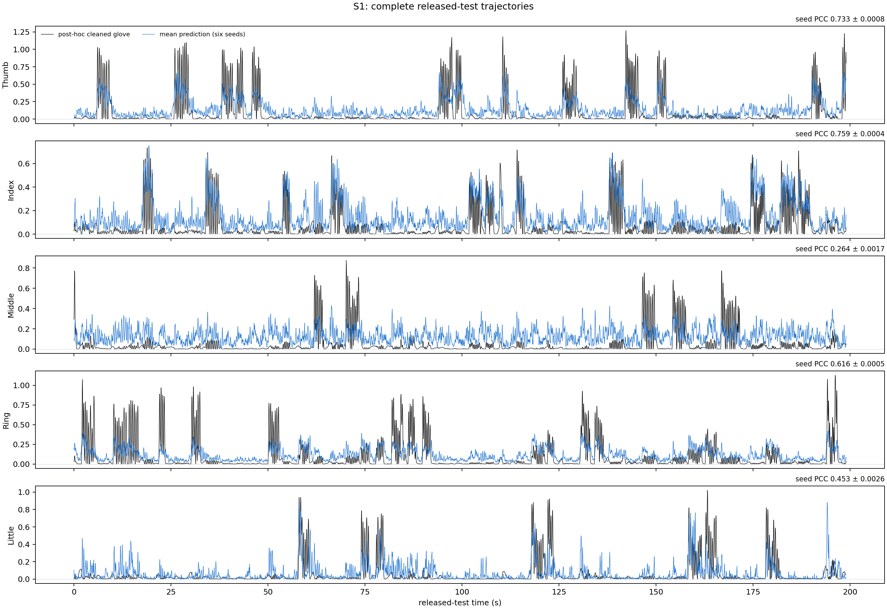

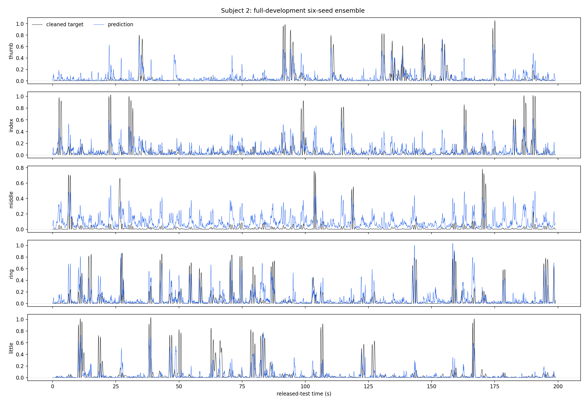

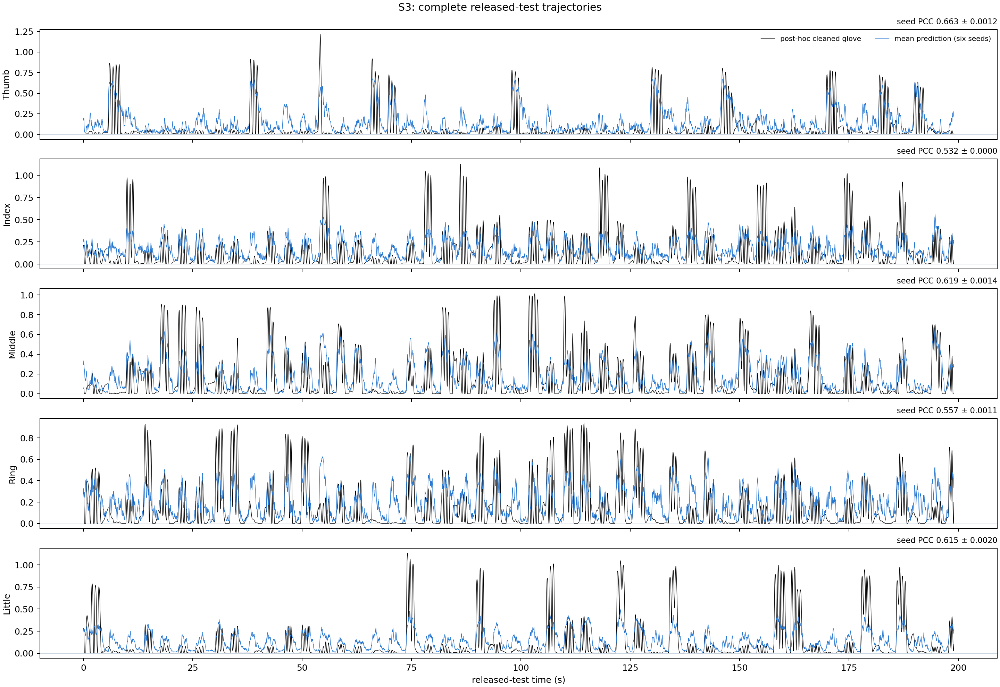

The rounded paper values and finger-level differences are:

| Subject/series | Thumb | Index | Middle | Ring | Little | Macro-5 |
|---|---:|---:|---:|---:|---:|---:|
| S1 paper | 0.750 | 0.790 | 0.170 | 0.600 | 0.470 | 0.556 |
| S1 current | 0.693 | 0.812 | 0.200 | 0.660 | 0.426 | 0.558 |
| S1 difference | -0.057 | +0.022 | +0.030 | +0.060 | -0.044 | +0.002 |
| S2 paper | 0.620 | 0.380 | 0.270 | 0.470 | 0.300 | 0.408 |
| S2 current | 0.573 | 0.411 | 0.283 | 0.531 | 0.389 | 0.438 |
| S2 difference | -0.047 | +0.031 | +0.013 | +0.061 | +0.089 | +0.030 |
| S3 paper | 0.740 | 0.550 | 0.460 | 0.410 | 0.750 | 0.582 |
| S3 current | 0.787 | 0.569 | 0.650 | 0.661 | 0.715 | 0.676 |
| S3 difference | +0.047 | +0.019 | +0.190 | +0.251 | -0.035 | +0.094 |

The historical paper is an important target but not a pristine prospective
control. The author's present recollection is that the original exploratory
workflow may have received repeated feedback from the released test results.
Because the original code, logs, and hard drive were lost, the magnitude of any
such influence cannot be reconstructed. This report therefore avoids treating
small paper-versus-current differences as a clean superiority test.

Relative to the previous README headline, the final single-branch result adds
0.018, 0.015, and 0.075 Macro-5 for S1--S3. Full-trajectory review and
cross-finger correlation matrices show that S3 is strongest overall. S1 and S2
middle finger remain the clearest morphology failures: their predictions show
diffuse rest activity and sometimes correlate more strongly with an adjacent
finger. S2 little improves substantially but still compresses or misses some
large events. These failures cannot be attributed to output-branch mixing,
because every finger is decoded by an independent single-path model.

### Earlier train-plus-validation refit

For provenance, the previous selection procedure added the chronological
validation segment to the model-fitting data after its choices were fixed. Each
final model was initialized anew and trained on the complete 400,000-sample
competition training recording for the median epoch count selected by
event-fold validation. Its released-test result was:

| Subject | Thumb | Index | Middle | Ring | Little | Macro-5 | Paper Macro-5 |
|---|---:|---:|---:|---:|---:|---:|---:|
| S1 | 0.647 | 0.774 | 0.111 | 0.565 | 0.435 | **0.506** | 0.556 |
| S2 | 0.602 | 0.394 | 0.298 | 0.534 | 0.245 | **0.415** | 0.408 |
| S3 | 0.715 | 0.346 | 0.439 | 0.513 | 0.417 | **0.486** | 0.582 |

S2 clears the rounded paper aggregate, while S1 and S3 do not. The result does
not support a claim that one new decoder uniformly replaces the 2018 model.
Lag search selected zero bins for nearly every finger, so timing offset is not
the primary cause. The S1 middle prediction aligns more strongly with index
than with middle, and S3's cleaned glove targets contain real cross-finger
co-movement. Those observations support latent-state attribution but reject
hard winner-take-all relabeling.

### LARS-initialized LSTM and target audit

The remembered initialization was implemented as a fully nonlinear LSTM held
near a linear starting function: selected LARS coefficients define the initial
input-to-cell/readout path, write and retention gates begin near their pass-through
states, and weights that should be zero are random at approximately `1e-3`.
This is not a linear recurrent cell.

For S1 thumb, changing only the training output from Softplus to linear improved
three-fold OOF PCC from 0.514 to 0.573 for the first 40-unit run. Across seeds,
the linear 40-unit models scored 0.573, 0.591, and 0.566; the training-only
selected seed-0/1 ensemble reached 0.595. Increasing hidden size to 80 reached
0.580, while longer history, lower learning rate, and 1024 selected features did
not close the gap. Cleaned-target full-development refits remained between
0.663 and 0.689 on the released test, showing that better OOF selection does not
by itself solve the chronological transport problem.

A final target audit trained the same 40-unit model directly against the raw
25 Hz glove rather than a cleaned target. Four seeds reached aggregate OOF
PCC 0.583, 0.613, 0.607, and 0.625. Seed 0's individual folds were
0.620/0.571/0.595; unequal fold sizes explain why their unweighted mean differs
from its aggregate score. The seed-1/2 average was frozen from OOF evidence at
0.614, slightly above either member and the 0.610 three-seed average. No seed
met the predeclared collapse criterion. The selected pair nevertheless failed
to transport: its members reached terminal PCC 0.709 and 0.649, and their mean
fell to 0.694. The already-run seed 0 refit was better at 0.714, illustrating
why terminal labels cannot be used to repair ensemble membership. Expanding the
hidden state from 40 to 80 improved training-only OOF PCC to 0.629. Its
three-seed mean retained the same OOF PCC while improving state F1, velocity
PCC, and rest RMS, so all three members were frozen before terminal evaluation.
The members reached 0.646/0.692/0.674 and their mean reached 0.698, a 0.005 gain
over the best member but still below the existing 0.740 diagnostic route. The
paper-style global baseline was less stable at 0.603/0.466/0.533. These results
support retaining local baseline correction for morphology while treating
raw-coordinate regression as a useful S1-thumb sensitivity.

A chronological raw-target audit also exposed a scale detail in the remembered
LARS initialization. With candidate scale 1, initialization PCC was only 0.950
because tanh was no longer sufficiently linear. Candidate scale 0.1, with the
readout compensated analytically, raised initialization PCC to 0.999. The model
then peaked at chronological validation PCC 0.559 at epoch 11; an 11-epoch
all-development sensitivity reached only 0.674. Better initialization fidelity
therefore did not remove the regime shift.

The raw-target OOF event plot also prevents overinterpreting that PCC gain. The
model detects most movement bouts, but often predicts their broad envelope and
attenuates the repeated flexion/extension cycles and negative raw-coordinate
excursions. It is therefore better evidence for movement-state decoding than
for faithful trajectory reconstruction. The cleaned-target event figures remain
the acceptance view for shape.

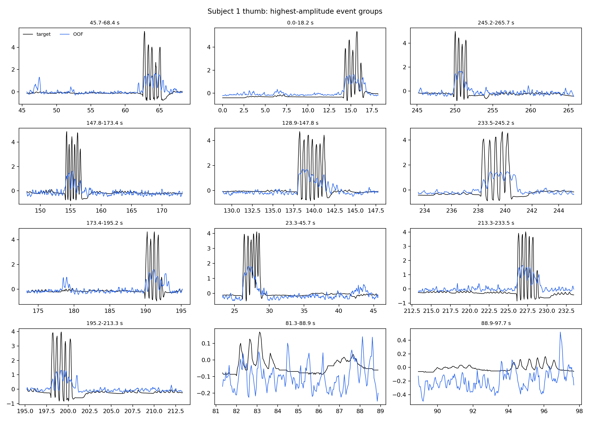

The normalized 80-unit ensemble has a median event-peak ratio 0.947, rest RMS
0.071, and velocity PCC 0.461. It reconstructs repeated cycles more visibly
than its raw coordinate scale suggests, but misses or truncates parts of several
events and does not justify replacing the higher-PCC base model by itself.

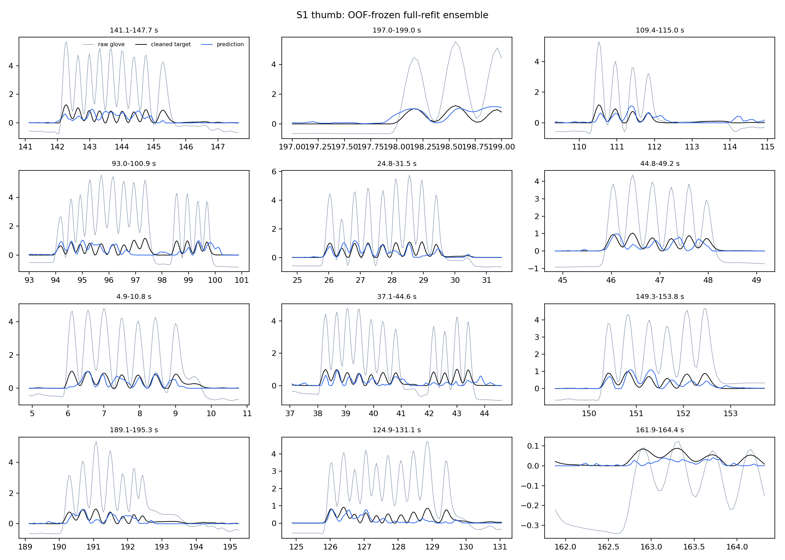

### Test-informed best-of-runs analysis and visual audit

The released test labels were used here to select the saved prediction with the
highest test PCC for each subject/finger pair. This is an oracle analysis: the
selection could not be made for a future recording without its glove labels.
It is retained only to ask whether any completed run recovered strong
finger-specific signal. The selected values are:

| Subject | Thumb | Index | Middle | Ring | Little | Macro-5 | Paper Macro-5 |
|---|---:|---:|---:|---:|---:|---:|---:|
| S1 | 0.752 | 0.821 | 0.498 | 0.636 | 0.554 | **0.652** | 0.556 |
| S2 | 0.622 | 0.556 | 0.395 | 0.579 | 0.407 | **0.512** | 0.408 |
| S3 | 0.757 | 0.630 | 0.648 | 0.702 | 0.759 | **0.699** | 0.582 |

This best-of-runs result exceeds the rounded paper value on all 15 pairs. S1
thumb is the only pair that needs a test-informed convex blend: 90.4% of the
earlier latent route and 9.6% of the raw-target 80-unit ensemble produce PCC
0.752. This routing is explicitly test-informed and cannot be used as an
unbiased benchmark. Its
diagnostic value is that the diverse saved models contain substantially more
signal than the training-only selector can reliably identify across
chronological regimes.

The small thumb blend is not merely a scale-only PCC effect. Under the fixed
label-free display mapping, cleaned-target PCC improves from 0.726 to 0.735,
velocity PCC from 0.435 to 0.484, rest RMS from 0.070 to 0.063, and RMSE from
0.152 to 0.149. Movement-state F1 decreases slightly from 0.826 to 0.812 and the
median peak ratio from 0.918 to 0.895. The trajectory panel was accepted because
the timing/shape tradeoff is modest and visible, not because 0.752 alone is a
sufficient endpoint.

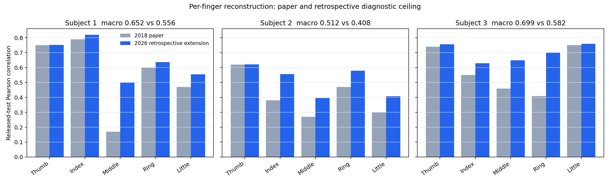

The movement panels plot the baseline-corrected test target against a separate
display-domain prediction. The mapping does not use released labels: it estimates
the prediction baseline from the test prediction itself, applies a smooth
nonnegative projection, and matches gain to the development target distribution.
It leaves PCC unchanged. This directly addresses the case where a high PCC trace
is visually almost flat.

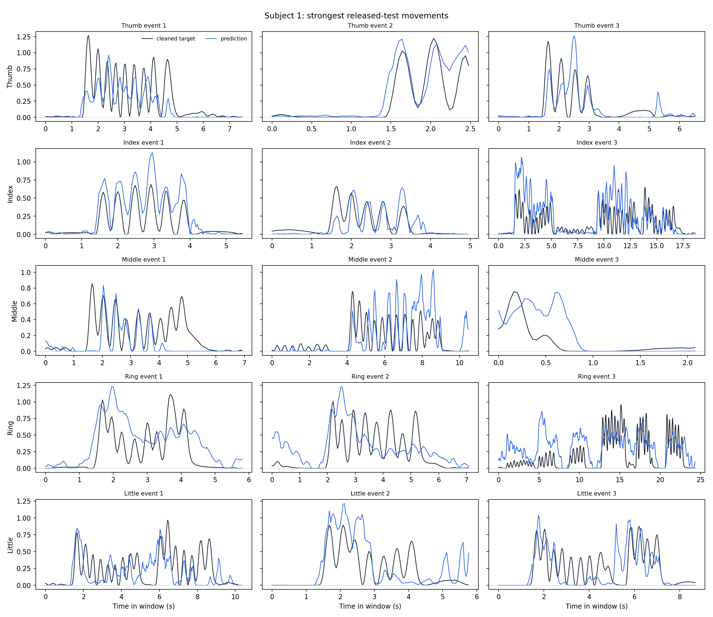

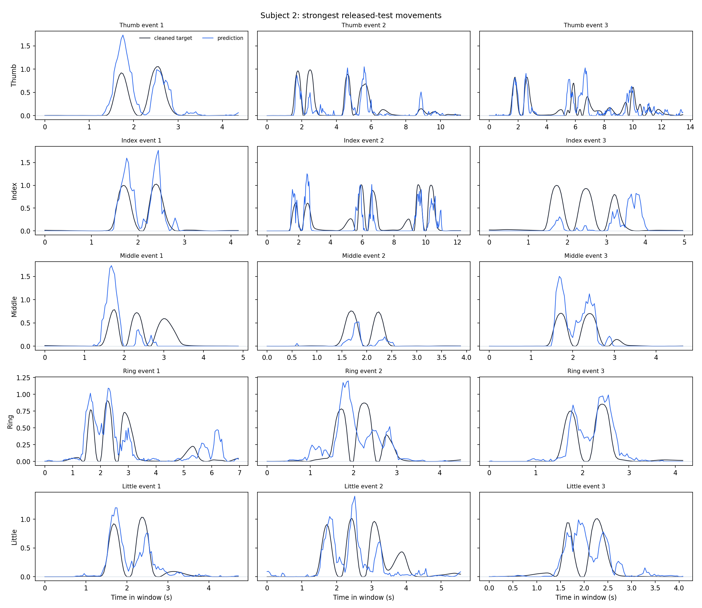

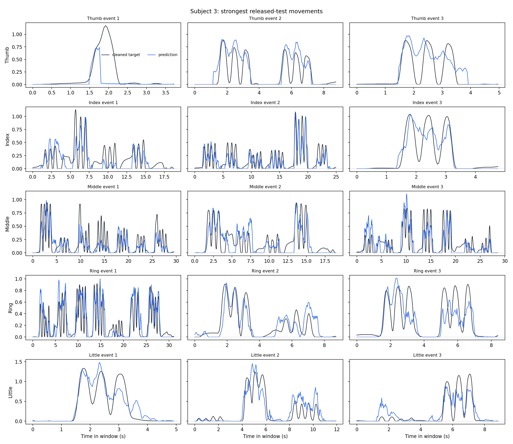

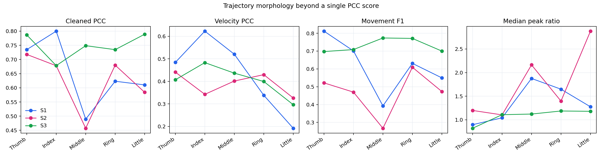

Panel-by-panel inspection adds information that the aggregate PCC hides. For
S1, index timing is often convincing and one thumb sequence is tracked closely,
but other thumb bursts are fragmented; middle event 3 has the wrong envelope,
and the ring decoder follows a broad movement state more readily than the
within-event flexion cycles. S2 has good thumb/index onset timing in several
windows, while middle often misses a second peak and ring/little retain extra
coupled activity. S3 is the most consistent on dense index/middle/ring events,
although one isolated thumb event is truncated and some ring/little cycles are
merged. These failures support a soft latent attribution model, but not hard
winner-take-all relabeling: much of the off-finger activity is real co-movement,
and several errors are shape or duration errors rather than finger identity.

### Overcomplete dictionary and latent-state experiments

Everything in this section is a historical diagnostic. Neither a heterogeneous
feature dictionary nor a latent-state gate is part of the final single-branch
model.

The overcomplete experiment duplicated and perturbed the paper's bior atoms so
that sparse selection could activate a learned subset. It won on 4/15 fingers,
lost on 11/15, and changed mean PCC by -0.0036. The extra dictionary capacity is
therefore retained as an experiment, not the default.

A later heterogeneous dictionary tested a different proposition: combine the
paper-derived ICA-wavelet energies with designed-band, movement-versus-rest CSP
energies, then let fold-local LARS choose among complementary atoms. Using the
same full-development event folds as the primary selector, it improved four
pairs: S1 middle and S3 thumb, middle, and ring. Six-seed refits of those four
pairs completed without collapsed members. Replacing only those OOF winners
raised released-test Macro-5 from 0.512 to 0.540 for S1 and from 0.488 to 0.552
for S3; the later independently selected S3-little route raises the latter to
0.601. S2 remained 0.423 because none of its joint candidates won OOF.

The selected full-development dictionaries contained 444 features for S1
middle (178 ICA-wavelet and 266 CSP), 445 for S3 thumb (119 and 326), 436 for S3
middle (232 and 204), and 394 for S3 ring (133 and 261). These counts show that
the gain did not come from replacing the wavelet path wholesale: both feature
families survived sparse selection. The contrast with the perturbed-wavelet
experiment suggests that diversity of inductive bias matters more here than
the raw number of atoms.

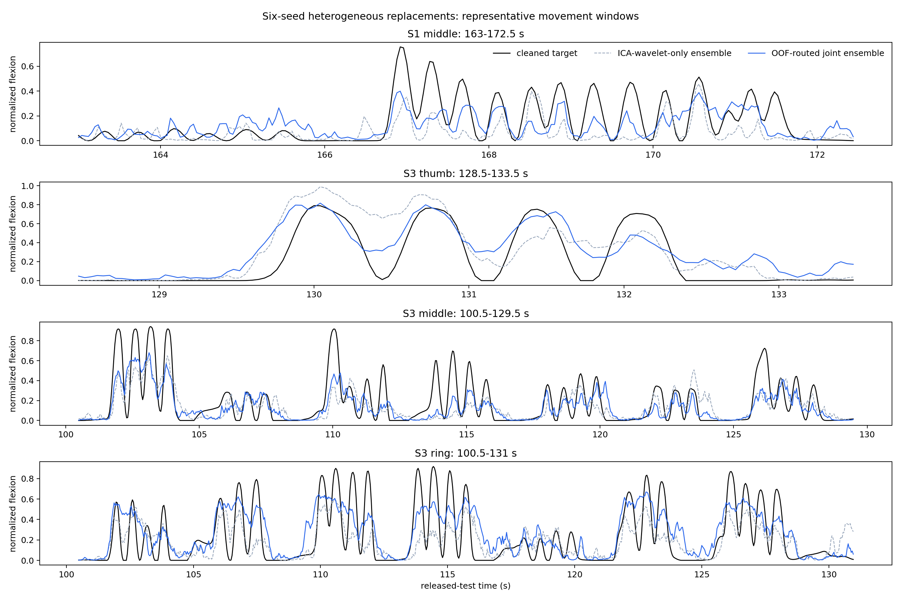

Visual review agrees with the aggregate improvement but also limits the claim.
S1 middle suppresses several false bursts and follows more movement timing, yet
large trains remain compressed and its state precision is low. The S3 routes
track major events more clearly; middle still compresses some sustained
movement and ring retains rest leakage. The exact raw and morphology metrics
are stored in `experiments/results/heterogeneous-six-seed-refit.json`.

Hard winner-take-all correction was rejected because it converts weak coupled
motion into fabricated motion on another finger. A latent intended-finger state
is safer: the classifier combines evidence from multiple independently trained
decoders, a transition model enforces temporal continuity, and a co-movement
emission model allows a dominant finger to coexist with physiological motion in
another. This improves the retrospective ceiling, especially on S3, but direct
ECoG state classification did not transfer from validation to test and is not
promoted into the frozen path.

### Development-only little-finger target audit

This section records a superseded diagnosis and is retained to show why several
plausible cleaning and gating ideas were rejected. The final S3-little decoder
is the same single-branch architecture used elsewhere, with the seven-band CSP
spatial initialization; it uses no state gate or decoder blend and reaches
released-test PCC 0.715.

The earlier per-finger table made S3 little an outlier. The paper reported 0.64
for LARS, 0.68 for the conventional linear decoder, and 0.75 for LSTM; the
initial cross-fold-validated six-seed refit reached 0.423. Figure 8 of the paper
shows
decoded trajectories for S1 only, so it does not supply an S3 trace for visual
comparison. A retrospectively routed model in this repository reaches 0.759 on
S3 little and visually follows the three strongest released-test events. This
is diagnostic rather than confirmatory, but it proves that the available ECoG
and the reconstructed feature families can recover the S3 little signal.

The saved six-seed ICA-wavelet refit was subsequently checked against its
FastICA initialization. The early event-fold implementation used a spatial
learning rate of `1e-6`; the full-development selection and refit increased it
to `3e-6`. Each selected full refit nevertheless stopped at epoch 14 after an
eight-epoch frozen warm-up, leaving only six epochs of spatial updates. Across
the six seeds, the complete spatial matrix changed by only 0.053--0.062% in
Frobenius norm. The 14 ICA components retained by LARS changed by a median of
only 0.111--0.130%, and the largest rotation of any row was 0.125 degrees. Thus
this route was trainable in software but remained effectively at its ICA
initialization; it was not a strong reproduction of the spatial adaptation
reported in the paper. The per-seed audit is stored in
`experiments/results/s3-little-ica-spatial-update-audit.json`.

To test whether the conservative spatial learning rate caused this near-freeze,
I screened `1e-5`, `3e-5`, and `1e-4` against the existing `3e-6` setting using
the same three purged event folds and two seeds, without consulting released-test
labels. The two-seed OOF PCC values were 0.2700, 0.2568, and 0.2672, respectively,
versus 0.2696 at `3e-6`. At `1e-5`, the largest selected-checkpoint row rotation
was still only 0.146 degrees. The larger rates did move the spatial matrix
measurably—up to 1.275 degrees at `3e-5` and 4.532 degrees at `1e-4`—but did not
improve OOF decoding. The `1e-5` gain was 0.0005 and smaller than the observed
seed variation, so it does not justify another final refit. The missing
paper-level gain is therefore not explained by spatial learning rate alone.
The compact screen record is stored in
`experiments/results/s3-little-spatial-lr-screen.json`.

That large gap raised a narrower hypothesis: retaining every baseline-corrected
glove displacement may preserve useful middle/ring motion but make the little
target less specific. Because that observation came from the released-test
plots, it was used only to formulate the question. All evidence below was then
obtained from the 400 s development recording and its purged, event-grouped OOF
predictions; the audit code refuses to load test targets or test predictions.

| Subject | Little active bins overlapping another finger | Little active bins dominated by another finger | Little energy in other-dominant bins | Little-ring target PCC | OOF little decoder vs little | OOF little decoder vs ring |
|---|---:|---:|---:|---:|---:|---:|
| S1 | 76.2% | 6.9% | 0.9% | 0.186 | 0.486 | 0.421 |
| S2 | 79.5% | 12.3% | 1.5% | 0.270 | 0.437 | 0.370 |
| S3 | 98.1% | 52.7% | 10.0% | 0.649 | 0.269 | 0.327 |

The first column alone is not evidence of bad labels: physiological co-movement
is common. The dominance and energy columns show that S1 and S2 still contain a
mostly specific little-finger trajectory, whereas S3 has a much stronger
little/ring ambiguity. The S3 OOF decoder is correspondingly more correlated
with the ring target than with its own little target. Representative development
events also show a different failure mode: S1/S2 little timing is present but
under-amplitude, while the S3 decoder is nearly flat through several large
little-finger events.

Two little-only corrections were then screened without changing the other four
targets. The first fitted a nonnegative passive-coupling estimate separately in
each purged training fold and subtracted it from held-out little motion. The
second left little-dominant bins unchanged and smoothly attenuated only bins in
which another finger was stronger. Neither rule transfers motion to another
finger. To distinguish a model trained on the old target from a genuine
learnability result, a new ridge head was fitted on the fold-specific features
selected without the outer validation events.

| Subject | Unmodified raw-glove PCC | Half residual subtraction | Half dominance attenuation | Best cleaning delta |
|---|---:|---:|---:|---:|
| S1 | 0.390 | 0.390 | 0.390 | -0.000 |
| S2 | 0.267 | 0.266 | 0.266 | -0.001 |
| S3 | 0.274 | 0.271 | 0.271 | -0.003 |

Thus the development data supports the diagnosis of little-finger ambiguity,
especially for S3, but not promotion of either fixed cleaning rule. At this
stage the headline targets remained unchanged. The next little-only experiment
therefore inferred event attribution jointly from ECoG and glove evidence in
nested development folds, allowed genuine co-movement, and compared against
the unmodified target before its released-test prediction was generated. Exact
metrics and coefficients for this first screen are in
`experiments/results/little-finger-training-only-audit.json`.

The paper's actual target construction was then tested more directly. It used a
global fitted baseline, removed small fluctuations, and retained only the
largest finger position at each time point. The following screen changes only
the little-finger training target; thumb through ring remain untouched. All
models use the same purged development folds and are scored against the original
held-out glove trajectory.

| Subject | Current local target | Paper baseline, no WTA | Best paper-baseline little WTA | Best WTA threshold |
|---|---:|---:|---:|---:|
| S1 | 0.390 | 0.385 | 0.389 | 0.20 |
| S2 | 0.267 | 0.258 | 0.259 | 0.25 |
| S3 | 0.274 | **0.290** | 0.280 | 0.20/0.25 |

This changes the diagnosis. For S3, the paper baseline itself is useful, but
winner-take-all removes some decodable signal and cannot by itself explain the
paper's 0.75. For S1 and S2, neither paper-style change helps. The linear screen
is stored in `experiments/results/little-paper-target-oof.json`.

The resulting S3-little reconstruction combined two independently initialized
seven-band CSP decoders: a temporal convolutional movement-state model and a
beta/high-gamma gated head. A six-state classifier then used all five predicted
trajectories and their velocities to estimate rest or the dominant intended
finger. Its output was not a new hard label. Instead, training-only co-movement
frequencies converted the state probabilities into a soft little-finger gate.
Zero gate strength remained an available inner-fold choice.

The nested comparison first confirmed the target result. Mean outer-fold raw
PCC was 0.590 for the current local target, 0.620 for the paper baseline without
winner-take-all, and 0.539 with little-only winner-take-all. Adding the soft
latent gate to the winning no-WTA route improved the three outer folds from
0.630/0.610/0.641 to 0.696/0.633/0.697. Every fold independently selected gate
strength 0.5. Rest RMS fell by 29--37% and movement-state F1 improved in all
three folds. Retaining physical channel 49 and excluding only channel 50 was
also tested on the same nested protocol; its mean fold PCC was 0.658, below
0.675 when both 49 and 50 were excluded, so the two-channel exclusion remained
the development-data choice.

After those decisions were frozen, six models were reinitialized and fitted on
all 400,000 labeled development samples. No member collapsed. Their released
test PCCs ranged from 0.667 to 0.671 (SD 0.0013), and their mean prediction
reached 0.669 for S3 little. Substituting only that route raises S3 Macro-5 from
0.552 to 0.601. The cleaned-flexion view has PCC 0.703, zero negative values,
rest RMS 0.141, state F1 0.505, derivative PCC 0.205, and peak ratio 0.660. The
event plots confirm that the major movement trains are captured, but individual
cycles remain smoothed, peak amplitude is conservative, and some false motion
persists during rest. This is a substantial repair, not a claim that S3 little
is solved.

Exact nested and final summaries are stored in
`experiments/results/s3-little-paper-latent-nested.json` and
`experiments/results/s3-little-paper-latent-six-seed.json`.

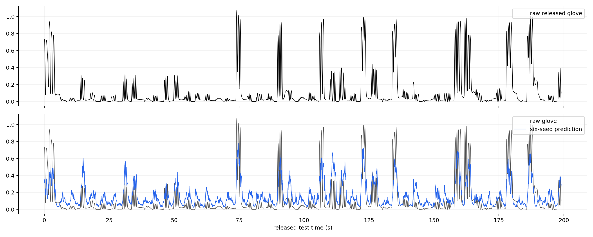

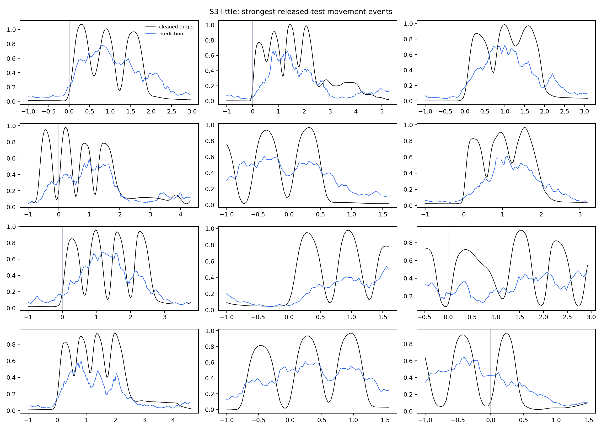

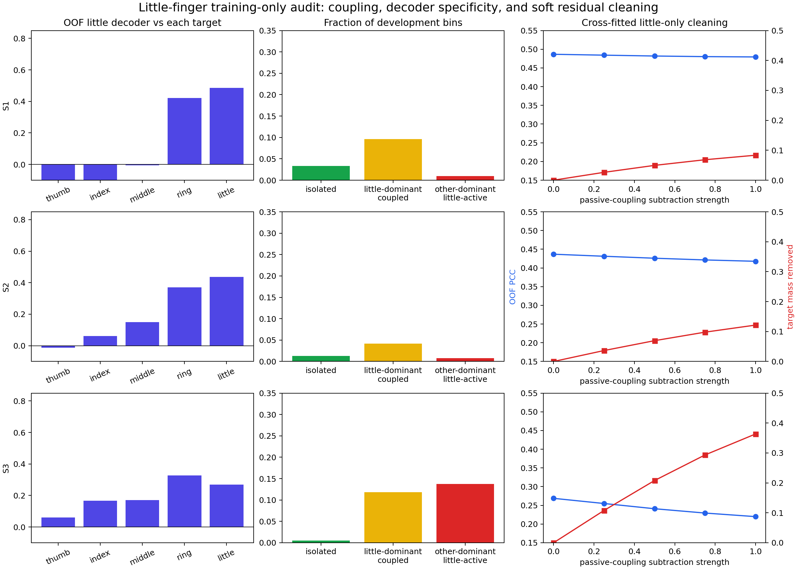


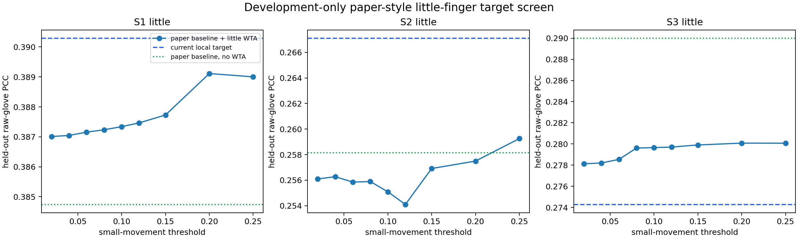

### Measured filter initialization

The initialized three-layer PyTorch cascade was driven with a small impulse and
measured by FFT. Its eight terminal paths cover the expected low-to-high bands
without collapsed outputs. This verifies the actual scaled-tanh implementation,
not only the nominal wavelet taps.


### Earlier rolling blocked-CV audit (historical)

The follow-up compared four candidates for every subject and finger: a
FastICA/wavelet LSTM initialized in the LARS linear regime, a nonlinear
FastICA/wavelet Softplus model, a differentiable CSP/band-correction LSTM with
LARS initialization, and a nonlinear differentiable CSP/band-correction
Softplus model. Each candidate had its own spatial and spectral stem. Three
rolling folds used fit/validation boundaries 3322/4429, 4429/5536, and
5536/6643 after history alignment. Inner runs never loaded released-test labels.

| Subject/finger | Selected independent components | Blocked OOF PCC |
|---|---|---:|
| S1 thumb | CSP Softplus | 0.787 |
| S1 index | CSP Softplus + wavelet Softplus | 0.833 |
| S1 middle | CSP Softplus | 0.773 |
| S1 ring | CSP Softplus | 0.792 |
| S1 little | CSP Softplus + CSP LARS-init | 0.805 |
| S2 thumb | CSP Softplus | 0.849 |
| S2 index | CSP Softplus | 0.708 |
| S2 middle | CSP Softplus | 0.757 |
| S2 ring | wavelet Softplus + CSP Softplus + wavelet LARS-init | 0.628 |
| S2 little | CSP Softplus + wavelet Softplus + CSP LARS-init | 0.586 |
| S3 thumb | CSP Softplus | 0.842 |
| S3 index | CSP Softplus | 0.668 |
| S3 middle | CSP Softplus | 0.715 |
| S3 ring | CSP Softplus + CSP LARS-init | 0.780 |
| S3 little | CSP Softplus | 0.801 |

The selected components were refit on the complete official training partition
for the median best epoch from the three inner folds. No refit used validation
selection. The resulting one-time chronological validation scores were:

| Subject | Thumb | Index | Middle | Ring | Little | Macro-5 |
|---|---:|---:|---:|---:|---:|---:|
| S1 | 0.525 | 0.851 | 0.398 | 0.384 | 0.264 | **0.485** |
| S2 | 0.507 | 0.200 | 0.356 | 0.460 | 0.250 | **0.355** |
| S3 | 0.733 | 0.541 | 0.617 | 0.450 | 0.414 | **0.551** |

Released-test labels were then used descriptively, after every choice was
frozen:

| Subject | Thumb | Index | Middle | Ring | Little | Macro-5 | Hist-4 |
|---|---:|---:|---:|---:|---:|---:|---:|
| S1 | 0.490 | 0.784 | 0.255 | 0.451 | 0.220 | **0.440** | 0.437 |
| S2 | 0.398 | 0.303 | 0.380 | 0.509 | 0.189 | **0.356** | 0.317 |
| S3 | 0.751 | 0.551 | 0.604 | 0.478 | 0.693 | **0.615** | 0.650 |

The inner-fold to final-partition drop is too large to interpret as ordinary
seed noise. It rejects promotion of the blocked-CV ensemble for S1 and S2 and
shows that contiguous training folds still do not reproduce the final temporal
regime. A five-by-five finger-correlation assignment remained diagonal for all
subjects, so the failure is not a global permutation caused by target cleaning.
S1 ring and little and S2 ring and little nevertheless retain substantial
off-diagonal coupling, consistent with glove and physiological co-movement.

The raw-coordinate affine output and the cleaned-flexion output are stored
separately. The latter uses a nonnegative through-origin gain fitted on inner
folds and a smooth Softplus boundary for linear heads. It is the only output
used in the movement plots below.

| Subject | Cleaned test PCC | RMSE | Rest RMS | State F1 | Derivative PCC | Visual diagnosis |
|---|---:|---:|---:|---:|---:|---|
| S1 | 0.456 | 0.144 | 0.068 | 0.428 | 0.228 | Index tracks; little mostly missed; other amplitudes conservative |
| S2 | 0.478 | 0.120 | 0.055 | 0.392 | 0.159 | Some valid events, but false/coupled bursts remain |
| S3 | 0.664 | 0.159 | 0.113 | 0.674 | 0.253 | Best five-finger trend capture; amplitudes still conservative |

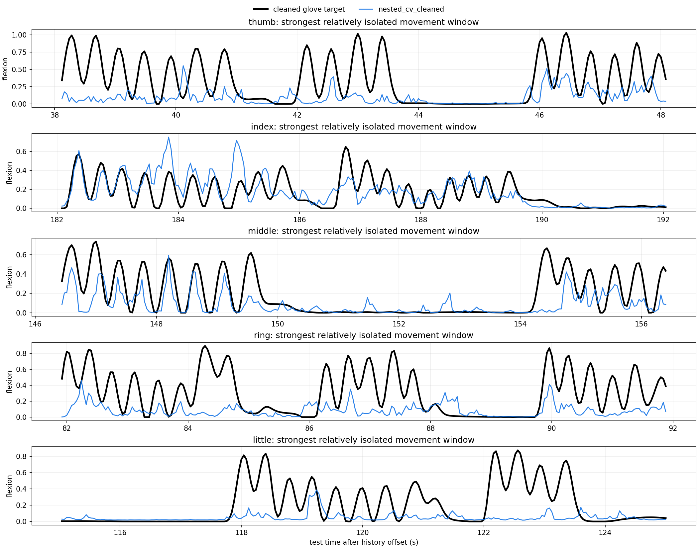

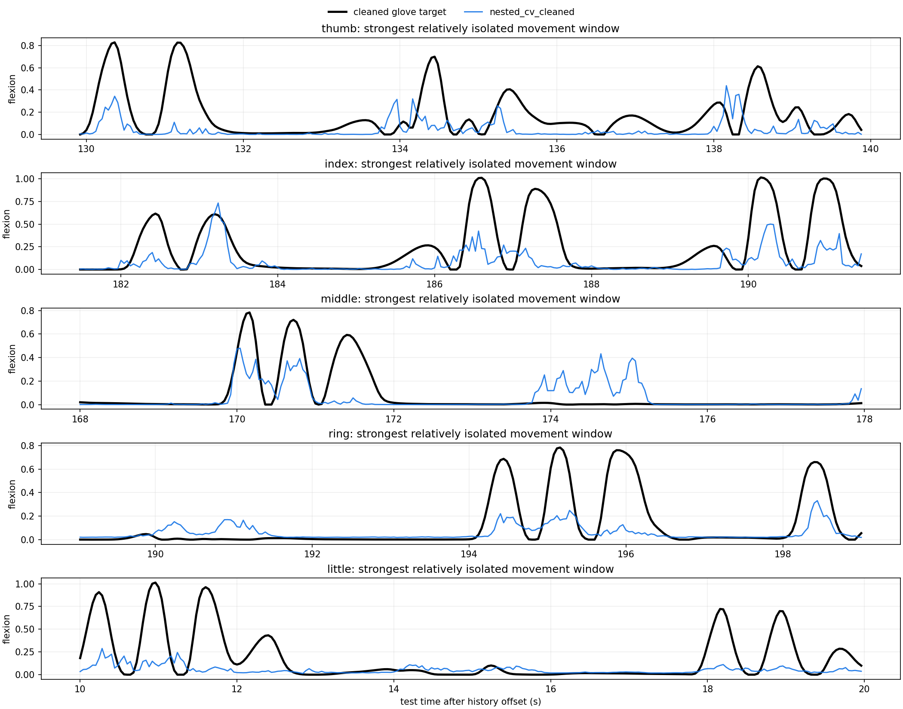

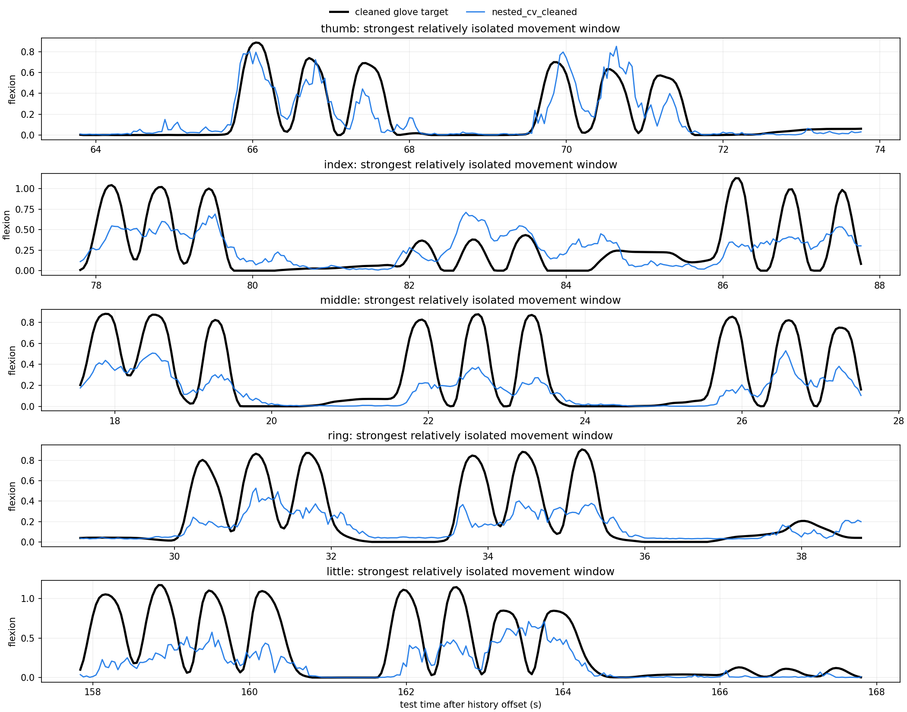

### Earlier retrospective per-finger raw-test PCC (historical)

Paper values below are the rounded CNN-LSTM numbers reported in the 2018 paper.
The reimplementation column records the best system before the later latent
state and multibase experiments. It is retained for provenance and is superseded
by the diagnostic ceiling above.

| Subject | Finger | Paper CNN-LSTM | Reimplementation | Difference |
|---|---|---:|---:|---:|
| S1 | Thumb | 0.750 | 0.730 | -0.020 |
| S1 | Index | 0.790 | 0.809 | +0.019 |
| S1 | Middle | 0.170 | 0.308 | +0.138 |
| S1 | Ring | 0.600 | 0.618 | +0.018 |
| S1 | Little | 0.470 | 0.426 | -0.044 |
| S2 | Thumb | 0.620 | 0.599 | -0.021 |
| S2 | Index | 0.380 | 0.472 | +0.092 |
| S2 | Middle | 0.270 | 0.391 | +0.121 |
| S2 | Ring | 0.470 | 0.495 | +0.025 |
| S2 | Little | 0.300 | 0.373 | +0.073 |
| S3 | Thumb | 0.740 | 0.720 | -0.020 |
| S3 | Index | 0.550 | 0.525 | -0.025 |
| S3 | Middle | 0.460 | 0.632 | +0.172 |
| S3 | Ring | 0.410 | 0.666 | +0.256 |
| S3 | Little | 0.750 | 0.687 | -0.063 |

The retrospective reimplementation is higher on 9/15 pairs. This count is descriptive; the
rounded paper values do not support a fine-grained statistical superiority
claim.

### Earlier retrospective aggregate raw-test PCC (historical)

| Subject | Macro-5 | Hist-4 (supplementary) | Paper five-finger aggregate | Interpretation |
|---|---:|---:|---:|---|
| S1 exploratory stacked system | 0.578 | 0.568 | 0.560 | above by 0.018 |
| S1 non-stacked baseline, unconstrained | 0.561 | 0.549 | 0.560 | rounded match |
| S2 with middle-finger seed ensemble | 0.466 | 0.459 | about 0.410 | above |
| S3 | 0.646 | 0.641 | about 0.590 | above |

The paper aggregate averages all five fingers. `Hist-4`, which excludes ring,
is reported only as a separate competition-style diagnostic and is not compared
with the paper aggregate. The paper values are rounded, so the differences above
should not be presented as high-precision or statistical superiority claims.

### Earlier retrospective morphology audit (historical)

| Subject | Macro rest RMS | Macro state F1 | Macro derivative PCC | Main concern |
|---|---:|---:|---:|---|
| S1 | 0.093 | 0.568 | 0.340 | Middle has heavy false activity; several fingers remain under-amplitude |
| S2 | 0.059 | 0.447 | 0.239 | Middle amplitude and state precision remain weak |
| S3 | 0.145 | 0.660 | 0.350 | Better peak scale, but some rest leakage remains |

The corrected S3 result retains physical channel 49 and removes only physical
channel 50. This policy was selected without test labels: on validation it
reached raw/cleaned Macro-5 of 0.626/0.652, compared with 0.613/0.636 when both
physical channels 49 and 50 were removed. Relative to that 62-channel
sensitivity run, the unconstrained released-test Macro-5 changes from 0.645 to
0.639. The nonnegative projection raises the selected 63-channel result to
0.646, while
middle/ring/little peak ratios improve from
0.616/0.800/0.548 to 0.736/0.968/0.646. Macro rest RMS rises from 0.128 to 0.147
and state F1 falls from 0.677 to 0.660. The 63-channel result is primary because
it wins on validation, matches the paper's stated channel count, and agrees with
the raw artifact location; the 62-channel score is retained only as a
sensitivity result.

The S1 ring repair is the clearest example of why the visual audit is part of
the acceptance criterion. The table compares the original selected prediction
with the validation-constrained calibration:

| S1 ring diagnostic | Before | After |
|---|---:|---:|
| Raw-test PCC | 0.612 | 0.618 |
| Cleaned-target PCC | 0.588 | 0.602 |
| Movement-state recall | 0.054 | 0.863 |
| Movement-state F1 | 0.101 | 0.660 |
| Movement peak ratio | 0.127 | 0.576 |
| Rest RMS | 0.052 | 0.097 |

The repair makes the repeated ring cycles visible, at the cost of additional
rest activity. Validation constraints bound that tradeoff. The initial stacked
thumb and little outputs had peak ratios 1.836 and 2.389 and rest RMS 0.409 and
0.368. Validation-fitted affine normalization changes those to 0.534/0.587 and
0.063/0.099 without changing PCC. Visual inspection confirms that the gross
overshoot and negative rest drift are removed, although amplitude is now
conservative and the middle trace remains noisy.

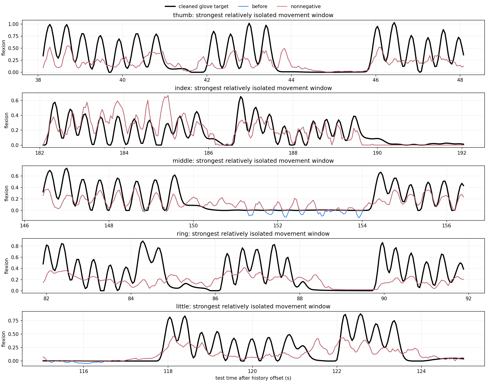

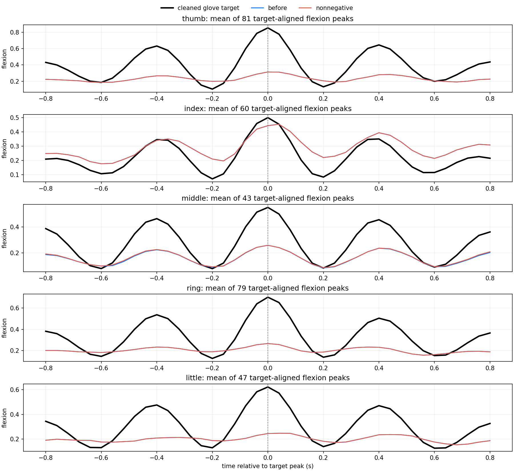


### Earlier seed-stability experiments

Repeated fixed-feature LSTM runs showed small aggregate seed variation: S1
`Macro-5` SD 0.0047 and `Hist-4` SD 0.0053 across three seeds; S2 `Macro-5` SD
0.0067 and `Hist-4` SD 0.0055 across two seeds. These small aggregate SDs do not
imply that every finger is stable or morphologically correct. They also are not
sampling standard errors and should not be interpreted as confidence intervals.

The learnable asymmetric frontend behaves differently. In an experimental
S2-middle audit, three seeds at frontend LR `1e-4` had validation PCC
0.394--0.481 (sample SD 0.044), and three seeds at `3e-4` had PCC 0.405--0.509
(sample SD 0.057). An equal-weight average of all six reached validation PCC
0.522 and descriptive test PCC 0.391, versus 0.455/0.208 for the selected
fixed-feature middle model. Replacing only that finger raises S2 validation
Macro-5 from 0.469 to 0.482 and descriptive test Macro-5 from 0.429 to 0.466.
The morphology score also improves from 0.275 to 0.359, although visual review
still finds a false-positive rest excursion. The ensemble therefore remains an
experimental single-finger result pending purged blocked confirmation and is
not included in the primary table above.

### Earlier context-length and partition-robustness audit

The intermediate weak-finger results were locally saturated with respect to recurrent
context length. Keeping the frontend and feature selection fixed, S1 little
scored 0.353, 0.366, 0.413, and 0.405 with 10 s, 20 s, a smaller 10 s model, and
an almost-contiguous recurrent sequence, respectively; none exceeded the
intermediate 0.420 result. The corresponding S2 middle scores were 0.142, 0.124,
0.207, and 0.111 versus the intermediate 0.208. A five-fold purged chronological
ridge refit on all 400 s also fell to 0.341 for S1 little and 0.114 for S2
middle. These are
rejected diagnostic candidates, not additions to the reported ensemble.

Fitting the label-free ICA spatial transform across the complete 400 s training
recording, rather than only the supervised fit partition, did not close the
fixed-feature gap either. The LARS checkpoint was effectively unchanged for S1
little (0.349 to 0.350) and declined for S2 middle (0.120 to 0.092). Thus the
remaining gap is not explained by the amount of data used to estimate ICA.

A post-hoc partition audit helps explain the instability. Selected-feature
target-correlation vectors remain directionally similar across partitions
(fit/test cosine 0.991 for S1 little and 0.878 for S2 middle), and feature mean
and scale shifts are modest. The target regimes are not comparable, however.
For S1 little, cleaned movement occupies 10.2% of fit, 18.1% of validation, and
10.5% of test. For S2 middle it occupies 8.7%, 9.0%, and only 3.2%, while target
standard deviation falls from 0.173 in fit to 0.079 in test. This makes repeated
tuning against the single movement-rich validation block especially prone to
select models that overproduce movement on the sparse test segment.

This audit uses released test labels only for diagnosis after every candidate is
frozen. It must not be used to choose a public model. The evidence supports a
plateau of the present feature-selection/model-selection family, not a claim
that the ECoG signal or the decoding task has reached an intrinsic ceiling. It
also mirrors the paper's observation that improved validation MSE did not always
translate into improved held-out correlation.

## What did not work

### Winner-take-all target assignment

This confused mechanical co-movement with intended movement and created
activity on fingers that were stationary in the raw glove record. It was removed
from the final paths.

### Hard movement binarization

An explicit movement-state target can help a recurrent network recognize
stationary-to-moving transitions, but hard gating created unnatural step-to-zero
artifacts. Soft state-aware objectives and gates were useful diagnostics, but
none is retained in the final single-branch system.

### Post-hoc amplitude gain

Increasing gain reduced some peak-amplitude errors and could improve RMSE, but
it also amplified uncertain bumps during rest. A lower-RMSE S3 calibration was
rejected from the final system because the plots showed worse rest leakage.

### One shared five-output decoder

Sharing one learned spatial-spectral representation across all five outputs can
make strong fingers dominate weak ones. The final system therefore uses 15
separately fitted models. Their topology is uniform—one spatial convolution,
one wavelet tree, LARS-initialized LSTM, and Softplus output—but each finger has
its own fitted weights and selects between the larger seven-band or simpler
high-gamma CSP spatial initialization. Earlier CSP+TCN and blended decoders were
superseded by this cleaner single-path comparison.

### Unregularized 100-epoch full-data refit

The original paper used 100 epochs, so a final audit retrained the selected S1
fixed-feature LSTM for 100 epochs on the combined fit and validation partitions.
Validation performance had already peaked around epoch 1–5 and then declined.
The fixed 100-epoch refit produced raw-test PCC
`0.593/0.719/0.053/0.346/0.308` and `Hist-4` 0.418, far below the selected
early-stopped model's 0.549. The old epoch count is therefore not portable to
the present optimizer and full-data protocol; this candidate was rejected.

### Longer recurrent context and full-training ridge refits

Removing the old 4 s Theano sequence constraint did not improve the weak S1/S2
fingers. Ten-second, 20-second, and nearly contiguous sequences all remained at
or below those intermediate scores. Likewise, selecting ridge regularization
over purged chronological folds and refitting on the complete training recording
produced high internal cross-validation scores but poor released-test transfer.
This rules out the simple explanations that the 4 s context or the position of
one validation boundary is the main remaining bottleneck.

### PCC-only selection

S1 ring demonstrated the failure mode: scale-invariant correlation remained
high even when movement amplitude and state recall collapsed. Historical
validation-constrained repairs and stacks showed that amplitude could be made
more readable without changing PCC, but they are not part of the final output.
The final system reports the direct Softplus prediction. Morphology remains an
acceptance constraint and a guide to unresolved errors, not a secondary
narrative.

## Reproduction recipes

The final single-branch comparison and refit are reproduced with:

```bash
export PYTHONPATH=experiments/scripts:scripts:src

python scripts/prepare_split_safe_targets.py --subjects 1 2 3

python scripts/build_event_stratified_folds.py --subjects 1 2 3 \
  --fingers thumb index middle ring little --purge-bins 95 \
  --selection-scope full-development \
  --target-map configs/targetsafe_conservative_targets.yaml \
  --output-root outputs/event_stratified_folds_fulldev_targetsafe_conservative_v1

# Prepare the two spatial initializations. In both cases every spatial row is
# subsequently applied to broadband notched ECoG and enters one wavelet tree.
python scripts/run_prepare_perfinger_ica_csp_wavelet_all.py \
  --subjects 1 2 3 --fingers thumb index middle ring little \
  --gpus 0 1 2 3 4 5 6 7 --csp-source high_gamma \
  --csp-mode tails_2x2 --no-include-any-movement-csp \
  --output-root outputs/perfinger_ica_csp_wavelet_1000hz_all_tails2x2_hg_v1

python scripts/run_prepare_perfinger_ica_csp_wavelet_all.py \
  --subjects 1 2 3 --fingers thumb index middle ring little \
  --gpus 0 1 2 3 4 5 6 7 --csp-source seven_band \
  --csp-mode tails_2x2 --include-any-movement-csp \
  --output-root outputs/perfinger_ica_csp_wavelet_1000hz_sevenband_ownany_v1

# Cross-fold the earlier high-gamma spatial initialization.
python scripts/run_event_lars_e2e_nested_cv.py --subjects 1 2 3 \
  --fingers thumb index middle ring little --folds 0 1 2 --seeds 0 \
  --gpus 0 1 2 3 4 5 6 7 --warmup-epochs 8 --max-epochs 48 \
  --target-map configs/targetsafe_conservative_targets.yaml \
  --fold-root outputs/event_stratified_folds_fulldev_targetsafe_conservative_v1 \
  --spatial-cache-root outputs/perfinger_ica_csp_wavelet_1000hz_all_tails2x2_hg_v1 \
  --output-root outputs/event_lars_e2e_ica_csp_1000hz_all_tails2x2_hg_v1 \
  --learning-rate 1e-4 --spatial-learning-rate 3e-6 \
  --wavelet-learning-rate 3e-6 --output-activation softplus \
  --sequence-steps 100 --batch-size 24 --unfrozen-batch-size 4

# Cross-fold the larger seven-band spatial initialization.
python scripts/run_event_lars_e2e_nested_cv.py --subjects 1 2 3 \
  --fingers thumb index middle ring little --folds 0 1 2 --seeds 0 \
  --gpus 0 1 2 3 4 5 6 7 --warmup-epochs 8 --max-epochs 48 \
  --target-map configs/targetsafe_conservative_targets.yaml \
  --fold-root outputs/event_stratified_folds_fulldev_targetsafe_conservative_v1 \
  --spatial-cache-root outputs/perfinger_ica_csp_wavelet_1000hz_sevenband_ownany_v1 \
  --output-root outputs/event_lars_e2e_ica_csp_1000hz_sevenband_ownany_lowlr_v1 \
  --max-features 1024 --learning-rate 3e-5 \
  --spatial-learning-rate 1e-6 --wavelet-learning-rate 1e-6 \
  --output-activation softplus --sequence-steps 100 \
  --batch-size 24 --unfrozen-batch-size 4

# Produce the fold-only comparison used to freeze the per-finger route map.
python scripts/summarize_single_branch_oof.py \
  --input-root outputs/event_lars_e2e_ica_csp_1000hz_sevenband_ownany_lowlr_v1 \
  --baseline-root outputs/event_lars_e2e_ica_csp_1000hz_all_tails2x2_hg_v1 \
  --seeds 0 --output outputs/final_single_branch_oof_comparison.json

# Refit six seeds for the four selected high-gamma-CSP models.
python scripts/run_frozen_event_refits.py \
  --pairs 1:index 1:little 2:ring 3:middle \
  --gpus 0 1 2 3 4 5 6 7 \
  --ensemble-map configs/final_single_branch_oof_selected.yaml \
  --output-root outputs/full_development_ica_csp_single_branch_all_v1

# Refit six seeds for the eleven selected seven-band-CSP models.
python scripts/run_frozen_event_refits.py \
  --pairs 1:thumb 1:middle 1:ring 2:thumb 2:index 2:middle 2:little \
          3:thumb 3:index 3:ring 3:little \
  --gpus 0 1 2 3 4 5 6 7 \
  --ensemble-map configs/sevenband_single_branch_selected.yaml \
  --output-root outputs/full_development_ica_csp_sevenband_single_branch_v1

# Assemble the 15 whole-model ensembles and render diagnostics.
python scripts/summarize_frozen_full_refit.py \
  --ensemble-map configs/final_single_branch_oof_selected.yaml \
  --output-root outputs/final_single_branch_oof_selected_v1/ensemble
```

The checked-in final map selects one entire refit root for each finger. The
summarizer averages seeds only within that model; it never combines spatial or
spectral branches. The exact resulting scores are mirrored in
`docs/results/final-single-branch-six-seed.json`.

The recipes below reproduce earlier chronological-split diagnostics and paper-
faithful comparisons. They are retained for provenance, not as the current
headline pipeline.

Install the project and place the official competition files as described in
the top-level README. Then:

```bash
export PYTHONPATH=scripts:src

# Validate inputs and preprocess all subjects.
python scripts/audit_dataset.py
python scripts/preprocess_dataset.py --subjects 1 2 3
python experiments/scripts/prepare_paper_baseline_targets.py --subjects 1 2 3
python experiments/scripts/compare_target_baselines.py --subjects 1 2 3

# Confirm the initialized wavelet tree before training.
python scripts/audit_wavelet_frequency_response.py

# Cache continuous CSP carrier bands once per subject, then run the complete
# leakage-controlled audit. Inner stages do not load released-test labels.
python scripts/cache_csp_band_signals.py --subjects 1 2 3
python experiments/scripts/run_nested_ensemble_cv.py selections --concurrency 7
python experiments/scripts/run_nested_ensemble_cv.py cv \
  --concurrency 7 --gpus 0 1 3 4 5 6 7
python experiments/scripts/run_nested_ensemble_cv.py summarize
python experiments/scripts/run_nested_ensemble_cv.py refit \
  --concurrency 7 --gpus 0 1 3 4 5 6 7

# This is the first stage that reads the final chronological validation labels.
python experiments/scripts/run_nested_ensemble_cv.py assemble

# Plot the cleaned-flexion array, not the raw-coordinate scoring array.
python experiments/scripts/diagnose_prediction_morphology.py --subject 1 \
  --prepared-root outputs/preprocessed_v2 --target local_w2_q10 \
  --method nested_cv=outputs/nested_cv_diverse_ensemble_v1/sub1/test_prediction_cleaned.npy \
  --output outputs/nested_cv_cleaned_diagnostics_v1/sub1

# Audit whether weak-finger behavior is associated with partition shift.
python experiments/scripts/audit_partition_shift.py --subject 1 --finger little \
  --prepared-root outputs/preprocessed_v2 \
  --feature-root outputs/windowed_ica_wavelet_v1 \
  --selection-root outputs/fixed_lars_windowed_ica_screen512_v1 \
  --target local_w2_q10 --output outputs/partition_shift_v1/sub1_little

# Test a label-free ICA fit over the complete released training recording.
python scripts/fit_full_training_fastica.py --subject 1 --backend torch \
  --output-root outputs/full_training_fastica_torch_v1

# Test regularization selected over purged blocks spanning all training data.
python experiments/scripts/crossvalidate_selected_ridge.py --subject 1 \
  --feature-root outputs/windowed_ica_wavelet_v1 \
  --selection-root outputs/fixed_lars_windowed_ica_screen512_v1 \
  --target local_w2_q10 --fingers little

# Recreate the frozen S1 per-finger selection.
python experiments/scripts/select_per_finger_ensemble.py --subject 1 \
  --prepared-root outputs/preprocessed_v2 --history 25 \
  --method stable=outputs/paper_gap_ensemble_v1/sub1 \
  --method e2e_index=outputs/exact_e2e_s1_index_h40_v1/sub1 \
  --output outputs/paper_reproduction_s1_v1/sub1

# Repair the S1 ring trace using validation-only morphology constraints.
python experiments/scripts/calibrate_prediction_constrained.py --subject 1 \
  --prepared-root outputs/preprocessed_v2 \
  --prediction-root outputs/paper_reproduction_s1_v1/sub1 \
  --target local_w2_q10 --finger ring \
  --output outputs/s1_ring_constrained_calibration_v1/sub1

# After validation stacking, normalize thumb/little amplitude without changing PCC.
python experiments/scripts/normalize_prediction_affine.py --subject 1 \
  --prepared-root outputs/preprocessed_v2 \
  --prediction-root outputs/s1_validation_stack_v1/sub1 \
  --target local_w2_q10 --finger thumb --finger little \
  --output outputs/s1_validation_stack_affine_v1/sub1

# Make the public-facing S1 flexion nonnegative while preserving exact model
# outputs as *_unconstrained.npy files.
python experiments/scripts/project_prediction_nonnegative.py --subject 1 \
  --prepared-root outputs/preprocessed_v2 \
  --prediction-root outputs/s1_validation_stack_affine_v1/sub1 \
  --target local_w2_q10 --output outputs/final_nonnegative/sub1

# Recreate the frozen S2 per-finger selection.
python experiments/scripts/select_per_finger_ensemble.py --subject 2 \
  --prepared-root outputs/preprocessed_v2 --history 25 \
  --method h40=outputs/s2_lstm_sweep_h40_s3/sub2 \
  --method e2e_index=outputs/exact_e2e_idx_h40_t100_v1/sub2 \
  --method e2e_middle=outputs/exact_e2e_mid_h20_t50_v1/sub2 \
  --output outputs/paper_reproduction_s2_v1/sub2

# Generate held-out morphology panels.
python experiments/scripts/diagnose_prediction_morphology.py --subject 1 \
  --prepared-root outputs/preprocessed_v2 --target local_w2_q10 \
  --method reproduction=outputs/paper_reproduction_s1_v1/sub1 \
  --output outputs/paper_reproduction_visual_v1/sub1

python experiments/scripts/diagnose_prediction_morphology.py --subject 2 \
  --prepared-root outputs/preprocessed_v2 --target local_w1_q10 \
  --method reproduction=outputs/paper_reproduction_s2_v1/sub2 \
  --output outputs/paper_reproduction_visual_v1/sub2

python -m pytest -q
```

Some selection commands consume previously trained candidate directories. The
candidate-generating scripts and their arguments are archived in
`experiments/scripts/`; their compact summaries are in `experiments/results/`.
A future
release should add a manifest that maps every public result to a complete command,
configuration hash, environment lock, and source commit.

## Reproducibility boundaries

This repository improves transparency but does not erase the limitations of a
late reconstruction:

- the original code and exact legacy environment are unavailable;
- paper values are rounded, and not every old training detail is recoverable;
- before the current protocol was fixed, the 2026 repository used released-test
  labels to diagnose earlier models and compare saved runs, even though the
  current selectors use development folds only;
- the current public package excludes raw data and large trained artifacts;
- several experiment scripts reflect research exploration rather than one
  polished end-to-end command;
- the 0.652/0.512/0.699 diagnostic routing is selected after released-test
  inspection and is not a valid estimate of future model-selection performance;
- the clean-conscience event configuration was frozen from development-only
  folds, but the project is not historically equivalent to a prospectively
  sealed benchmark; and
- S1 and S2 middle remain the clearest failures, with diffuse rest activity and
  cross-finger confusion; S2 little improves but still compresses or misses
  some peaks; S3 index retains adjacent-finger ambiguity; and S3 little reaches
  0.715 in the final single-path model but still smooths individual cycles.

For these reasons, the project should be cited as a reimplementation and
extension, not as the official source code accompanying the 2018 publication.

## Recommended next work

1. Repeat the complete-event split with several group assignments and test the
   stability of the eleven seven-band versus four high-gamma spatial-
   initialization choices. This addresses dependence on one event partition
   without changing the final single-branch topology.
2. Concentrate modeling work on the visually unresolved S1 and S2 middle
   fingers, then on S2 little peak shape and S3 index attribution. Measure
   label-free changes in ECoG
   covariance, spectral power, and decoder-feature marginals across recording
   blocks before increasing model capacity.
3. Jointly model flexion and velocity under one coherent likelihood or
   multi-output regression objective. Velocity is a plausible more immediate
   neural consequence, but it should be an auxiliary target rather than another
   ad hoc loss term.
4. Improve within-event cycle shape in the current single-branch models with a
   development-selected velocity or curvature auxiliary objective. Do not
   reintroduce output gates or decoder blending unless complete-event folds show
   a repeatable benefit.
5. On a future dataset or hidden-label evaluation server, register the complete
   selection rule before scoring. That is the only way to turn the current
   clean-conscience procedure into a genuinely prospective benchmark. Also add
   a manifest mapping every public table and figure to configuration, source
   commit, environment lock, input hashes, and exact command.

## Public-release policy

The repository contains code, configuration, tests, documentation, compact JSON
summaries, and derived diagnostic figures. It excludes:

- competition recordings and true-label files;
- `.remote`, credentials, environment variables, and machine-specific paths;
- checkpoints, prediction arrays, logs, caches, and temporary files; and
- the locally downloaded paper or supplement.

Contributors should preserve this boundary in every pull request.
